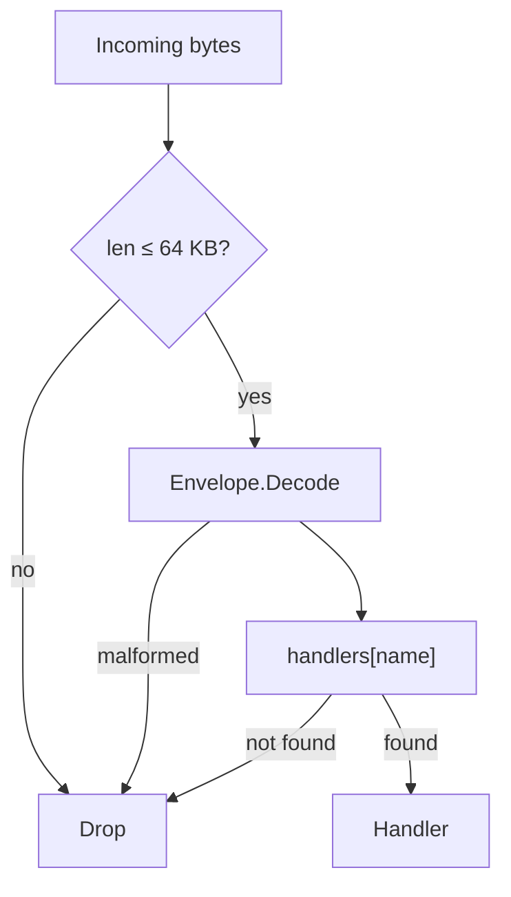
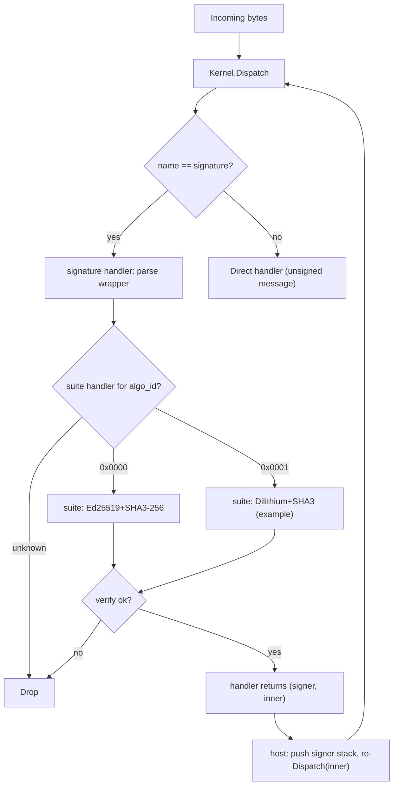

# Seed kernel: a tiny message kernel that bootstraps into a sandboxed app runtime

*Everything is a message. An auditable-in-one-sitting kernel grows from one trusted key into arbitrary behaviour — untrusted code runs sandboxed (WASM handlers or confined JS), anywhere from a browser tab to a single native binary.*

## 1. Vision

A minimal runtime where **everything is a message**. The kernel does one thing: parse an envelope and dispatch it to a handler registered under a **name**. Signing, authorization, capability gating, installation, and application logic are **modules** — layers that compose around the kernel like an onion. The system bootstraps from one trusted key (or no key at all, if that's what you want) into arbitrarily complex behaviour without the kernel knowing what any of it means.

Every binding is three orthogonal pieces: the **name** is the kernel's opaque dispatch key; the **bytes** are the WASM instance the kernel holds at that key; the **author** is the signer who installed it — a field in the installer's records, invisible to the kernel. The kernel is `handlers[name] → wasm_instance` plus dispatch; the signature module identifies authors; the installer binds names to bytes under a deployer-supplied **policy** that decides who may install what.

**Design principles:**

- The kernel is small enough to audit in a single sitting — one file, no cryptography, no authorization, no installation logic.
- The kernel makes one routing decision: look up the name and invoke the handler. Everything else, including how new handlers get installed, is a module concern.
- Modules form layers. Lower layers (signatures, installation) gate higher layers (apps like chat). Each layer can only see downward.
- Modules are independently usable — each is a standalone WASM module testable in isolation; nothing forces you to use them together.
- Untrusted code runs confined — a handler reaches the outside world only through the capabilities it declared, and logic too dynamic for WASM runs as zero-authority JavaScript in a QuickJS realm whose only reach is a single `host.call` capability seam.
- Node-to-node links are confidential by default — the runtime transport opens each connection with an authenticated key exchange, then carries every frame as a forward-secret, individually-authenticated encrypted record, uniform across TCP, WebSocket, and WebRTC and needing no external TLS or Noise tunnel.
- The same envelope works for tiny JSON payloads and large binary blobs.
- Cryptographic algorithms are pluggable; the kernel can survive a post-quantum transition without a protocol rewrite.
- The kernel compiles to WebAssembly, so the same kernel runs unmodified in every host — browser, server runtime, or a single native binary.

The reference composition stacks app modules → installer (optional) → signature → kernel; §5 diagrams it.

---

### 1.1 Concepts at a glance

A reader's-digest mental model; full details follow in §2–§9.

- **Envelope** — `magic | version | name_len | name | payload` (§2). The kernel's only routing decision is `handlers[name]`.
- **Name** — opaque dispatch key; convention `"seedkernel.bootstrap.v1:" + canonical` (literal ASCII) for bootstrap handlers, free-form for apps under the policy's discretion.
- **Handler** — a WASM module that exchanges bytes with the host through a fixed scratch offset in its own memory (§4).
- **Signing is a wrapper, not a header field.** A signed message is an outer envelope with `name = signature` whose payload carries `(algo_id, signer, sig, inner_envelope)` (§6.3).
- **Author** — top signer of the current dispatch, read via `kernel.call(signature.signer, …)` (§6.5).
- **Installer** — holds install records, accepts signed install messages, runs a deployer-supplied policy callback on each (§7).
- **Policy callback** — the only authorization decision point. Reference policy: deployer chooses first installer at a name; subsequent installs require the same author (§7.4).
- **Bridges** — `SetHandler`-installed handlers that pin the caller names they serve; the only code that performs real I/O (§8).
- **Bootstrap** — host wires kernel, signature, and (optionally) installer; growth then happens via signed installs (§9).
- **Runtime / shell** — the deployable artifact: kernel + signature + installer under a policy, plus raw-byte capability backends (`crypto`, `net`, `fs`, `module`, `clock`) and a zero-authority JS confinement host. It loads a **signed bundle** and *becomes* that app — chat (§11) and [seed store](https://github.com/arj03/seedstore) are two (§12).
- **Bundle** — an app as signed content: an author-signed manifest committing to each module's hash, a guest program, and the capability domains the guest is granted. The loader verifies each module against its committed hash and installs it directly (§12.4) — no per-module install envelope.
- **Guest** — zero-authority JS confined in a QuickJS realm; its only reach is the `host.call(op, bytes)` seam into the cap-bridge, restricted to the domains its bundle's manifest declares (§12.2–§12.3).

```
incoming bytes
   │
   ▼
kernel.dispatch(name) ──► handlers[name]
                            │
                            └─► kernel.call(name, payload) ──► other handler / bridge
```

**Want to see it run?** Build the WASM artifacts (see `WASM/package.json` scripts), then either run `node WASM/tests/run.mjs` for the end-to-end test + 10k-message benchmark, or serve `WASM/browser/` over HTTPS and open `chat-shell.html` in two browsers for a P2P chat demo (§11). The worked-example trace in §13 walks through the same pipeline byte-by-byte.

## 2. The Envelope

Every message shares a single envelope format. The envelope carries the bare minimum the kernel needs: a routing key (`name`) and an opaque payload. The kernel's only job is to look up the handler for the name and invoke it.

```
┌───────────────────────────────────────────────────────┐
│ magic: 2 bytes          (0x5344 — ASCII "SD")         │
│ version: 1 byte         (0x01)                        │
│ name_len: 1 byte                                      │
│ name: [var bytes]       (opaque dispatch key)         │
│ payload: [remainder of buffer]                        │
└───────────────────────────────────────────────────────┘
```

Four bytes of fixed header, then the name, then the payload runs to the end of the buffer. The total envelope (all fields) must not exceed 65,536 bytes (§2.2). `name_len` must be at least 1; a zero-length name is invalid and will be rejected by the kernel.

| Field | Size | Description |
| --- | --- | --- |
| `magic` | 2 bytes | `0x5344` — identifies a seed kernel envelope |
| `version` | 1 byte | Protocol version (`0x01`) |
| `name_len` | 1 byte | Length of the name (1–255 bytes; `0` is invalid) |
| `name` | variable | Opaque dispatch key; meaning is a convention, not a kernel concern |
| `payload` | to end | The message body — handler-defined |

The kernel does not interpret the payload. Installation, signature wrapping, capability declarations, and every other piece of structure live inside the payload of some specific name and are the concern of the handler registered for that name, not the kernel.

### 2.1 Signing is a wrapper, not a field

To sign a message, you wrap an envelope inside another envelope whose `name` is the signature module. The outer payload carries the algorithm id, signer pubkey, the signature, and the inner envelope bytes. The signature module re-dispatches the inner envelope after verifying. Wire layout and details are in §6.3.

This makes signing **opt-in per message** and **composable**: you can have unsigned messages alongside signed ones, and you can stack wrappers (e.g. encrypted-then-signed, or hybrid sigs) without ever changing the envelope format.

### 2.2 Maximum message size (64 KB)

The kernel enforces a hard upper bound of **65,536 bytes** on the total envelope (header + name + payload). The kernel rejects any buffer larger than this limit before parsing.

**Rationale.** Signature verification dominates per-message cost (§10). Capping the envelope at 64 KB bounds the worst-case data a `verify` call must process, keeping per-message latency predictable and preventing a single oversized message from stalling the pipeline. For use cases that need to reference large data (files, images, firmware blobs), the payload carries a **content hash** — the digest of the external data under the envelope's signature suite — and consumers retrieve the actual bytes from an external store. The signature still covers the hash, so integrity is preserved end-to-end; the kernel just never has to move the bulk data through its dispatch path.

This limit applies to the **outermost** envelope on the wire. For signature wrappers (§2.1), the 64 KB budget includes the outer framing, the signature fields, and the complete inner envelope. Implementations should account for wrapper overhead — ~140 bytes for Ed25519 over the 33-byte literal-ASCII `signature` name (4 envelope header + 33 name + 2 algo + 2 signer_len + 32 pubkey + 2 sig_len + 64 sig), larger for PQ suites — when sizing inner payloads.

The 64 KB limit is a protocol constant, not a per-deployment configuration knob. Keeping it fixed avoids interoperability splits where one node accepts messages another rejects.

**Install messages** (handled by the installer, §7) carry a name plus a WASM module inside their payload, and so are subject to the same 64 KB cap. The reference implementation modules are well within budget (see §10.2 for sizes). Signature suites — including post-quantum ones — install through the same mechanism and follow the same limit. The cap applies to the **wire** install path; a bundle's modules (§12.4) install directly via `SetHandler` from a verified local file and never cross the dispatch path, so they are not envelope-capped — the one place this rationale does not apply, since a local file needs no verify-latency bound. That is tighter than it looks, but tenable: an installed suite is **verify-only** (§6.6 — the handler exposes a single verify op; sign and hash never ship), and verify-only WASM builds of the NIST PQ schemes (ML-DSA, Falcon, SLH-DSA) run to tens of kilobytes. The 278 KB libsodium blob of §10.2 is not the yardstick — that is the sumo build backing the host's entire raw-byte crypto surface (§12.1), not a single suite. A suite that genuinely cannot fit is seeded host-side via `SetHandler` (§3.1), which is a host call rather than a wire message and so is not subject to the envelope cap — exactly how the genesis suite arrives (§9). A suite is pure computation (§6.4), so the only thing forgone on that path is the installer's author-of-record (§7.1) — the same trade the genesis suite already makes.

### 2.3 Maximum signature wrapping depth

The host MUST drop any `signature` envelope when the signer stack already contains `MAX_SIGNATURE_DEPTH` entries. **`MAX_SIGNATURE_DEPTH` is a protocol constant equal to `4`.**

**Rationale.** Each signature wrapper costs one verify (~95 µs for Ed25519 on a modern core). Per-wrapper overhead is ~140 bytes for Ed25519 (§2.2), so a 64 KB envelope can in principle nest ~475 wrappers. Without a cap, a single inbound message can force that many verifies (~45 ms CPU), turning a tiny attacker input into a CPU-amplification DoS against the single-threaded dispatch loop. Capping depth at 4 supports realistic use cases (single-sig, hybrid Ed25519+PQ, key-rotation overlays, an attestation envelope) while keeping per-message verify cost bounded.

The host enforces this by checking the signer-stack depth before it runs the wrapper handler — the stack is host-owned (§6.5), so the check is a length read and a full stack costs no verify. The 4-entry cap aligns with the authorization model in §6.5: the operative authorization is always the top signer, so deeper wrappers add no semantic value the kernel can use.

---

## 3. The kernel

The kernel has one message-driven path: parse an envelope and dispatch its payload to the handler registered for the name. It also exposes `SetHandler` (§3.1) — a host-level method for directly installing or replacing any handler. `SetHandler` is the **only** install path the kernel knows about; message-driven installation, when a deployment wants it, is a handler like any other (§7).

**"Drop" semantics.** Throughout this document, **drop** means "silently ignore: no response is generated, no error is propagated to the sender." Implementations MAY log or meter dropped messages but MUST NOT return a synchronous error or surface a side-effect. The kernel never produces unsolicited responses — every reply travels in a fresh envelope under the relevant app handler's policy.

```
dispatch(bytes):
  if len(bytes) > MAX_ENVELOPE_BYTES:                 drop
  envelope = parse(bytes)
  if envelope == null:                                drop  // bad magic, version, name_len, or truncation
  if handlers[envelope.name] is null:                 drop
  handlers[envelope.name](envelope.payload)
```

A module can call another module using `kernel.call`. The kernel knows nothing about signers, authors, or capabilities — that state lives in the signature module (§6.5) and the installer (§7). Any handler that needs to know who signed the current message calls `kernel.call` to `signature.signer`.

**Single-threaded dispatch.** A kernel instance dispatches one message at a time. The signer stack (§6.5), the call-depth counter, and the caller stack (used by `kernel.caller`) are all per-instance; the host MUST NOT enter `dispatch` re-entrantly except via `kernel.call`. Concurrent inbound traffic is the host's concern — typically by serializing onto a single event loop or running independent kernel instances per worker.



### 3.1 Host-level handler management (`SetHandler`)

The kernel exposes a single method for the host to manage handlers directly:

```
kernel.SetHandler(name, handler)
```

`SetHandler` installs or replaces the handler for the given `name`. If a handler already exists for that `name`, it is replaced. If `handler` is null, the handler is removed. The kernel never holds two entries for the same `name`; replace is in-place. `SetHandler` itself returns nothing — it is a side-effecting primitive on the kernel's handler table. The reference host wraps it with a thin `host.register(name, handler) → handlerId` convenience that allocates an internal handler id (used by `host.blockFromCall`, §4.4) and then performs the underlying `SetHandler` call.

`SetHandler` is the only way handlers enter or leave the kernel's table. There is no message kind for installation, no privileged "register" path, and no protected-vs-unprotected distinction — every entry in the table arrived via the same call. Handlers installed by `SetHandler` have **no installer record**: they are invisible to the installer's tables (§7). The host is responsible for whatever attribution and policy it cares about; the kernel just stores the function pointer.

Because `SetHandler`-installed handlers have no installer record, their name is not in any bridge's pinned-caller list; see §8 for why this means bootstrap handlers cannot reach any I/O bridge.

`SetHandler` is internal to the host process — it is a direct method call, never reachable from inbound messages or WASM handlers. The host controls access through its own authentication (process-level permissions, operator console, HSM, or whatever is appropriate for the deployment). The kernel does not define an access control policy for `SetHandler`; that is the host's responsibility.

The same call the host uses during bootstrap (§9) remains available afterward for emergency replacement of any handler, including bootstrap handlers like `signature` and the installer itself. Message-driven installation lives in the installer (§7); the host-level `SetHandler` path is the emergency fallback.

**Replacing installer-managed names.** The kernel never touches an installer record — it does not know records exist (§7.1). But a stale record (author, bytes_hash) left behind by a raw replacement would misattribute it: the old author would still apply to brand-new bytes, so the reference policy would treat the next same-name install as a same-author upgrade of code it never signed. So the host's own handler-management path clears any install record at a name as a side effect of (re)binding or removing that slot — `SetHandler`/`register` and `removeHandler` all auto-clear it. A `SetHandler` replacement therefore always runs with no install record (a later signed install may wire a fresh one), and the host needs no separate `installer.remove(name)` step first. `installer.remove` (§7.5) remains the path for message-driven or operator revocation, where clearing the record is the whole point.

### 3.2 The installer (optional)

Most deployments want to install new handlers by sending signed messages, not by direct host wiring. The system provides this through an **installer**: a host-side handler that turns signed install messages into `SetHandler` calls under a deployer-supplied policy. The installer is not part of the kernel — it is one more handler the host wires via `SetHandler` during bootstrap. Frozen-config deployments simply skip it and grow no further.

The installer is described in detail in §7. Its surface is two ideas:

- **An install message** binds a `name` to WASM bytes. The author is the top signer.
- **A policy callback** decides whether to honor each install. The reference policy is in §7.4.

A signed install message reaches the installer exactly like any other signed envelope: the signature wrapper verifies, pushes the signer, and re-dispatches; the kernel routes the inner envelope to `handlers[install]`; the installer runs.

---

## 4. WASM Handler Contract

All WASM interfaces are specified as raw WASM function signatures. Any language that compiles to WASM (AssemblyScript, C#, Rust, C, Zig, Go) can implement these.

Handlers exchange messages with the host through a **scratch region** in their own linear memory. There is no allocator contract, no pointers crossing the boundary, no buffer lifetimes for the handler author to reason about — just "read input here, write output there, return the length."

### 4.1 Exports (handler must provide)

| Export name | WASM type | Description |
| --- | --- | --- |
| `memory` | linear memory | Handler's memory; the host reads input from and writes output to the scratch offset within it. |
| `scratch` | `global i32` | Byte offset into `memory` where the host places input and reads output. Set once during instantiation; the host reads it once after instantiation and the handler MUST NOT change it afterward. |
| `scratchSize` | `global i32` *(optional)* | Bytes of scratch the handler reserves at `scratch`. The host reads it once at instantiation and clamps its input/output copies to it; when absent (or below the 128 KB default, or naming out-of-bounds memory) the default is used. Export it only if the handler genuinely reserves that region — the host writes there. |
| `handle` | `(i32) → i32` | `(input_len) → output_len` — process the message at `scratch` and return the response length. |

**I/O protocol.** Before each call, the host writes the input bytes at offset `scratch` (up to the configured scratch size — default 128 KB, or the handler's exported `scratchSize`, set per handler at instantiation). The handler reads its input from `scratch`, writes its response back at `scratch` (overwriting the input is fine), and returns the number of response bytes. Return `0` for "no response." The host reads `output_len` bytes at `scratch` after `handle` returns and does not touch the region again until the next call.

Memory outside the scratch region is the handler's private state — statics, globals, whatever allocator it wants for its own bookkeeping. None of that is exposed to the host.

### 4.2 Imports (host provides to handler)

The host exposes these under the import module `"kernel"`. These are the **only** host imports — everything else (author queries, capability lookups, logging) is accessed via `kernel.call` to the appropriate module.

| Import name | WASM signature | Description |
| --- | --- | --- |
| `call` | `(i32, i32, i32, i32) → i32` | `(name_ptr, name_len, payload_ptr, payload_len) → response_len` — synchronous dispatch to the handler registered for the given name. The four pointers are into the **caller's own memory** (anywhere the caller likes). The response is written into the caller's scratch region; the return value is the response length, or `-1` on error (no handler registered, call depth exceeded, response too large for caller's scratch). See §4.4. |
| `caller` | `(i32) → i32` | `(out_ptr) → len` — writes the **immediate caller** at `out_ptr` as `[name_len u8][name bytes]`: the name of the handler whose `kernel.call` reached this one. `[0x00]` (single byte, `name_len = 0`) means no caller — the handler was reached by direct envelope dispatch, not through `kernel.call`. Only the immediate caller is exposed, never the deeper chain: bridge authorization (§8.1) is on this name, and exposing nothing else makes treating a non-immediate frame as authoritative *impossible* rather than merely forbidden. It reflects `kernel.call` only; signature-wrapper re-dispatch starts a fresh context (its lineage is the signer stack, §6.5). A host that wants a full call-chain audit trail logs it host-side; it routes every `kernel.call` and already holds the chain. |

### 4.3 Safety & memory model

What a handler **cannot** do:

- Access the filesystem, network, or clock. The only outside-world reach is `kernel.call` to other handlers; bridges (handlers that perform real I/O) additionally require the caller to be one they serve — each bridge pins the caller names it answers for (§8). The default is no reach; a bridge only serves callers it explicitly pins.
- Allocate memory across the boundary. There is no allocator contract — every cross-module byte lives in one handler's scratch and is copied by the host into another's. The host never holds a pointer into a handler's memory across a return, and never writes outside the scratch region.
- Corrupt anything outside its own scratch and private memory. A buggy or malicious handler can scribble in itself but cannot touch the host, the kernel, or another handler.

What a handler **must** internalize:

- Memory is bounded by what the WASM module declares (and the host engine's own limits); the kernel imposes no per-handler cap.
- A `kernel.call` overwrites your scratch with the callee's response. If you still need the input, copy it first (§4.4).

> **Compute and memory exhaustion are the host's problem.** WebAssembly engines on the JavaScript platform expose no native fuel/timeout mechanism, so this protocol does not specify one. The depth caps (§2.3, §4.4) and the 64 KB envelope limit (§2.2) bound the verify-amplification and recursion vectors, but a single installed handler can still infinite-loop or declare a huge linear memory and OOM the single-threaded host — and a permissive registry (§7.4) multiplies that across many installs. Deployers concerned about runaway handlers should run dispatch in a Worker with a watchdog (for compute) and pre-validate handler bytecode in the installer's policy callback (cap declared memory, forbid unbounded loops/recursion, etc.) before installing. The kernel exposes the call-depth bound (§4.4) but does not bound per-handler execution time or memory footprint.

### 4.4 Synchronous cross-module calls (`kernel.call`)

`kernel.call` performs a synchronous dispatch to the handler registered for the given `name`. The host wires the two handlers together by copying through their scratch regions:

1. Host reads `name_len` bytes from caller memory at `name_ptr`, and `payload_len` bytes at `payload_ptr`. (These pointers are into caller memory — anywhere the caller put them; they do not need to be in scratch.)
2. Host looks up the target handler. If none is registered, returns `-1`.
3. Host writes the payload bytes into the target's scratch region and calls `target.handle(payload_len)`.
4. Target reads input, writes response at its own scratch, returns `response_len`.
5. Host reads `response_len` bytes from the target's scratch and writes them into the caller's scratch region.
6. Host returns `response_len` to the caller. The caller reads its response from its own `scratch` offset.

**Semantics:**

- The callee sees raw payload bytes at its scratch — there is no envelope wrapping. Routing is by `name` only.
- The callee cannot distinguish an inbound envelope from a `kernel.call`. It sees input at scratch and writes output at scratch.
- Calls are **re-entrant**: A can call B can call C. The host enforces a maximum call depth (default 8); exceeding it returns `-1`.
- **The caller's scratch is overwritten when the callee returns a non-empty response.** A handler that still needs its original input across a `kernel.call` must copy it into private memory before calling — assume the worst, since any response overwrites scratch unconditionally. When the callee returns no bytes (return value `0`), the caller's scratch is left untouched, so callers MUST NOT rely on `kernel.call` to clear scratch. If a handler holds secrets in scratch and needs them cleared regardless of callee behaviour, it must zero scratch itself.
- If the callee's response exceeds the caller's scratch size, the host returns `-1` and writes nothing. Tune scratch size per handler if you expect large responses.

**Handlers blocked from `kernel.call`.** Two kinds of handler MUST cause `kernel.call` to return `-1` *before* the target is invoked. The check belongs at the call router (the host's `kernel.call` import), not inside the handlers.

1. **State mutators** — handlers that call `kernel.SetHandler` or modify the installer's records. Without the block, an in-handler `kernel.call` could mutate state under the current top signer's authority without that signer's intent.
2. **The `signature` wrapper itself** — it does not mutate persistent state, but accepting it pushes a new entry onto the signer stack and re-dispatches the inner envelope under it. Allowing it via `kernel.call` would let an arbitrary handler reframe the active signer mid-chain and break the "top signer = author" rule.

Blocked handlers run only at top-level dispatch, where the signature wrapper has already verified the outer signature. Read-only queries (`signature.signer`) remain freely callable.

The reference host auto-blocks the two bootstrap handlers `signature` and `install`. Deployer-added handlers in either class MUST be marked blocked via `host.blockFromCall(handlerId)` immediately after `host.register`.

**Replay protection (mandatory for state-mutating handlers).** Every mutator that acts under the top signer's authority — `install` and any deployer-added equivalent — MUST consume a `u32` big-endian sequence number as the *first* field of its payload and MUST drop the message if `seq <= last_seen[(handler, signer.pubkey)]`. A signed install is self-authenticating and stateless on the wire — its signature stays valid forever, so anyone who has seen the bytes can resend them verbatim; the monotonic high-water mark is what makes the second delivery a no-op. The seq check MUST run before any state mutation; cheap-drop checks MAY run first to avoid polluting the seq table with messages that would have been refused anyway. The high-water mark is per-key-per-handler, lives in a persistent table that is **not** part of any install record (§7.1), and **persists across deny-listing, removal, or other policy changes** (tombstone-forever) — re-admitting (or `installer.remove` + re-installing) a previously-denied signer MUST NOT rewind their sequence, or pre-denial wire bytes could be replayed after the re-admission. Senders pick strictly increasing seqs (gaps are fine); on counter loss, jump forward conservatively.

The `signature` wrapper is on the blocklist but consumes no `seq`: it does not act under any signer's authority — it *establishes* the top signer — and the push/pop of the signer stack it drives leaves no persistent state to replay. The two protections target different threats: `seq` cuts off wire replay of authorized mutations; the blocklist cuts off in-pipeline corruption of kernel state.

**Application handlers: replay protection is opt-in.** The protocol mandates `seq` only for handlers that mutate kernel-managed state (the installer and any deployer-added equivalent). Ordinary app handlers (chat, ...) are not on the blocklist, do not consume `seq` by default, and a signed envelope replayed verbatim onto the wire will re-verify and re-dispatch byte-identically — anyone who has ever seen the bytes can resend them. Whether that matters is application-specific: idempotent handlers (e.g. appending a chat line to a display log, where seeing the same message twice is a UX nit rather than a security failure) can ignore replays; handlers whose payload causes a meaningful state change (transferring an asset, casting a vote, flipping a switch, charging an account) MUST defend themselves. The mechanism is the same one this section prescribes for mutators — a `seq` field consumed before the action with a per-`(handler, signer.pubkey)` high-water mark keyed by the canonical public key — but the app chooses the field placement in its payload, the storage backing the counter, and whether related handlers share a high-water map or keep independent ones. Apps that need stronger guarantees than monotonic `seq` (e.g. exactly-once semantics across a network partition, or freshness windows) layer their own nonce / timestamp / challenge-response scheme on top; the kernel exposes no clock and offers no help here.

---

## 5. Layering and composition

Modules form an onion: each layer wraps the layers above it and depends only on the layers below (§1). No layer has a hard dependency on the layers around it — the onion is a typical composition, not a required one.

```
┌──────────────────────────────────┐
│   App modules                    │
│   (chat, …)                      │
│                                  │
│   handlers dispatched normally   │
├──────────────────────────────────┤
│   I/O bridges (optional)         │
│   (net, ui, fs, clock, …)        │
│                                  │
│   SetHandler-installed           │
│   caller-name pinned             │
├──────────────────────────────────┤
│   Installer (optional)           │
│                                  │
│   parses install messages        │
│   runs policy callback           │
│   holds (author, bytes_hash)     │
│         records                  │
├──────────────────────────────────┤
│   Signature                      │
│                                  │
│   signature wrapper              │
│   signer stack                   │
├──────────────────────────────────┤
│   Kernel                         │
│                                  │
│   envelope parsing               │
│   dispatch by name               │
└──────────────────────────────────┘
```

### 5.1 Modules in the reference implementation

A one-line per layer index — full details live in §6 (Signature), §7 (Installer), §8 (Bridges), and §11 (App examples).

| Layer | Modules | What lives there |
| --- | --- | --- |
| **1: Signature** | Signature | Algorithm suites, signer stack, wrapper verification. |
| **2: Installer** | Installer | The install message handler, the install records, the policy callback. |
| **3: I/O bridges** | Deployer-defined (`net.send`, `ui.write`, `fs.read`, `clock.now`, …) | The only code that performs real I/O. `SetHandler`-installed, each pinning the caller names it serves. |
| **4: App modules** | Chat (example) | User-facing handlers installed via signed install messages. |

Each module is in its own file and can be used standalone — the signature module is testable without a kernel, the installer is testable without bridges, and chat is just a handler testable without signatures. Inter-module queries go through `kernel.call` to the target module's name (e.g. `signature.signer`); install records are read host-side, not over the wire (§7.6).

**The hash function used for id derivation.** A few places still hash: `bytes_hash` (the content id of an installed module, §7.1), the app-name derivations a policy may choose (`hash(canonical || author_pubkey)`, below), and any allowlist that pins a binary. Throughout, `hash(…)` there means the **genesis suite's hash** (§6.2) — the only hash function guaranteed to exist at boot; in the reference implementation SHA-3-256 (32-byte output). A deployment that swaps the genesis suite swaps that hash, so every `bytes_hash` shifts — but the **bootstrap and suite slot names are literal ASCII, not hashes** (below), so they do *not* shift, and the §9 bootstrap seeds survive a genesis swap untouched. Pick the genesis suite once and treat it as a deployment-wide constant regardless.

**Naming convention for bootstrap handlers:** `name = "seedkernel.bootstrap.v1:" + canonical_name` — the **literal ASCII string**, not a hash of it. Names are opaque bytes, so nothing forces a hash; a readable name reads plainly in logs and keeps the bootstrap namespace independent of the genesis hash (only `bytes_hash` earns that dependency, §14). Suite slots follow the same rule at `"seedkernel.suite.v1:" + algo_id_hex` (§6.4). There is no installer record to mix in — these handlers are seeded by the host via `SetHandler` (§3.1), not by a signed message.

**Naming convention for app handlers:** free-form within whatever the policy approves. The reference policy (§7.4) places no constraint on names beyond uniqueness — first installer at a name owns it, and only that author can update it. Deployers who want author-scoped namespaces (so two parties can each have their own `chat` without conflict) can require names of the form `hash(canonical || author_pubkey)` in their policy callback. The kernel is indifferent.

---

## 6. The signature module

This is where pluggable signatures live. The signature module dispatches verification to pluggable **algorithm suites** — each an ordinary handler (§6.6) installed at a conventional suite-slot name and selected by `algo_id` — and owns the `signature` name, a wrapper format that lets any envelope be signed.

### 6.1 Algorithm suite

An algorithm suite is a bundle of:

| Operation | Purpose | Example (suite 0x0000) |
| --- | --- | --- |
| `hash(data) → bytes` | Produce a name from a canonical string | SHA-3-256 → 32 bytes |
| `verify(pubkey, signature, data) → bool` | Verify a message signature | Ed25519 |

Each suite declares fixed sizes (key length, sig max length, hash length) used for sanity-checking the wrapper payload. Only `verify` is exposed as a WASM handler op (§6.6): signing is a sender-side operation that lives in the host, and id derivation hashes host-side too (§5.1, §6.2) — the suite handler runs neither.

### 6.2 The Genesis suite (algo_id = 0x0000)

The signature module needs *something* to verify the very first message. By convention:

- **algo_id 0x0000** = Ed25519 + SHA-3-256
- It is delivered as a **separate WASM module** (e.g. libsodium compiled to WASM), loaded at boot time.
- The host trusts it **by hash** — the expected SHA-3-256 hash of the genesis WASM module is the one cryptographic constant in the bootstrap configuration.
- It cannot be removed through the message pipeline — the installer refuses its `SetHandler`-seeded slot (§7.4), so no signed message can unseat it; only a direct host-side `SetHandler(name, null)` can (§7.5, §9.1). But it **can be superseded** for all new messages by installing a new suite at a different slot (§6.4).

The kernel itself does not know about a genesis suite. The hash is held by the host's bootstrap code, which seeds the suite handler via `SetHandler` at its suite-slot name (§6.4) before any messages are dispatched — exactly like the `signature` handler itself.

During a PQ migration, Ed25519 is typically the **outer** wrapper and the new PQ suite is the **inner** one. See §6.5 (wrapping convention).

### 6.3 The `signature` wrapper

Signing is a wrapper message. To send a signed inner envelope, build the inner envelope as normal, then wrap it:

```
outer envelope:
  name          = signature name id
  payload       = [ algo_id:     2 bytes (u16)            ]
                  [ signer_len:  2 bytes (u16)            ]
                  [ signer:      var bytes (public key)   ]
                  [ sig_len:     2 bytes (u16)            ]
                  [ signature:   var bytes                ]
                  [ inner_envelope: remainder of payload  ]
```

The inner envelope is a complete envelope — including its own magic, version, name, and payload.

The signature is computed over `DOMAIN_env ‖ algo_id ‖ signer_len ‖ signer ‖ inner_envelope` — a domain-separation prefix, the outer wrapper fields (`signer_len` is the same 2-byte u16 as on the wire), and the raw bytes of the inner envelope including its own framing. `DOMAIN_env` is the constant `"seedkernel-envelope-sig-v1\0"` (§16.1), one of a family of disjoint per-context domain prefixes (§14); it is prepended before signing and verifying but is **not** transmitted — both ends know it, so the wire payload and the §2.2 overhead are unchanged. Re-enveloping (relaying) is lossless: a relay alters none of these fields — not the domain, `algo_id`, `signer_len`, `signer`, nor the inner bytes — so the signature stays valid.

Length-prefixing `signer` inside the preimage makes it **self-delimiting**: the `(signer, inner_envelope)` boundary is fixed by `signer_len`, so no other split of the same concatenated bytes can hash to an identical preimage. With genesis (a fixed 32-byte key) this is belt-and-suspenders, but a future suite that admits variable-length public keys would otherwise let an attacker re-partition `signer ‖ inner` into a different `(signer', inner')` with the same signed bytes — a splice attack the length prefix forecloses structurally rather than relying on every suite pinning its key length.

**Signing the outer `algo_id` and `signer` closes the flip attacks.** Because the signature now covers `algo_id`, an attacker cannot flip it on a captured message to replay that message under a second suite that happens to verify the same key (§6.4 rotation), and cannot re-attribute a captured message to a different `(algo_id, pubkey)` author identity — either edit changes the signed preimage and fails verification. Two consequences follow: replay state (§4.4) may be keyed however the mutator likes (the earlier prohibition on namespacing it by `algo_id` is retired), and the `signer` a suite verifies against is fixed by the signature rather than an out-of-band hint. Suites SHOULD still reject non-canonical or small-order public keys so that one logical key has exactly one byte encoding — the §4.4 replay high-water marks and the installer's author-matching are both keyed on raw pubkey bytes, so a second encoding would split one identity in two — but with `signer` signed this is defense-in-depth, not the load-bearing barrier it was when the fields travelled unsigned.

After verification, the inner envelope re-enters the pipeline and dispatches normally. A single handler is registered at the `signature` name: an ordinary scratch-ABI handler (§4) that parses the wrapper, verifies it via the suite, and — on success — returns the verified signer together with the inner envelope. It is stateless: the host owns the signer stack and drives the lifecycle around the handler's output — push, re-dispatch, pop (§6.5). The verify-time flow is:



Unknown `algo_id`s drop because no handler is installed at that suite slot (§6.4); only installed suites can be verified against.

### 6.4 Registering new algorithms

A suite is an **ordinary handler** (§6.6): a standard scratch-ABI (§4) WASM module installed at the conventional suite slot `name = "seedkernel.suite.v1:" + algo_id_hex` — the **literal ASCII string** (`algo_id_hex` is 4 lowercase hex digits), not a hash of it. There is no suite registry and no separate suite ABI — the signature module reaches a suite by plain `kernel.call` to its slot name, exactly as any handler reaches any other. Because the name is literal ASCII, the signature module builds it directly (a hash function it does not have) and calls the suite itself; there is no host-side suite-dispatch import (§6.6). Multi-argument primitives fit the single-buffer model by length-prefixing (§6.6), the same framing the `signature` wrapper and install payload already use.

The genesis suite is seeded at bootstrap via `SetHandler` at its slot (§6.2, §9), like every other bootstrap handler. To add another suite at runtime, send a signed install message targeting the suite slot for the new `algo_id`. There is nothing special about a suite install: the installer runs the same `approveInstall` policy callback and, on approval, calls `SetHandler(slot_name, instance)` and writes the `(author, bytes_hash)` record to `installations[]` — the identical path as any handler install (§7.2). A suite is pure computation.

The deployer's policy callback (§7.3) governs who may register suites — the same callback that governs every other install. There is no separate "trust for signature.register" path; "may this signer install at the suite slot for `algo_id N`?" is just a policy question. The reference policy's first-install/same-author rule (§7.4) applies: the first installer at a suite slot owns it and is the only author who can replace its WASM later.

Once a new suite is installed, messages signed under it should be wrapped per §6.5: the new suite is the **innermost** signer (the operative authorizer); legacy-suite wrappers go on the outside.

**Duplicate registration.** The reference policy's same-author requirement prevents a different signer from replacing a suite once installed. To rotate a suite, deployers allocate a new `algo_id` and install at the new slot. The genesis suite (`algo_id 0x0000`) is seeded by the host at bootstrap (§9) via `SetHandler`, so the reference policy refuses to install over it — its slot has no install record (§7.4, "Slots seeded by `SetHandler` are refused"). Emergency replacement of the genesis suite is a direct host-side `SetHandler`, like any other bootstrap-handler replacement (§9.1).

**Lazy validation.** The signature module does not verify that suite bytes actually implement the suite contract at install time. If the bytes don't behave as a suite handler, the first message signed under that `algo_id` fails verification and drops. This is intentional — schema/interface checking is the installer policy's job if a deployment cares (it can inspect the WASM exports before approving, see §7.3), and the security-relevant path (verify failure → drop) is fail-safe regardless.

### 6.5 Signer stack

The host maintains a **signer stack** — the keys verified during the current top-level dispatch. The kernel doesn't know it exists, and neither does the signature module: the wrapper handler is stateless (§6.3), so the stack and its lifecycle live in the one component that already spans the inner dispatch.

**Lifecycle.** On every accepted `signature` wrapper the host pushes one entry, dispatches the inner envelope synchronously, and pops on return. Stack depth therefore equals the number of nested `signature` wrappers active at the current point in the pipeline, capped at `MAX_SIGNATURE_DEPTH` (§2.3, checked before the wrapper runs). Because the push, the dispatch, and the pop are three consecutive host statements — `push` / `dispatch(inner)` / `pop` in a `finally` — the invariant "an entry is on the stack ⟺ its wrapper verified" holds by construction: no partial state, no repair path, nothing to leak across a module boundary.

```
signature-envelope  (algo = Ed25519,  signer = A)        ← outer
  └─ signature-envelope  (algo = Dilithium, signer = B)  ← inner
       └─ inner envelope  (the actual message)

stack while the actual message handler runs: [A, B]   (A pushed first, B on top)
```

**Query API — `signature.signer`.** Any handler may call `kernel.call(signature.signer, …)` to read the current stack. The query handler ignores its payload (zero bytes is canonical) and returns `[count u8] [algo_id u16][pubkey_len u16][pubkey ..]*` in push order — outermost signer first, top signer last. Empty stack returns `[0x00]`. `pubkey_len` is u16 big-endian so post-quantum suites with multi-kilobyte public keys (e.g. ML-DSA) fit without truncation. The stack is scoped to the *top-level* dispatch, so nested `kernel.call` frames see exactly the same answer; the question "who signed the message that caused this chain of calls?" is well-defined everywhere in the chain.

**Author = top signer.** When the installer (§7) or any other handler asks "who is the author of this dispatch," the answer is the **top** (innermost) signer. Outer wrappers attest but do not lend authority: if A wraps B's envelope, the action is B's intent; A's wrapping is part of the audit trail, not part of the authorization. Application handlers reading `signature.signer` may apply any policy they like (e.g. require *all* signers to satisfy some property); only the installer's reference policy is top-only.

**PQ wrapping convention.** Whichever algorithm is operative MUST be the **innermost** wrapper. A PQ rollout signs PQ first and optionally wraps Ed25519 on top: every layer still has to verify (so a break in either algorithm fails the message), but authorization sits with PQ. Inverting the order would silently downgrade authorization to Ed25519.

### 6.6 Suite handler contract

A suite is a standard scratch-ABI handler (§4): it exports `memory`, `scratch`, and `handle`, reads its input from the scratch region, and writes its response there — no allocator, no pointer arguments, no host-side suite-dispatch import. The signature module invokes it with `kernel.call(suite_slot_name, request)` — the *same* `kernel.call` import every handler gets (§4.2); it builds the literal-ASCII slot name (§6.4) itself and reads the suite's `[valid u8]` response from its own scratch. A suite performs exactly one operation — **verify** — so the request carries no op selector; its fields are length-prefixed into the single buffer, big-endian (§16), exactly like the `signature` wrapper payload (§6.3):

| Request (at scratch) | Response |
| --- | --- |
| `[pubkey_len u16][pubkey][sig_len u16][sig][data ..]` | `[valid u8]` (1 = valid, 0 = invalid) |

Verify is the suite's whole contract. Id derivation is **not** routed through the suite: the reference host hashes directly via its bundled libsodium (§5.1), and the genesis hash is a host-side constant (§6.2), so a suite never exposes a hash. If a suite ABI ever has to grow a second operation, that is a *new contract at a new slot version* — the slot name pins `…suite.v1:` (§6.4), so a `v2` suite lives at a distinct slot and the two can never collide. No in-band op or version byte is needed: the slot you call already names the ABI you get.

The `u16` length prefixes accommodate post-quantum suites whose public keys and signatures run to multiple kilobytes (§6.5). The `data` field is the full signed preimage `DOMAIN_env ‖ algo_id ‖ signer_len ‖ signer ‖ inner_envelope` (§6.3): the signature module prepends the domain constant and the outer fields (including the 2-byte `signer_len`, which keeps the preimage self-delimiting) to the inner envelope it already parsed, then hands the whole thing to the suite. The suite stays oblivious to the structure — it verifies `sig` over `data` under `pubkey`, nothing more — so domain separation and outer-field binding live entirely in the signature module and every suite gets them for free.

The one cost versus a bespoke ABI is a single ≤64 KB `memcpy` of `data` into the suite's scratch per verify — negligible against the ~95 µs verify it precedes (§10).

The signer-query schema (`signature.signer`) is described in §6.5 — it is exposed by the signature module itself, not by suite handlers.

---

## 7. The installer module

The installer accepts signed install messages, runs a deployer-supplied policy callback to decide whether to honor them, and on approval calls `SetHandler(name, instance)`. It also holds the install records — read host-side (§7.6), never over the wire.

### 7.1 Install records

The installer maintains two tables. The first is the install records:

```
installations[name] → {
  author:      (algo_id, pubkey)
  bytes_hash:  content hash of the installed WASM module — genesisHash(wasm)
}
```

The second is a **replay high-water table that is deliberately separate from the install records**:

```
seq_high_water[(handler, signer.pubkey)] → u32   // canonical-pubkey-keyed; see §4.4
```

It lives apart because the §4.4 replay counter must be **tombstone-forever**: `installer.remove` (§7.5) clears `installations[name]`, but it MUST NOT touch `seq_high_water`, or removing and re-admitting the same key would rewind `seq` to zero and let pre-removal wire messages replay. The separation is also structurally necessary — the `install` handler is `SetHandler`-seeded and so has *no* row in `installations[]` (it is invisible to the installer's own tables), so the installer's own replay counter cannot live in a per-name install record in the first place.

`bytes_hash` is the genesis-suite hash (§6.2) of the **WASM module** — `genesisHash(wasm)`, the same content identifier a bundle manifest's `modules[].hash` (§12.4) and a policy allowlist (§7.3) use. The installer computes it directly from the inbound bytes; sender claims are never trusted. Because it is the hash of the wasm alone (not the install framing), the same binary keeps the same `bytes_hash` across re-signings and `seq` bumps — replay protection is `seq`'s job (§4.4), not the content id's, so the two concerns stay separate. One identifier works across install records, policy allowlists, and manifests.

`SetHandler`-installed handlers have **no row** in this table. They have no author of record and their name is in no bridge's pinned-caller list (§8). The host owns whatever metadata it cares about.

### 7.2 The install message

Signed install messages target `name = "seedkernel.bootstrap.v1:install"` (literal ASCII, §5.1). The payload:

```
install payload:
  seq:           4 bytes (u32 big-endian)         (§4.4 replay protection)
  name_len:      1 byte
  name:          var bytes                         (the name to bind)
  wasm:          remainder
```

When invoked, the installer:

1. Reads the top signer (the *author* of this install). If the stack is empty, drop — installs must be signed.
2. Parses the payload. Drop on malformed.
3. Computes `bytes_hash = genesisHash(wasm)` — the content hash of the WASM module (§7.1). One identifier across install records, policy allowlists, and manifests.
4. Consumes the `seq` and updates the `seq_high_water[(install, signer.pubkey)]` mark in the separate replay table (§7.1, §4.4) — never in the install record. Replays (`seq <= last_seen`) drop here, before any further state mutation.
5. Calls the deployer-supplied **policy callback** `approveInstall(name, author, bytes_hash, wasm, existing_record_or_null) → bool`. If no callback is wired or it returns false, drop. With no callback wired, every install is dropped — installation is opt-in for the deployment.
6. Instantiates the WASM against the standard handler ABI (§4) and calls `SetHandler(name, instantiatedHandler)`. Suite installs (§6.4) take this same path — a suite is an ordinary handler at its slot name, with no special-casing.
7. Writes the install record to `installations[name]`.

The order is deliberate: cheap parse checks first; replay protection before the policy callback (so a replayed install drops cheaply, before it can re-run an arbitrarily expensive policy callback); the policy callback runs against the *resolved* state (with `bytes_hash` already computed and any existing record fetched), so the policy never has to do that work itself.

### 7.3 The policy callback

The callback is the entire authorization story. It receives everything relevant:

- `name` — the name the install is targeting
- `author` — `(algo_id, pubkey)` of the top signer
- `bytes_hash` — the content hash of the WASM about to be installed
- `wasm` — the raw WASM bytes. Pre-approved binaries match against `bytes_hash` cheaply; inspection-based policies (e.g. structural validation, instruction-set filtering, export-table checks for suites) get the bytes directly without re-hashing.
- `existing_record_or_null` — the current installation at `name`, if any

It returns `true` to proceed with the install or `false` to drop. That is the full interface.

Deployers wire whatever policy fits their environment. Some examples:

- **Open registry.** `return true;` — anyone may install at any name. Because the install path is the same `host.dispatch` that handles remote peer frames (§11), this is remote installation of arbitrary WASM — effectively remote code execution, not just a name-squatting risk (a handler reaches I/O through the bridges its callers are pinned to, §8). Useful only for local testing; never appropriate for a deployment exposed to untrusted senders.
- **Reference policy.** `existing == null ? deployer_first_install(...) : author == existing.author` — an author gate; see §7.4.
- **Content-hash allowlist.** `return bytes_hash ∈ approved_hashes;` — only pre-audited binaries. `bytes_hash = genesisHash(wasm)`, so an entry pins one specific binary and stays valid across re-signings and `seq` bumps.

Other common patterns: fixed author allowlists and M-of-N quorums (requires reading the full signer stack via `signature.signer`).

The callback may be arbitrarily expensive — the installer dispatches one install at a time and the policy decision is on the install hot path, but it is not on the message-dispatch hot path. A callback that consults an operator console or HSM is fine.

### 7.4 Default reference policy

The reference installer ships with a default policy that is easy to explain — "trust the original author." It has two rules, both about *who* may bind a name:

1. **First install at a name:** the deployer's choice. The reference implementation exposes a `firstInstallPolicy(name, author, bytes_hash)` sub-callback that the deployer wires. Common values are:
   - An author allowlist (closed registry — only specified keys may claim new names).
   - A naming-convention check (e.g. names must be of the form `hash(canonical || author_pubkey)`, structurally proving the author claimed the name for themselves).
   - `return true` (open registry). **Read the warning in §7.3 before using this** — combined with the fact that the same `host.dispatch` path carries remote peer frames and `install` messages (§11), an unconditional first-install policy is not merely name-squatting: it is remote installation of arbitrary WASM, i.e. remote code execution.
2. **Subsequent install at the same name:** the install must be signed by the existing author:
   ```
   author == existing.author
   ```

   This is the reference choice, not a protocol requirement. Every install flows through `approveInstall`, so a deployer who wants stricter update control — a quorum, or an explicit acknowledgement on every update — encodes it in the callback.

These rules give you everything you'd usually want without any extra machinery:

- **Squat-resistant.** Once an author has bound a name, no one else can take it over — their install fails rule 2.
- **Upgrades just work.** The author installs a new version and signs it with the same key; the binding updates in place with no further interaction.
- **Delegation is just an upgrade.** To hand a name over, the current author installs a new version whose handler treats some other key as the relevant authority going forward, and (optionally) the installer records the new author. The kernel doesn't care; the install record is the source of truth.
- **Slots seeded by `SetHandler` are refused.** If there is no record for `name` but `kernel.handlers[name]` is non-null, the slot was seeded via host-side `SetHandler` (a bootstrap entry like the signature handler). The installer refuses to overlay it. To replace such a slot, the host uses `SetHandler` directly.

The reference policy is one specific way of saying "trust the original author." Deployments with different needs — quorum-controlled production registries, content-hash allowlists, delegation hierarchies — replace `firstInstallPolicy` or the whole callback. Everything else in the system behaves the same.

**Design note: install state is a register, not a log.** The install payload deliberately carries no backlink to its predecessor — no `parent` hash chaining a name's versions together. Backlinks earn their keep in systems that replicate *history* through untrusted intermediaries — [Secure Scuttlebutt](https://ssbc.github.io/scuttlebutt-protocol-guide/)'s `previous` link, [Bamboo](https://github.com/AljoschaMeyer/bamboo)'s backlink/lipmaa links — where the chain verifies a log segment as complete and in-order and makes equivocation provable. Both properties require an observer that *stores* history; `installations[name]` holds only the current record, so a chain here would have no verifier. `seq` (§4.4) already provides everything a backlink could enforce — replay protection and per-signer ordering, the role SSB's sequence number plays — and fork *detection* is structurally impossible for a component that never holds two versions at once. A backlink would also invite a compare-and-swap policy (upgrade only if the claimed parent matches the current `bytes_hash`), which hurts convergence: a node that missed one intermediate install is wedged out of every later upgrade, and partition-induced divergence — which last-writer-wins-by-`seq` heals at the next install — becomes permanent. A deployment that wants verifiable lineage or equivocation-proofs should log the install messages themselves in a replicated append-only log (Bamboo is the design to borrow: entries commit to a payload hash, keeping the log small) and feed the installer from it. The lineage then lives where it can be verified, and the installer stays a register.

### 7.5 Revocation

There is no separate revocation cascade. Revocation is something the policy expresses, plus a small mechanism the installer exposes for undoing previous installs.

**Removing an install.** The installer exposes `installer.remove(name)` as a host-side method (callable by the host directly, not via messages — like `SetHandler`). It clears `installations[name]` and calls `SetHandler(name, null)`. It does **not** clear the `seq_high_water` table (§7.1): the replay high-water marks are tombstone-forever (§4.4), so re-installing at the same name later cannot rewind a signer's sequence. Suite slots (§6.4) are ordinary handler installs and take exactly this path. The genesis suite is never installer-managed (its handler was seeded by the host via `SetHandler`, not by an install), so `installer.remove` on the genesis slot is a no-op; removing the genesis suite requires a direct host-side `SetHandler(name, null)`. Used by operators for emergency cleanup or by message-driven revocation handlers a deployer chooses to add.

**Message-driven revocation.** A deployer who wants signed messages to be able to revoke installs adds a `revoke` handler that:

1. Identifies the author (top signer).
2. Decides — through its own logic, which the deployer writes — whether this author is permitted to revoke this name. The reference suggestion: only the install's current author may revoke it; in trust-chain-like deployments, an ancestor authority may revoke a descendant's installs.
3. Calls `installer.remove(name)` on approval.

**Post-revocation behaviour.** Removing an install clears the slot. Anyone may then re-install at the same name under rule 1 of the reference policy, or the deployer's policy can maintain a deny-list to prevent specific bytes_hashes or specific authors from reclaiming. The kernel doesn't enforce permanence; the policy callback does, if a deployment wants permanence.

**Compromised key recovery.** Under the strict reference policy a compromised key can keep installing new versions of its handlers indefinitely — `author == existing.author` still matches. The protocol does not bake in a single recovery model; *who* may override the original author is a deployment policy question. Three deployer-side responses exist, and most production deployments will want at least one:

- **Deny-list in `approveInstall`.** Refuse installs where `author` is in a deployment-maintained revoked set. The set is out-of-band state, distributed by whatever channel the deployment trusts (operator console, gossip, signed update from a higher authority). This stops new installs but does not by itself remove the compromised handler that is already in place.
- **Host-side `installer.remove`.** The operator clears the compromised handler directly. Pair with a deny-list so the same key cannot re-install immediately afterward.
- **A deployer-defined `revoke` handler** as described above, signed by a higher authority (operator key, M-of-N quorum). On approval it calls `installer.remove`.

The replay-protection counter (§4.4) persists across denial, so re-admitting a previously-revoked key never lets pre-revocation messages replay.

### 7.6 Reading install records

The install records are read **host-side** — there is no `kernel.call` query message. A host holds a direct `lookup(name) → {author, bytes_hash} | null` on the installer. The only in-pipeline consumer of an install record is the policy callback (§7.3), and it already receives the resolved `existing` record, so nothing needs a wire round-trip to read one. Bridges don't read the installer at all — they authorize callers by pinning names (§8).

The installer is therefore a **pure sink**: its entire wire surface is the single mutating handler `install`, which is on the `kernel.call` blocklist (§4.4). There is no readable message on it — no `installer.lookup`, no `installer.caps_of`. A deployment that wants a wire-reachable directory of installs builds one as an ordinary app handler over the host-side `lookup`.

---

## 8. I/O Bridges

A bridge is a `SetHandler`-installed handler that **pins the caller names it serves**. Bridges are the only code in the system that performs real I/O; everything else is pure computation inside the WASM sandbox.

### 8.1 Bridge authorization: pinning `kernel.caller`

A bridge authorizes each request by comparing its **immediate caller** against the set of caller names it was wired to serve. There is no capability index to consult and no per-install cap to declare: granting a handler access to a bridge *is* the operator wiring that handler's name into the bridge's pin list.

```
caller = kernel.caller()               # [name_len u8][name bytes]; [0x00] = no caller
if caller.name_len == 0: return -1     # reached by direct envelope dispatch, not by kernel.call
if caller.name ∉ my_pinned_callers: return -1
# ...perform I/O and return the result...
```

The chat shell's UI bridge is the worked example (§11): it compares `kernel.caller` against the single handler name it serves and refuses everyone else. Pinning collapses the trust flow to one decision by one decider — the operator wiring the pin — with no index in between; it is the same "who may reach this bridge" question the reference policy's out-of-band operator acknowledgement used to answer.

**`kernel.caller` is not an author.** It returns the *name* of the immediate calling handler, not a key. A bridge whose policy depends on the **author** (rather than on which handler was called) MUST additionally consult `signature.signer`. The two answer different questions: `kernel.caller` answers "which handler is asking me to do this?" and `signature.signer` answers "whose signed message kicked off this chain?". Most bridges only need the former, since a bridge is pinned to handler *names*, not to keys directly. Only the immediate caller is exposed, so there is no deeper frame to misuse — the confused-deputy mistake of authorizing on a non-immediate frame is structurally unavailable, not merely forbidden.

**Whether the input was signed is orthogonal to whether the bridge fires.** Signing is opt-in per message (§2.1) and the bridge check is caller-*name*-based, not signer-based. So an *unsigned* envelope dispatched directly to a served handler will drive that handler's bridge I/O with an empty signer stack — nothing in the kernel, installer, or bridge layer requires the triggering envelope to have been signed. An app author MUST NOT assume "my handler only ever runs on signed input." If a handler's behaviour depends on the caller's identity (not just on being a pinned caller), it MUST consult `signature.signer` itself and refuse when the stack is empty or the signer is not authorized. The chat demo gets this for free only because its inbound frames are signed and the signer is pinned to the DTLS channel (§11); the core protocol does not enforce it. See §14.

### 8.2 Structural sandbox invariant

A bridge serves only the caller names it was explicitly wired with. A bootstrap handler seeded via `SetHandler` (the `signature` wrapper, the installer itself) is in no bridge's pin list, so every bridge check against it fails. Signature and any other bootstrap handler cannot reach any bridge — not because of a rule in their code, but because nothing pins them. This is the structural reason why a compromised bootstrap handler still can't open a socket.

---

## 9. Bootstrap Sequence

Bootstrap is the host's job, not the kernel's. The host instantiates the kernel and the two modules, then composes the onion.

1. Instantiate the kernel.
2. `SetHandler` for the genesis signature suite handler (verified by hash) at its suite-slot name (§6.4).
3. `SetHandler` for the `signature` wrapper and the `signature.signer` query handler.
4. *(Optional — needed for message-driven installation.)* Instantiate the installer and wire `approveInstall(name, author, bytesHash, wasm, existing) => …`. With no installer wired, the deployment is frozen. With it wired but no callback, every install is dropped.
5. `SetHandler` for `install`. (The installer's records are read host-side, §7.6, so there is no query handler to seed.)
6. *(Optional.)* `SetHandler` for I/O bridges (`net.send`, `ui.write`, `fs.read`, …). Bridges are native host code, each pinning the caller names it serves.
7. *(Optional.)* App modules (chat, …) arrive after this point as signed install messages — no further host wiring needed.

The kernel's role in this sequence is: store handlers and dispatch messages. Everything else — author identification, install records, policy gating — is the host wiring modules together. Signature verification happens once at the `signature` entry point. The installer turns signed install messages into `SetHandler` calls and records each install's author + bytes_hash. Bridges authorize their callers by pinning caller names (§8), independent of the installer. App modules (layer 4, §5.1) are installed by sending signed messages addressed to the installer.

### 9.1 Post-bootstrap replacement

The `SetHandler` calls during bootstrap are not special bootstrap-only operations. The same `kernel.SetHandler(name, handler)` method (§3.1) remains available to the host after bootstrap. If a bug is found in the signature module, the installer, or any other bootstrap handler, the host can replace it at any time:

```
kernel.SetHandler(signatureName, patchedSignatureHandler)
```

This does not depend on the message pipeline — the host calls it directly, bypassing `signature` and the installer. This is deliberate: if the component you need to fix is the one that verifies messages, no signed message can authorize the fix. The host controls access to `SetHandler` through its own security model (process-level permissions, operator console, HSM, or whatever is appropriate for the deployment).

**Message-driven replacement of bootstrap handlers.** The installer handles new installs of *app* handlers under its policy. Replacing a *bootstrap* handler (signature, installer itself) is a different threat model — the reference policy refuses to install over a slot that was seeded via `SetHandler` precisely because that's how bootstrap handlers arrive. Deployers who want signed-message authority to swap a bootstrap handler can wire a separate `bootstrap.replace` handler after bootstrap, with whatever authorization rules fit (single root key, M-of-N quorum, etc.). It is treated like any other mutating handler — added to the `kernel.call` blocklist (§4.4), gated by signature verification at top-level dispatch.

The host-level `SetHandler` path remains available regardless as the emergency fallback for cases where the message pipeline itself is compromised.

---

## 10. Performance

Benchmarks verify 10,000 signed messages (Ed25519, genesis suite) through the full kernel pipeline vs. a plain signature-verify baseline. Each message is a `signature` wrapper around a `chat.text` inner envelope (~221 bytes on the wire).

### 10.1 Kernel pipeline vs. raw verify

Measured in Node.js with `performance.now()` on an AMD Ryzen 7 PRO 7840U. The kernel and signature are separate `.wasm` modules (AssemblyScript), the signature module being an ordinary scratch-ABI handler (§4); the installer is host-side JS (`host/installer.ts`). A JavaScript host orchestrates them and provides Ed25519 via libsodium (also WASM). Each signed message crosses a handful of WASM boundary crossings and memory copies.

| Method | Node.js |
|---|---|
| Kernel pipeline (decode + verify + dispatch) | 834 ms (~83 µs/msg) |
| Plain Ed25519 verify only | 810 ms (~81 µs/msg) |
| **Overhead** | **~2.9%** |

The Ed25519 verify dominates. Each signed message crosses a handful of WASM boundaries and memory copies (envelope parse, signature-wrapper parse, suite verify via `kernel.call`, re-dispatch of the inner envelope, inner handler invocation — the signer push/pop is a host array operation, not a boundary crossing); even so, the sandbox tax is ~2 µs/msg over the raw verify.

Collapsing the previous version's trust + install machinery into a single host-side installer means fewer cross-module queries on the install hot path, but installation is not on the message hot path, so the overhead ratio for the steady-state pipeline is unchanged from the previous baseline.

### 10.2 Distribution Size

| Component | Size |
|---|---|
| kernel.wasm | 6 KB |
| signature.wasm | 5.6 KB |
| host/*.js — minified (`build/host-min`; ~20 KB gzipped) | 88 KB |
| libsodium.wasm (sumo build: Ed25519 + SHA-3-256, plus the §12.1 BLAKE2b / XChaCha20 backends) | 278 KB |
| libsodium-wrappers.mjs + libsodium-core.mjs | 152 KB |
| **Total deployment with default genesis suite** | **~530 KB** |
| QuickJS realm engine (the single release-sync build, from `quickjs-emscripten`) — only loaded when a bundle's guest runs (§12.3) | ~750 KB |

The kernel and signature modules are pure protocol logic — no cryptographic code — and together come to ~12 KB of WASM. The signature module is a stateless scratch-ABI handler (§4) like any other; it is the only WASM the host recognizes by name to drive a lifecycle around, but it carries no bespoke ABI. The `host/*.js` layer is the runtime around them: it loads the modules, routes `invoke_handler` callbacks, owns the signer stack and drives its push/dispatch/pop lifecycle (§6.5), provides the `kernel.call` / `kernel.caller` imports every handler gets — the signature module reaches the genesis suite through that same `kernel.call` (§6.6) — services the genesis suite handler with libsodium, and contains the installer (install records, policy callback, host-side `lookup` — §7). It also now contains the whole shell (§12) — net, fs, cap-bridge, safe-js, bundle, policy — which is why it is larger than the kernel-pipeline-only host of earlier revisions. libsodium is the host's choice of default genesis suite, not part of the protocol; a different deployment could swap in any suite that satisfies §6.6 — the sumo build is larger than a sign-only build because it also backs the §12.1 raw-byte crypto capability. A future post-quantum suite installed at a new suite slot (§6.4) would be a larger module because it bundles its own algorithm implementation. The QuickJS engine is lazy: a node that only relays and dispatches envelopes never pays for it.

`npm run build` emits the host twice: the readable `build/host` (144 KB, doc comments intact) for debugging and a comment-stripped `build/host-min` (88 KB, ~20 KB gzipped) for shipping. The doc-comment density is high enough that a small dependency-free comment stripper (`scripts/minify.mjs`, with every emitted file gated through `node --check`) cuts ~40% of the source size — no bundler, no new dependencies. The host figure in the table above is the shipped, minified build.

---

## 11. Example app layer: chat (`chat-shell.html`)

Chat is the simplest possible app module: a single handler installed at a `chat.text` name. After the signature+installer layer is bootstrapped, the application handler itself is trivial — it receives a verified, dispatched envelope and does whatever it wants with the payload.

`WASM/browser/chat-shell.html` is a runnable end-to-end demo of the whole stack: a browser shell that owns only the kernel, the signature module, the installer, a WebRTC transport (`RtcNetwork`, `host/net-rtc.ts`, §12.7), and a sandboxed iframe — every byte of chat UI and logic arrives as a signed WASM artifact installed at runtime.

On load it generates an Ed25519 identity, instantiates `kernel.wasm` + the signature module (the installer is host-side JS), and wires a permissive first-install policy that approves installs signed by the local identity. The user then picks a chat app from a dropdown (`v1 — text only`, `v2 — text + image + nick`), the shell signs the corresponding WASM artifact under the local key, sends it to the installer, and the policy callback approves it — the same pipeline the protocol describes for any signed install. Upgrading from v1 to v2 is an install at the same name, signed by the same key — the reference policy approves it without further intervention.

Peers connect over a WebRTC mesh provided by `RtcNetwork` (`host/net-rtc.ts`, §12.7) — the same relay-signaled, perfect-negotiation fabric the storage demo uses, here consumed directly for fire-and-forget `send`. A signaling relay (`scripts/relay.mjs`), configured from the **Network** tab, is only the rendezvous for the SDP/ICE exchange and can be killed once data channels are open. `RtcNetwork` hands every authenticated inbound frame to `host.dispatch`: the signature verifies against the peer's pubkey, and the inner `chat.text` (or v2 name) envelope routes to the installed handler. A `Start call` button additionally publishes audio/video tracks over the same `RTCPeerConnection`s, rendered as per-peer tiles above the chat UI; a network change kicks an ICE restart (`RtcNetwork.restartAllIce`) so a transient drop recovers without a manual reconnect.

The relay is partitioned into **rooms** so a single instance can host many independent groups without them seeing each other's signaling. A client picks its room as the URL path — `ws://host:8080/<room>` — and the relay only forwards frames between sockets that share a room; a bare `/` lands the client in the default room `global`. The shell exposes this as a Room field on the **Network** tab, with a **Random** button that fills in 64 bits of hex entropy (suitable for use as a private rendezvous token). Room names are URL-safe identifiers (`[A-Za-z0-9._-]`, up to 128 chars). The room is **not** an authenticated channel — knowing the name is the only credential, and the relay sees every byte of signaling traffic in its room — but the end-to-end identity binding described below means a relay (or another room member) cannot impersonate a peer, only observe SDP metadata and refuse to forward.

The wire is DTLS underneath: WebRTC data channels run over DTLS (Datagram Transport Layer Security — TLS adapted for datagram transport, with the same handshake, key exchange, and per-record encryption-plus-MAC), so every dc is confidential and integrity-protected by default. But DTLS alone only authenticates "the other end of this handshake," not "the holder of kernel pubkey *X*." `RtcNetwork` binds the two with `PeerLink`'s in-channel HELLO/AUTH challenge (`host/net-link.ts`, §12.6): each end proves it holds the kernel private key for the pubkey it claims *before* any frame is delivered, and every later frame is attributed to that authenticated identity rather than to anything inside the frame. This is continuous channel binding, stronger than the one-shot SDP `a=fingerprint` assertion (RFC 8827 §5.6.4) an earlier version of the shell signed at the signaling layer — a MITM relay can splice SDP and bring DTLS up to itself, but can never complete AUTH without the peer's private key, so the link never authenticates and never delivers a byte. Signaling itself (the relayed SDP/ICE) is not encrypted, but the relay sees only SDP metadata and can at most refuse to forward. Kernel envelopes themselves are signed, not encrypted; confidentiality on the wire comes entirely from the DTLS layer underneath.

The shell never sees plaintext message content beyond what the iframe chooses to render: the chat handler runs inside the kernel, talks to its UI through a scoped `chat.ui` bridge name that the shell pins to that handler's name (§8), and the iframe is `sandbox="allow-scripts allow-forms"` with no same-origin access to the shell.

To run it locally: build the WASM artifacts (`kernel.wasm`, the signature module, and the chat app modules) into `WASM/build/`, then serve `WASM/browser/` over HTTPS (the bundled `localhost+1.pem` / `localhost+1-key.pem` are mkcert certs for `localhost`) and open `chat-shell.html` in two browsers to chat between them.

---

## 12. The runtime as an app host: capabilities, the shell, and signed bundles

Chat (§11) is a browser shell wired by hand. The same onion ships as a **general runtime artifact** — the *shell* — that any app rides on as **signed content**. The shell knows nothing about chat or storage; it offers a fixed, generic surface, verifies a bundle against a policy, and *becomes* whatever the bundle is. [seed store](https://github.com/arj03/seedstore) is the worked example: a full peer-to-peer storage node is the shell plus a signed bundle, with no storage-specific code in the runtime.

"Capabilities" from here on mean one thing: the **bundle cap domains** (§12.2, §12.4) — five coarse names (`crypto`, `net`, `fs`, `module`, `clock`) that a bundle's signed manifest grants to the app's confined JS *guest*. They answer "may this *app's guest* reach this backend at all?" (WASM handlers, by contrast, carry no cap declaration at all — a handler reaches a bridge only when that bridge pins its name, §8.)

The manifest's `caps` field is the guest's *entire* authority — which is why it lives inside the signed manifest and nowhere else. It has to: the guest is not a kernel handler — it has no name in the kernel's table, no install record, and no entry in the caller stack, so a bridge's §8 name-pinning check cannot see it.

### 12.1 Raw-byte capability backends

Beyond the bridges that pin caller names (§8), the runtime provides the capability *backends* an app's confined logic actually drives. They are deliberately structureless — bytes in, bytes out — so the kernel never learns what an app means by them:

- `crypto.*` — the bundled sumo libsodium: hash (BLAKE2b), `sign`/`verify` (Ed25519), the raw `stream_xor` (xchacha20), `random` (`host/cap-bridge.ts`, backed by `loadSodium`). `sign` is under the node identity but **scoped**: the host prepends `DOMAIN_guest` plus the app's identity to the message before signing (§12.2), so a guest never obtains a raw node-key signature. Raw signing stays host-internal (it backs the PeerLink handshake, §12.6).
- `net.*` — an authenticated request/response transport over a `Network` (`host/net.ts`): node↔node over raw TCP, browser↔node over RFC 6455 WebSocket (`host/net-node.ts`), or peer↔peer over WebRTC data channels (`host/net-rtc.ts`, §12.7), each connection pinned to a peer's kernel pubkey by a challenge/response (`host/net-link.ts`). It offers `send` (a single peer request/response) and `peers`; a guest fans out itself with `Promise.all` over `send` — a distinct request per peer, of which broadcasting one shared payload is just N identical entries (§12.2, §12.3).
- `fs.*` — raw bytes under an opaque, flat key (`host/fs.ts`): `get`/`put`/`size`/`list`/`delete`/`stat` (existence is `size ≥ 0`, so there is no separate `has`). An in-RAM `MemoryFs` and a directory-backed `NodeFs` (`host/fs-node.ts`); OPFS/IndexedDB in the browser later. No content-addressing, no paths — that's app policy.
- `clock` and an installed-handler call (`KernelHost.callHandler`) to reach a WASM handler by name.

Anything with *structure* is a **no-capability module** that transforms bytes: WebSocket framing is `ws.wasm` (`./ws`), Reed–Solomon erasure coding is an app's `codec.wasm` — both pure transforms the host drives, never something the kernel knows.

### 12.2 The cap-bridge: the guest op ABI

An app's confined logic reaches all of the above through a single seam, `host.call(op, bytes) → bytes` — the capability counterpart to a WASM handler's `kernel.call`. `host/cap-bridge.ts` (`./cap-bridge`) services that seam from the primitives above and *only* those. Every op is application-neutral; the bridge has no idea it is hosting storage.

The op numbers are a **shared guest↔host identifier**, not a wire value: the generated preamble injects them into the guest as `const CAP_<NAME> = n;` and the bridge switch reads the same table, so the two cannot drift (they are regenerated together, never independently versioned, and the numbers never travel between nodes). The set is one contiguous block grouped by domain; new ops are appended. Multi-byte integers are big-endian, as everywhere in the protocol (§16).

| # | Op | Request | Response |
| --- | --- | --- | --- |
| 1 | `HASH` | message bytes | 32-byte generic hash (BLAKE2b) |
| 2 | `STREAM_XOR` | `[nonce 24][key 32][msg ..]` | `msg` ⊕ XChaCha20 keystream |
| 3 | `SIGN` | message bytes | 64-byte detached Ed25519 signature under the node identity, over `DOMAIN_guest ‖ scope ‖ msg` — the scope is host-derived (below, §16.1), never guest-supplied |
| 4 | `VERIFY` | `[pk 32][sig 64][msg ..]` | `[valid u8]` |
| 5 | `IDENTITY` | (empty) | the node's 32-byte public key |
| 6 | `RANDOM` | `[n u32]` | `n` random bytes |
| 7 | `NET_SEND` | `[peer 32][type u8][payload ..]` | `[ok u8][response ..]` |
| 8 | `NET_PEERS` | (empty) | `[count u32][pk 32 ×count]` |
| 9 | `FS_GET` | key (utf8) | `[0]` absent \| `[1][bytes ..]` |
| 10 | `FS_PUT` | `[klen u32][key][bytes ..]` | (empty) |
| 11 | `FS_LIST` | prefix (utf8, may be empty) | `[count u32] {[klen u32][key]}` |
| 12 | `FS_DELETE` | key (utf8) | (empty) |
| 13 | `FS_STAT` | (empty) | `[used u64][available u64]` |
| 14 | `FS_SIZE` | key (utf8) | `[size i32]` (−1 if absent) |
| 15 | `MODULE_CALL` | `[name_len u8][name][request ..]` | the installed handler's response bytes |
| 16 | `CLOCK` | (empty) | now in unix ms (`u64`) |

`NET_SEND` is the only op that genuinely round-trips: the guest `await`s it, and a fan-out is the guest's own `Promise.all` over it (there is no `NET_SEND_MANY` — the seam hands out real promises, so scatter-gather is the guest's, not a host op). Every other op resolves to bytes without yielding.

**The signing op is scoped, never raw.** `SIGN` does not sign the guest's bytes as given: the host signs `DOMAIN_guest ‖ scope ‖ msg`, where `scope = author_pk ‖ app_len u8 ‖ app` is derived from the admitted manifest (§12.4) — the same `(author, app)` pair that keys bundle freshness — and is never guest-supplied. The domain-prefix family is disjoint (§14, §16.1), so a guest-obtained signature can never verify as an envelope wrapper, a bundle manifest, or a channel AUTH; and two different bundles derive disjoint scopes, so one app cannot sign objects in another's namespace. `VERIFY` stays raw — verification is not an oracle — so an app checks a scoped signature by reconstructing the prefixed preimage itself; every node running the same bundle derives the same scope, which is what makes the signatures portable across a cohort. One consequence to design for: rotating a bundle's author key changes the scope and orphans previously signed objects, so an app that anticipates handover records its scope inside its own signed formats. §14 has the trust rationale.

The **capability domains** a manifest declares (§12.4) expand to fixed op sets — the coarse, human-auditable vocabulary ("this app reaches net + fs"), not a list of op numbers:

| Domain | Ops |
| --- | --- |
| `crypto` | 1–6 (`HASH`, `STREAM_XOR`, `SIGN`, `VERIFY`, `IDENTITY`, `RANDOM`) |
| `net` | 7–8 (`NET_SEND`, `NET_PEERS`) |
| `fs` | 9–14 (`FS_GET`, `FS_PUT`, `FS_LIST`, `FS_DELETE`, `FS_STAT`, `FS_SIZE`) |
| `module` | 15 (`MODULE_CALL`) |
| `clock` | 16 (`CLOCK`) |

An op outside the granted domains does not resolve — the bridge refuses it, and the shell never wired the backing resource in the first place (an `fs`-less bundle gets no fs backend at all, not an fs backend behind a check). An unknown domain name in a manifest throws when the realm is built — a typo fails loudly rather than silently granting nothing, or, worse, everything.

**Relation to WASI.** The cap-bridge is deliberately WASI-shaped at the seam: a small syscall table, a zero-authority guest, capability by non-wiring rather than by runtime check. The differences are what justify a bespoke ABI. The ops are identity-centric, not POSIX-flavoured — `net` is addressed by peer pubkey over a channel bound to that key (§12.6), not by socket; `fs` is a flat opaque blob store with no paths; `SIGN`/`IDENTITY` put the node's identity on the surface, which WASI has no notion of (and every guest-obtainable signature is domain-scoped, §12.2). And the grant itself is *signed content*: the guest's authority is the `caps` field of an author-signed manifest (§12.4) admitted by operator policy (§12.5), where WASI's grants are host-local instantiation choices with no concept of authorship. WASI begins after the questions of who authored the code, who may install it, and who signed the triggering message are already settled; §2–§9 is the machinery that settles them. The discipline that keeps this from drifting into a worse re-implementation of WASI's surface: ops stay structureless bytes, anything with structure becomes a no-capability module (§12.1), and the table grows by appending sparingly.

### 12.3 Zero-authority JS realms

Logic that is inherently async or awkward to express as a *synchronous* WASM handler runs as confined JS in a QuickJS-compiled-to-WASM realm (`host/safe-js.ts`, `./safe-js`). A fresh realm has only the ECMAScript intrinsics — it cannot even *name* `fs`/`net`/`process`/`fetch` — and reaches the outside only through the one injected `host.call` seam. The seam is narrow-async: a sync op (crypto/fs/clock/module) resolves to bytes immediately, and the one genuinely round-tripping op (`NET_SEND`) returns a real Promise the guest `await`s. So the guest is ordinary async/await JS, a fan-out is `Promise.all`, and there is **one** realm — a single non-Asyncify build — serving both roles: `call()` runs an initiator that may `await` net, and `callSync()` answers an incoming request straight through to its bytes *while* an initiator is parked mid-`await` in that same realm. A suspended async function is just heap state, so re-entering to run a synchronous handler is ordinary JS — no second engine, no Asyncify, no module-global suspend state to keep two realms from overlapping. This is the chat shell's sandboxed-iframe confinement (§11), generalised: "run zero-authority guest JS over a cap seam," the sibling of "run a WASM handler under caps."

### 12.4 Signed bundles

An app is delivered as a **bundle** (`host/bundle.ts`, `./bundle`) — a directory of signed content:

```
manifest.bundle     the signed manifest envelope (below)
<module>.wasm       each WASM handler module
<guest>.js          the zero-authority guest program (§12.3)
```

**Why a separate concept when §7 installs already distribute code?** The install pipeline distributes exactly one thing: WASM handlers into the kernel's table. A bundle exists for everything else an app is made of:

- **The guest is not installable.** It is JS source for a QuickJS realm, not WASM — the installer's path ends in "instantiate WASM, `SetHandler`" — and it can exceed the 64 KB envelope cap (§2.2). Without the manifest it would have no signed identity at all.
- **The guest's authority has no other home.** A bridge grants a WASM handler access by pinning its kernel name (§8); the guest has no name and no install record, so the manifest's `caps` is its entire capability declaration.
- **Version coherence.** Installs are per-name and independent; nothing in §7 says "codec at hash X, reputation at hash Y, and guest at hash Z together constitute app v1.2." The manifest is the author's signed statement of the coherent set — without it a node can hold a mix of individually-valid module versions that were never meant to run together.
- **Operator/author separation.** The shell is one fixed, auditable artifact; the app arrives as content signed by a third-party key the operator's policy admits. Verification is channel-independent: a bundle read from a USB stick verifies exactly like one fetched from a mirror or, later, pushed over a relay.

**One authenticated statement, not two.** The signed manifest already commits to every module's `genesisHash` (§7.1), and the loader verifies each `.wasm`'s bytes against it, so a separate per-module install envelope — a second author signature re-proving the same bytes under the same policy — would be pure redundancy. The loader instead installs each verified module directly under its declared `kernelName` via `SetHandler`, **synthesizing the install record** (`author` = the manifest author, `bytes_hash` = the verified hash) under the same install policy (§12.5). Three things follow: a bundled module is **not** bound by the §2.2 64 KB envelope cap (it never crosses the kernel's dispatch path — the one place §2.2's rationale doesn't apply, since a local file needs no verify-latency bound); the manifest needs no `install` filename field; and boot no longer re-dispatches install envelopes, so an equal-version reload cannot collide with the tombstone-forever `seq` high-water table (§4.4) — a direct install consumes no `seq`. A **live update** over the relay is a different thing: an ordinary signed §7.2 install (the wire path, §7), which keeps its signature, policy, and `seq` checks in full.

**Manifest envelope.** `[author_pk: 32 bytes][sig: 64 bytes][manifest: UTF-8 JSON to end]` — an Ed25519 detached signature over `DOMAIN_manifest ‖ json`, where `DOMAIN_manifest` is the constant `"seedkernel-manifest-sig-v1\0"` (§16.1), prepended before signing/verifying but not stored. The disjoint prefix means a manifest signature can never double as an envelope-wrapper or channel-handshake signature over the same bytes (§6.3, §14). There is deliberately no canonical-JSON step: the envelope carries the exact bytes that were signed, and the verifier parses exactly the bytes it checked, so the bytes *are* the manifest and canonicalisation has nothing to bite on.

**Manifest fields.**

| Field | Type | Enforced? | Meaning |
| --- | --- | --- | --- |
| `app` | string | key | Display name for the coherent set; with `author_pk` it forms the `(author, app)` freshness key (see freshness below). |
| `version` | integer | **yes** | Monotonic version of the coherent set. A load whose `version` is below the persisted `(author, app)` high-water mark is refused as a downgrade (see freshness below). |
| `modules[]` | `{name, file, hash, kernelName}` | yes | One entry per WASM module: logical name, filename, `genesisHash(wasm)` hex (the *same* value the installer records as the module's `bytes_hash` and a policy `modules` allowlist matches, §7.1 — and the module's `bytes_hash` in the synthesized record), and the kernel name the loader binds the module at via `SetHandler`. The manifest is the authoritative source of the bind name now that modules install directly. |
| `guest` | `{file, hash}` | yes | The guest program: filename + `genesisHash(utf8(source))` hex. |
| `caps` | string[] | **yes** | The capability domains (§12.2) granted to the guest. The shell expands them to the allowed op set and wires only the matching backends; nothing outside them resolves. They are ordinary app powers the operator authorizes by choosing to run this bundle (none grants raw node-identity signing — the `crypto` domain's `SIGN` is scoped to this app's namespace, §12.2, §14). |
| `config` | map (string → string \| number) | no | App constants injected into the guest as `const APP = {…}`. Opaque to the runtime. |

**Load algorithm** (`loadBundle`). The shell is host code, so failures here **throw to the operator** — the §3 "drop" semantics apply to wire messages, not to loading a local directory:

1. Read `manifest.bundle` and verify the envelope signature. Invalid ⇒ reject; nothing has landed.
2. Require `author_pk` to be in the policy's `authors` (§12.5).
3. **Freshness.** Read the persisted freshness high-water mark for `(author_pk, app)` (absent ⇒ −∞). Refuse the load if `version < high_water` — that is a downgrade, and nothing lands. Otherwise proceed and persist `high_water := max(high_water, version)`. Equal versions reload (an ordinary reboot re-reads the same directory); a newer version advances the mark; the mark is monotonic and never rewound, so once version N has loaded, no bundle older than N ever loads again on this node.
4. For each manifest module, in order: read the `.wasm` and require `genesisHash(bytes) == hash` (mismatch ⇒ reject); install the verified bytes directly at `kernelName` via `SetHandler`, synthesizing the record (author = manifest author, `bytes_hash` = the verified hash) under the install policy (§12.5) — no envelope, no `seq`. A module the policy refuses does not abort the load — the loader reports which modules registered, and the operator decides.
5. Read the guest source and require `genesisHash(utf8) == guest.hash` (mismatch ⇒ reject).
6. Only now may the guest run (§12.8): a realm (§12.3) over a cap-bridge restricted to `caps`' op set, loaded with `op preamble ‖ const APP = merge(manifest.config, operator config) ‖ guest source`.

**One authentication, one authorization.** The manifest signature authenticates the *set* and freshness-checks it (steps 1–3); the content-hash check binds each module's bytes to what the manifest committed to (step 4); and the install policy (§12.5) authorizes the bind (author in the allowed set, and the module hash on the allowlist if one is configured). Tampered module bytes under a valid manifest fail the hash check; a manifest from an allowed author still cannot land a module the policy's `modules` allowlist excludes. There is no longer a second *signature* re-proving the same bytes — the manifest is the single authenticated statement, and the policy is the single authorization decision.

**Operator config wins.** The shell merges the operator's `--app-config` *over* the manifest's `config` before injection. The split is intentional: the author-signed `config` carries content-structural constants (a storage app's k/m/blockSize), the operator's carries per-node policy (a quota). The merge is opaque — the shell never inspects a key — which also means the operator can override a structural constant. That is consistent with the trust model (the operator's host *is* the TCB, §14), but bundle authors should not assume their `config` reaches the guest unmodified.

**Bundle freshness.** The manifest's `version` is an enforced monotonic integer, not a label: `loadBundle` step 3 refuses any directory whose `version` is below the persisted `(author, app)` high-water mark, so feeding a node an older signed bundle directory — a stale relay copy, or a compromised/confused provisioning step handing over yesterday's build — is rejected as a downgrade rather than silently re-loaded. This protects the **local** path today, not just a hypothetical wire path: the whole bundle — guest and modules alike — is loaded wholesale from the directory at every boot, and neither carries a `seq` of its own (module installs are direct, §12.4; the guest was never installable), so `version` is the single downgrade guard for the set and without it an older build could quietly replace a newer one. The mark is host-local persisted state; an operator who must genuinely roll back deletes or lowers it out of band (the operator is the TCB, §14). See §14.

### 12.5 The policy file

The shell's only governance knob is `--policy <allowed-keys.json>` (`host/policy.ts`), parsed strictly — a malformed file fails the boot loudly rather than silently widening trust:

```json
{
  "authors": ["<author ed25519 pubkey, hex>", "…"],
  "modules": ["<module bytes_hash, hex>", "…"]
}
```

| Field | Required | Semantics |
| --- | --- | --- |
| `authors` | yes, non-empty | The closed set of keys that may bind a name (§7.4 rule 1) **and** that may sign a bundle manifest (§12.4 step 2). |
| `modules` | no | Allowlist of module `bytes_hash`es (`genesisHash(wasm)`, §7.1 — the same id a manifest's `modules[].hash` carries). Omitted ⇒ any module from an allowed author; present ⇒ the install's hash must be listed (the §7.3 content-hash pattern, compounded with the author gate). |

**Omitting `--policy` is deny-all, not "no policy".** A node given no policy file runs an *empty author set*: it boots, serves, and refuses every install — the wire path (§7.2) and the bundle's own manifest author (§12.4 step 2) alike, so a `--policy`-less node loads no app at all. Trust is something an operator adds deliberately; the absence of a decision is never read as permission. This resolves through one shared function (`policyFromJson`), so every target — the Node shell and the native loader (§12.9) — boots the same posture; a target cannot carry a permissive default of its own.

The *guest's* §12.2 cap domains are **not** gated by this file — they come from the app's signed manifest, bounded by which bundle the operator chose to run (`--bundle`). That needs no per-author gate because the one power that would be dangerous to hand out loosely — raw node-identity signing — isn't grantable at all: a guest's `SIGN` is confined to its own app scope (§12.2, §14), and the rest (`fs`, `net`, hashing, …) are ordinary app powers.

### 12.6 Node↔node transport: channel identity binding

A real socket carries no trustworthy "from" field, so before a connection may deliver frames it runs a mutual challenge/response (`host/net-link.ts`) proving each end holds the kernel private key for the public key it claims — the same binding `RtcNetwork` applies to each WebRTC data channel in the browser chat shell (§11, §12.7). `PeerLink` is transport-agnostic over any channel that delivers whole messages: raw TCP (length-prefix framing) node↔node, RFC 6455 WebSocket (`ws.wasm` framing) browser↔node (`host/net-node.ts`), or a WebRTC `RTCDataChannel` peer↔peer (`host/net-rtc.ts`, §12.7) — same handshake, same frame plane, only the bottom byte-pipe swaps. Every transport enforces one wire-visible frame cap, `MAX_FRAME_BYTES` (16 MiB, §16.1), checked against the length prefix (TCP) or frame length (WS) **before** the body is buffered — so an unauthenticated peer cannot make a node allocate more than a single frame from one length prefix. TCP and WebSocket cap identically, so a frame that crosses one crosses the other.

Three link-layer messages, each tagged with a leading type byte:

```
HELLO = [0x01][pubkey: 32][nonce: 32][eph: 32]   sent by both ends immediately
AUTH  = [0x02][sig: 64]                          sig = Ed25519(transcript) — see below
FRAME = [0x03][AEAD record ..]                   accepted only after AUTH verifies
```

`eph` is a fresh **ephemeral X25519 public key**, generated per connection. AUTH signs the whole **transcript**, not just a nonce:

```
transcript = DOMAIN_channel ‖ lo ‖ hi
             {lo, hi} = the two `pubkey ‖ nonce ‖ eph` triples (mine, the peer's) sorted by bytes
```

Both ends derive the *same* transcript — the two `pubkey ‖ nonce ‖ eph` triples ordered canonically, so dialer and accepter agree regardless of who opened the socket — each signs it with its own key, and each verifies the peer's AUTH against it. Because the signature commits to **both identities, both nonces, and both ephemeral keys**, a signature collected on one connection — including from a node deliberately used as a signing oracle — names the wrong peer on any other connection and fails to verify. This is what closes the impersonation hole a nonce-only AUTH would have (sign the victim's outstanding nonce, replay it elsewhere as the victim); see §14. `DOMAIN_channel` is the constant `"seedkernel-channel-id-v1\0"` — domain separation so a handshake signature cannot double as any other protocol's signature over the same bytes. An outbound dial pins `expectPeerId`: if the far end's HELLO presents a different key, the link closes — no silent re-pointing. Frames sent before authentication completes are queued, bounded by `MAX_QUEUE_BYTES` (1 MiB) of total buffered bytes with oldest-dropped — a byte bound, not a frame count, so a few large frames cannot evade it — so a peer that never authenticates cannot make a node hoard memory.

**The signed ephemeral key makes this an AKE.** Because the identity signature covers `eph`, the handshake is a SIGMA-style authenticated key exchange: the signature binds the key exchange, and — since each signature already covers *both* identities — there is no separate identity-MAC seam of the classic SIGMA kind to get wrong. Once both AUTHs verify, each end computes the ephemeral–ephemeral DH `X25519(my_eph_sk, peer_eph_pk)` and derives two directional session keys from it and the transcript hash, `KDF(dh, transcript_hash, label)`, with the canonical lo/hi ordering assigning the two directions (the `lo` end encrypts with `k_lo→hi` and decrypts with `k_hi→lo`; the `hi` end mirrors). Every post-AUTH FRAME is then a **ChaCha20-Poly1305-IETF record** under the sending direction's key, with an implicit monotonic per-direction counter as the nonce and strict counter enforcement on receive. There is exactly one post-handshake frame type — the AEAD record — so no plane split and no downgrade seam to police. The identity Ed25519 key stays signing-only and never takes a DH role, keeping it disjoint from the sealed-box / Curve25519 uses of the node key (§12.9, §14).

Above the link, `Transport` (`host/net.ts`) runs typed request/response inside the encrypted record channel — a single frame plane, no separate unauthenticated bulk path:

```
req = [0x00][corr: u32][type: u8][payload ..]
res = [0x01][corr: u32][payload ..]
```

The `res` frame carries no `type`: the requester matches a response to its outstanding request by `corr`, and it already knows the `type` it asked for, so echoing it back is dead weight the requester ignores. Block bytes ride this plane too (in seed store, a STORE pushes bytes in a `req` body and a FETCH returns them in a `res` body), so the record layer authenticates and encrypts them along with every other frame; content-addressing (`genesisHash(bytes) == block_id`) remains the app-level admission check on those payloads, not the transport's integrity story. A response resolves only if it arrives from the peer the request went to, so an authenticated-but-malicious cohort member cannot answer on another peer's behalf by guessing the correlation counter. Scatter-gather is the guest's own: because `NET_SEND` hands the guest a real Promise (§12.2, §12.3), a fan-out is `Promise.all` over a distinct request per peer (broadcasting one shared payload is just N identical entries) — partial results by construction, since an unreachable peer resolves `[ok 0]` rather than rejecting the batch. There is no host-side `sendMany` op; the one concurrency primitive the transport still owns is the single request/response.

**What the handshake gives.** Because AUTH signs the full transcript, it authenticates that the far end held the claimed private key *for this exchange*: the signature is bound to the exact identities, nonces, and ephemeral keys that produced it, so it cannot be harvested on one connection and replayed on another, and a node used as a signing oracle yields nothing reusable. The same signature binds the ephemeral keys, so the derived session is authenticated end to end. Every post-AUTH frame is then individually authenticated, confidential, and replay-protected (strict counter enforcement over the ordered channel), and the session is **forward-secret** because the DH keys are ephemeral — an in-path attacker who hijacks or injects into the live stream *after* authentication can neither read nor forge frames. This retires the earlier requirement to run `PeerLink` inside an external encrypted tunnel (TLS, Noise); the record layer lives in the shared `net-link.ts`, so the same protection is uniform across TCP, WebSocket, and WebRTC. See §14.

### 12.7 Browser↔console WebRTC

§12.6's `PeerLink` rides any whole-message channel, and a WebRTC `RTCDataChannel` is one — which turns WebRTC into a first-class `Network` exposing the same `send` / `peers` surface as the TCP and WebSocket transports.

**`RtcNetwork` (`host/net-rtc.ts`) — relay-signaled mesh.** Peers reach each other directly over `RTCDataChannel`s; a relay (`scripts/relay.mjs`) is only the *signaling* rendezvous for the SDP/ICE exchange and can be killed once channels are open — there is no server in the data path. One ordered binary data channel per peer carries everything, and `Transport` (§12.6) rides on top untouched, so a storage cohort gets P2P for free while a fire-and-forget app (chat) consumes `send` directly. The `Signaling` seam is pluggable — the relay, a DHT, gossip, or even an existing `PeerLink` between two already-connected peers all satisfy it — and deliberately carries *no* SDP-fingerprint signature, because identity is proven in-channel: `PeerLink`'s HELLO/AUTH runs *inside* the data channel (§12.6), which is stronger than a one-shot SDP-fingerprint assertion at the signaling layer (the approach an earlier version of the chat shell used, now replaced by this path — §11). A MITM relay can splice SDP and bring DTLS up to itself but can never complete AUTH without the peer's private key, so the link never authenticates and never delivers a byte. The module is browser-native (it uses the platform `RTCPeerConnection`); a Node/Bun *console* node joins the same mesh by passing a `peerConnectionFactory` (`weriftPeerConnectionFactory`, `host/net-rtc-node.ts`) — "swap the connection, keep the stack," the §12.6 move applied to WebRTC. werift (pure-TS) is used rather than the native `node-datachannel` because the latter segfaults under Bun.

**Confidentiality.** Like every transport now, the WebRTC fabric's frames are confidential and integrity-protected by the §12.6 AKE record layer. Because a data channel is DTLS-encrypted, WebRTC additionally carries a second encryption layer underneath — redundant with the record layer but harmless and free. As on the raw transports, the in-channel AUTH is what supplies the identity binding DTLS alone does not (§11).

### 12.8 The shell

`boot(opts)` (`host/main.ts`, `./shell`) assembles all of the above — kernel + signature + installer under the loaded policy, the fs/net capability backends, the node identity — and returns a `Shell` (`loadBundle`, `runGuest`, `serve`, `installFromEnvelope`); a CLI wraps it:

```sh
node build/host/main-node.js --policy ./allowed-keys.json --dir ./data --key ./node.key \
     --listen 0.0.0.0:7000 [--ws-listen 0.0.0.0:7001] \
     --bundle ./app-bundle [--peers <pk>@host:port,…] [--put file] [--get hex[:hex…] --out file]
```

A serving node that has loaded a bundle runs the app's *initiator* side on demand (`runGuest` → `realm.call`, which may `await` net) **and** serves its *request* side from the **same** confined realm (`serve` routes `transport.onRequest` to the guest's `handle` entrypoint via `realm.callSync` — the holder answers from local fs + crypto synchronously, so it responds while an initiator is parked mid-`await` in that realm). The shell is application-neutral — it can host any signed app — and for a self-contained non-browser deployment the Go/native target ships it as a single binary (§12.9). seed store's WASM README has a complete storage walkthrough.

### 12.9 The Go/native shell — the primary non-browser deployment

The §12.8 shell runs as JS on Node or Bun, but the **recommended** way to run a node outside the browser is the **Go/native target** (`native/`, a top-level Go module): a single self-contained, cgo-free binary — `seedloader` — with no Node, no Bun, and no separate JS engine to install on the box.

It is a **platform target, not a reimplementation.** All protocol and app logic stays shared JS: the byte-identical cap-bridge (§12.2), the node↔node transport (§12.6 — the PeerLink AKE handshake, the encrypted request/response Transport, the routing), the installer and its install policy (§7), bundle verification (§12.4), the policy file (§12.5), and the confined safe-js guest (§12.3) all run as *the same TypeScript* the other targets run — just hosted differently. Go supplies only the platform **primitives** the §1 table calls for; protocol is never re-derived in a second language (the rule from §1: *Go grows with primitives, never with logic*).

That is enforced mechanically, not by discipline: the shared modules are compiled by `tsc` and concatenated into `native/*.gen.js` by `scripts/bundle-loader.mjs` (`npm run build:loader-bundles`), which the loader `//go:embed`s and evaluates in QuickJS. Nothing under `native/` is a hand-written second copy of a shared module. Each bundle runs over a *seam* — a small TypeScript adapter (`host/native-shim.ts`) that satisfies the same interfaces the JS host does (`InstallerHost`, `BundleHost`, `FreshnessStore`) by forwarding to Go's byte-level `bridge`. Because the adapter is typechecked against those interfaces, a change to a shared rule that the native target fails to honor is a **compile error**, not a silent divergence discovered later. The seam carries no rules of its own: who may bind a name (§7.4), the §7.2 payload layout, the manifest signature and its domain prefix (§12.4), the freshness arithmetic, and the deny-all default (§14) all live in the shared modules, so there is exactly one implementation of each to audit.

Concretely the binary embeds and drives, over [wazero](https://wazero.io) (a pure-Go, cgo-free wasm runtime):

- **`kernel.wasm` + the genesis suite** — the same §3 / §6 modules every target runs.
- **`libsodium.wasm`** — the *same* crypto blob as the browser/Node build, which is exactly what makes a Go node's sealed boxes, XChaCha20 blocks, and Ed25519→Curve25519 conversions byte-identical to a JS node's. Wire/crypto parity is free when it is literally the same code (§6.6).
- **a prebuilt QuickJS** (quickjs-ng, `native/qjs`) — so the shared host JS runs unmodified with no native JS-engine dependency. QuickJS is synchronous, so Go owns the event loop (timers, the JS job queue, socket delivery). A net `host.call` returns a real Promise to the guest: Go kicks off the host realm's Transport request under a call id and, when it settles, resolves the guest's pending Promise (`deliverNet`), and the shared loop pumps the guest realm so the awaiting entrypoint resumes — the same real-promise seam the Node/Bun build uses, driven by Go's loop instead of quickjs-emscripten's job pump. The confined guest runs in a second, zero-authority QuickJS realm whose only seam is `host.call`.
- **`ws.wasm`** — the *same* RFC 6455 framing blob the browser/Node targets use (`host/ws/ws-wasm-backend.ts`), driven over wazero and exposed to QuickJS as `__ws`. WebSocket framing is a no-capability byte transform (§12.1), not host code, so it is the identical module on every target; the handshake/codec state machine stays shared host JS (`ws-codec.ts` + `net-frame.ts`) running in QuickJS over a raw Go socket. Instantiated lazily on first WS use, so a pure node↔node TCP deployment never pays for it.

Go-native primitives back the capability seams: `os` for the §12.1 fs backend, `net` for the raw TCP socket — node↔node directly, and browser↔node under a WebSocket whose RFC 6455 framing is the shared `ws.wasm` above — and `crypto/rand` for entropy. WebRTC (§12.7) stays browser-only. The CLI mirrors §12.8 exactly:

```sh
seedloader --policy ./allowed-keys.json --dir ./data --key ./node.key \
     --listen 0.0.0.0:7000 [--ws-listen 0.0.0.0:7001] \
     --bundle ./app-bundle [--peers <pk>@host:port,…] [--put file] [--get hex[:hex…] --out file]
```

Because the wire and the bundles are shared, a Go node and a Node/Bun node interoperate directly in one cohort — `put` on either, `get` on the other, in both directions, against the same signed bundle and genesis (verified end-to-end for seed store by `WASM/scripts/loader-interop.sh`).

**Scope: the native target is a bundle-runner.** Its app path is the §12.4 bundle — load, verify, install the modules, run the guest — and its request path is transport → shared route bundle → cap-bridge → the installed handlers. What it does *not* have is a front door onto top-level `dispatch`: no CLI flag and no network path feeds a raw §2 envelope into the kernel, so the envelope → §6.5 signature wrapper → §7.2 wire-install pipeline, while fully wired and covered by the loader's own tests, is unreachable in the production binary. A live wire install is a §12.8 JS-shell capability today; on native, installs arrive as a signed bundle. Everything under that missing front door is the same shared code both targets run — the kernel's handler table, the signature wrapper and the signer stack, the installer and its policy — so adding the entry point is a shell concern, not a protocol one. The rest of the handler contract is at parity: `kernel.caller` tracks the real call chain (§4.2), so §8.1 bridge pinning decides on the same name it would on the JS host; `kernel.call` resolves every target through the kernel's own `find_handler`, the same table `dispatch` resolves against, so the two paths cannot disagree; and a handler's declared `scratchSize` (§4.1) is honored identically, so the same module gets the same I/O limits on either target.

**Size.** One file, ~7.5 MB stripped, cross-compiled to win/linux/mac with `GOOS`/`GOARCH` — nothing to install alongside it. The bulk is wazero's compiler backend (~4 MB) and the Go runtime (~2.4 MB); the protocol's own footprint stays tiny (§10.2). Against the JS shell — which needs a Node/Bun install plus the lazily-loaded ~1.5 MB QuickJS engines — the native binary trades a larger single artifact for zero external dependencies, the right shape for a server or an appliance.

**Performance.** Because the Go target drives the *same* `libsodium.wasm` under wazero that the JS targets run under V8, crypto throughput tracks node closely — Ed25519 verify and XChaCha20 land within ~10% either way, and the Reed–Solomon codec runs a touch *faster* (≈330 / 394 vs ≈315 / 319 MB/s encode / decode). The one deliberate exception is the block-id hash (BLAKE2b-256), which runs on **native Go** (`golang.org/x/crypto/blake2b`, byte-identical to libsodium and KAT-pinned): it sits on the storage data path and is the single primitive wazero ran the wasm materially slower than V8, so native (~600 vs ~390 MB/s) is the clear win. Signed-envelope dispatch trails node by Go-side per-message overhead, not crypto. Reproduce with `go test -run x -bench . -benchmem ./...` from `native/`; the node baselines come from `WASM/tests/run.mjs` (`testPerf10k`) and seedstore's `WASM/tests/bench.mjs`.

---

## 13. End-to-end worked example

A signed `chat.text` message arriving at a fully bootstrapped node, traced through every boundary. Assume `<keyA>` was used to install the chat handler at name `chat.text@keyA` (the canonical name the deployer's first-install policy approves under), so the chat handler is in the kernel's table and `installations[chat.text@keyA]` has the corresponding record. The message below is signed by `<keyA>`.

**Message on the wire.** An outer signature envelope (per §6.3) carries `algo_id = 0x0000` (genesis), `signer = <keyA pubkey>`, `sig = Ed25519(DOMAIN_env ‖ 0x0000 ‖ 0x0020 ‖ <keyA pubkey> ‖ inner_envelope, keyA_sk)` (where `0x0020` is `signer_len` = 32), and an inner envelope with `name = chat.text@keyA`, `payload = "hello, world"` (per §2). The signature covers the domain prefix, the outer `algo_id`, `signer_len`, and `signer`, and the inner envelope's raw bytes (§6.3).

**Pipeline trace:**

1. **Host receives bytes** from the transport, copies them into kernel memory, calls `kernel.dispatch(ptr, len)`.
2. **Kernel `dispatch`**: `len ≤ 65536` ✓; parse succeeds with `magic=SD`, `version=01`. Look up `handlers[<signature name>]` → found (installed by `SetHandler` at bootstrap). Call `invoke_handler(...)`.
3. **Host `invoke_handler`** routes to the signature handler, stages the payload in its scratch region, calls `signature.handle(len)` (the standard §4 scratch ABI).
4. **Signature handler**: Parse `algo_id=0` → genesis. `signer_len=32` matches Ed25519. Build the verify request `[signer_len=32][<keyA>][sig_len=64][sig][DOMAIN_env ‖ 0x0000 ‖ 0x0020 ‖ <keyA> ‖ inner_envelope_bytes]` — the fields are length-prefixed with no op selector (§6.6), and the last field is the signed preimage as `data` (`0x0020` is `signer_len` = 32, §6.3) — and `kernel.call(genesis suite slot, …)`; the reference host services that slot with libsodium's `ed25519_verify`. Response is `[01]` (valid). The handler writes `[algo_id=0x0000][signer_len=32][<keyA>][inner_envelope_bytes]` back into its scratch and returns that length. It holds no state.
5. **Host reads that output**, pushes `(0, <keyA>)` onto the (host-owned) signer stack, and re-enters the kernel with the inner bytes: `kernel.dispatch(innerPtr, innerLen)`.
6. **Kernel `dispatch`** (recursive): parse succeeds, look up `handlers[chat.text@keyA]` → found (installed earlier by the installer). Call `invoke_handler(...)`.
7. **Host `invoke_handler`** routes to keyA's chat handler WASM instance. Copy payload `"hello, world"` into the chat module's scratch region. Call `chat.handle(12)`.
8. **Chat handler** reads from scratch, prints (or appends to a buffer), returns `0` (no response). Inbound dispatch ignores the response.
9. **Inner dispatch returns**, host pops the signer stack — now empty.
10. **Outer `dispatch` returns** to the host. Done.

If the chat handler had wanted to know *who sent this*, it would have called `kernel.call(signature.signer, [])` between steps 7 and 8 and received `[01] [00 00] [00 20] [<keyA pubkey>]` — count=1, algo_id=0, pubkey_len=32 (u16 BE), 32 pubkey bytes.

If the chat handler had wanted to log via a `ui.write` bridge, it would have called `kernel.call(ui.write, payload)`. The `ui.write` bridge would then call `kernel.caller()` to read its immediate caller — `[20] [chat.text@keyA]` here (`name_len = 0x20 = 32`, then the name) — check that name against the caller names it was pinned to serve, and only then perform the I/O (§8).

That's the entire pipeline. Every step is a synchronous call across one of three boundaries: kernel/host, signature/host, or app-handler/host. Nothing else is moving.

---

## 14. Security considerations

The security properties are introduced where they arise (§2.3, §3.1, §4.4, §6.5, §8, §12.4–§12.6); this section collects the trust assumptions and the load-bearing invariants in one place so an implementer or auditor can see the whole model at once.

**Trust boundary / TCB.** The host *is* the trusted computing base. Anyone with access to `SetHandler` (§3.1) owns everything: they can replace the signature module, the installer, or any bridge, with no signed message required (§9.1). The kernel enforces no access control on `SetHandler` — guarding it is the host's job (process permissions, operator console, HSM). Everything above the host is sandboxed WASM that can only reach the outside world through bridges, which serve only the caller names they are pinned to (§8).

**The one cryptographic root constant.** The genesis suite's WASM hash (§6.2) is the single trust anchor baked into bootstrap. Bootstrap and suite slot names are literal ASCII (§5.1), not hashes, so they are independent of the genesis suite; only `bytes_hash` (the content id of an installed module, §7.1) and the app-name / allowlist hashes a policy chooses are computed with the genesis suite's hash. Swapping the genesis suite therefore shifts content ids and any hash-derived app names — but not the bootstrap namespace — so the §9 seeds survive it. Pick the genesis suite once per deployment regardless.

**Domain-separated signature contexts.** Every signature the runtime produces is over a context-specific domain prefix: `DOMAIN_env` for envelope wrappers (§6.3), `DOMAIN_manifest` for bundle manifests (§12.4), and `DOMAIN_channel` for the channel-handshake transcript (§12.6). The prefixes are disjoint and prepended before signing (never transmitted), so a signature harvested in one context cannot verify in another — cross-context replay is closed by construction, not by a runtime check. Folding the wrapper's `algo_id` and `signer` into the envelope preimage (§6.3) extends the same discipline *within* the envelope context: a captured message can no longer be re-attributed to a different suite or key by editing the formerly-unsigned outer fields, since those edits now break verification.

**Kernel authentication vs. transport confidentiality.** At the *kernel protocol* level (§2–§9), envelopes are *signed, not encrypted*: the signature wrapper (§6.3) gives message authentication and integrity, §4.4 gives mutators replay resistance, and the protocol itself provides **no** confidentiality — envelopes stored at rest, or carried over a transport that adds none, are plaintext unless a deployment adds an encryption wrapper (which composes as another layer, §2.1). The *runtime transport* (§12.6) does add its own: after the AKE handshake every frame is an AEAD record under a forward-secret session key, so node↔node frames — kernel envelopes and control req/res alike — are confidential and integrity-protected on the wire across all transports (TCP, WebSocket, WebRTC). WebRTC additionally runs inside DTLS (§12.7), a redundant-but-harmless second layer. The confidentiality boundary is thus the transport: on the wire the runtime protects frames end to end between authenticated peers; at rest, and above the transport, envelopes remain plaintext unless separately encrypted.

**The channel handshake is an authenticated key exchange (AKE).** §12.6's HELLO carries an ephemeral X25519 key alongside the identity pubkey and nonce, and AUTH signs the full transcript — both identity keys, both nonces, **and both ephemeral keys**, canonically ordered — so the identity signature binds the key exchange (a SIGMA-style construction; because each signature already covers *both* identities there is no separate identity-MAC seam to patch). A node induced to sign (the signing-oracle setup) produces a signature bound to *that* exchange, useless elsewhere, so frame attribution stays sound against impersonation and misattribution. From the ephemeral–ephemeral DH plus the transcript hash both ends derive per-direction session keys (the canonical lo/hi ordering assigns roles), and every post-AUTH frame is a ChaCha20-Poly1305 record with an implicit monotonic counter as its nonce. That yields forgery resistance, replay resistance (strict counter enforcement over the ordered channel), and confidentiality in one mechanism, forward-secret because the DH keys are ephemeral — an in-path attacker who hijacks or injects into the live stream after authentication can neither read nor forge frames. This **retires the earlier requirement** to wrap `PeerLink` in an external TLS/Noise tunnel. The identity Ed25519 key stays signing-only, never taking a DH role, keeping it disjoint from the sealed-box / Curve25519 uses of the node key (§12.9). The residual exposure is what any AEAD channel leaves: traffic-analysis metadata (frame sizes and timing) and the endpoints themselves — a compromised node still sees its own plaintext.

**Bundle freshness.** The manifest carries a monotonic `version` integer, enforced at load against a persisted per-`(author, app)` high-water mark (§12.4): a directory whose `version` is below the mark is refused as a downgrade, and the mark is never rewound. This closes the older-directory-reload gap on the **local** path (a stale or confused provisioning step) as well as any future wire-delivery path — a strictly stronger position than deferring the rule until peers can push bundles. The whole bundle loads wholesale from the directory every boot — modules install directly (§12.4) and the guest is not installable, so neither carries a `seq` of its own — which makes `version` the single downgrade guard for the set. Keeping bundle modules off the wire `seq` path is also what lets an equal-version reload re-install cleanly: were the tombstone-forever high-water table (§4.4) persisted, re-dispatching an already-consumed install `seq` at every reboot would drop the module and brick the node. The mark is host-local persisted state, so a deliberate rollback is an out-of-band operator action (the operator is the TCB).

**Guest signatures are domain-confined; the node's raw key never signs guest bytes.** The guest ABI's `SIGN` (§12.2) is not a raw oracle: the host signs `DOMAIN_guest ‖ scope ‖ msg`, with the scope derived from the admitted manifest's `(author_pk, app)` — never from the guest. The invariant this buys: **no guest-obtainable signature verifies in any protocol context** — not as an envelope wrapper (`DOMAIN_env`, §6.3), a bundle manifest (`DOMAIN_manifest`, §12.4), or a channel AUTH (`DOMAIN_channel`, §12.6) — **nor in any other app's scope**, since distinct bundles derive disjoint scopes. Raw node-key signatures exist only for host-authored material: the AKE transcript, and any envelopes host code deliberately signs. What remains is deliberate: *within its own scope*, an admitted app speaks for the node — a compromised guest can sign arbitrary statements in its app's namespace (a storage app's chunk descriptors, say). That is exactly the authority the operator granted by running the bundle, and the oracle form is the contained way to grant it: the key can be *used* but never *exfiltrated*, so unloading the bundle revokes the authority instantly, where an app-held signing key would outlive its own compromise. Apps SHOULD sub-separate their own object types under their scope (a distinct leading tag per signed format) — the same family-of-prefixes discipline, one level down.

**Replay protection is mandatory for mutators, opt-in for apps.** Handlers that mutate kernel-managed state (`install`, any deployer-added equivalent) MUST consume a `seq` and enforce a tombstone-forever, canonical-pubkey-keyed high-water mark (§4.4). Ordinary app handlers do not get this automatically: a signed app envelope replayed verbatim re-verifies and re-dispatches, so any handler whose payload causes a meaningful state change MUST add its own `seq` defence (§4.4).

**Signing is opt-in, so bridge authorization ≠ message authenticity.** A bridge's caller-pinning check (§8.1) asks "which handler is calling me," not "was the triggering message signed." An unsigned envelope routed to a bridge's served handler still drives that handler's bridge I/O. Handlers whose policy depends on *who* signed MUST consult `signature.signer` and refuse an empty/unauthorized stack themselves; nothing below them enforces it.

**Structural sandbox.** Bootstrap handlers seeded via `SetHandler` have no install record, and — more to the point — their name is in no bridge's pinned-caller list, so every bridge check against them fails (§8.2). A compromised bootstrap handler still cannot open a socket — not by a rule in its code, but because nothing pins it.

**Suite slots carry more authority than an ordinary handler under an accept-all policy.** A signature suite is an ordinary handler at its literal-ASCII slot `SUITE_SLOT_PREFIX + algo_id_hex` (§6.4) — so an accept-all first-install policy admits one exactly as it would a codec module, and to the policy the suite slot name looks like any other name. But a suite is not like a codec: whoever lands an accept-all verifier at an `algo_id` slot can thereafter mint envelopes that "verify" under that suite for *any* pubkey, polluting the §4.4 replay high-water marks and impersonating authors at scoped names as `{algo_id, pk}`. Registering a suite is deliberately "just a policy question" (§6.4) — a closed author-set (and module-hash) gate makes a suite install clear it like anything else — but the corollary is that **an accept-all policy is not a safe posture for a node any peer can reach with an install**. This is not the shipped default: a `--policy`-omitted node runs an empty author set, so every install is denied (§12.5); the exposure is confined to a deployer who deliberately wires an accept-all rule such as `referencePolicy(host, () => true)`. Run any suite-hosting or install-reachable node under a closed policy; treat an accept-all rule as a bring-up convenience only.

**Residual: compute and memory.** The protocol bounds verify-amplification (signature depth §2.3, 64 KB envelopes §2.2) and recursion (call depth §4.4) but does not bound a single handler's CPU time or linear-memory footprint (§4.3). A permissive registry multiplies the exposure. Deployers exposed to untrusted installs should run dispatch under a Worker watchdog and pre-validate handler bytecode (memory caps, loop/recursion limits) in the policy callback.

---

## 15. Background

This project was inspired by the [8k-demo](https://github.com/ssbc/8k-demo) P2P project built on top of secure scuttlebutt running in the browser. The goal was to strip it down to the bare essentials and make the core as small as possible, moving functionality into modules to be distributed in whatever fashion.

## 16. Protocol constants

All limits and reserved values in one place. Multi-byte integers are big-endian throughout the protocol.

| Constant | Value | Where enforced | Notes |
| --- | --- | --- | --- |
| `MAGIC` | `0x5344` ("SD") | Envelope decode | First 2 bytes of every envelope. |
| `VERSION` | `0x01` | Envelope decode | Only accepted version. |
| `MAX_ENVELOPE_BYTES` | `65536` | Kernel dispatch + encode | Hard cap on the outermost envelope (§2.2). |
| `MIN_NAME_LEN` | `1` | Envelope decode | `name_len = 0` is invalid. |
| `MAX_NAME_LEN` | `255` | Envelope encode | One-byte length prefix. |
| `MAX_CALL_DEPTH` | `8` (default) | `kernel.call` host import | Re-entrant call cap; host configurable. |
| `MAX_SIGNATURE_DEPTH` | `4` | Signature handler | Max nested `signature` wrappers per inbound message (§2.3). |
| `DEFAULT_SCRATCH_SIZE` | `131072` (128 KB) | Handler instantiation | Per-handler scratch region; host configurable. |
| `GENESIS_ALGO_ID` | `0x0000` | Signature module | Reserved for the genesis suite (§6.2). |

Reserved-value handling: any envelope whose `magic`, `version`, or `name_len` is outside the table above is **dropped** (see §3 for what *drop* means).

### 16.1 Runtime (shell) constants

These belong to the reference runtime (§12), not the kernel protocol — a different shell could change them without breaking envelope interop, but they are wire- or ABI-visible to bundles and peers of *this* runtime.

| Constant | Value | Where enforced | Notes |
| --- | --- | --- | --- |
| Cap op ids | `1`–`17` | cap-bridge (§12.2) | Guest↔host op identifiers, contiguous and grouped by domain (§12.2); regenerated with the guest preamble, never sent between nodes. |
| Capability domains | `crypto`, `net`, `fs`, `module`, `clock` | manifest `caps` (§12.4) | An unknown domain throws when the guest realm is built. |
| Manifest envelope | `[pk 32][sig 64][json]` | `loadBundle` (§12.4) | Ed25519 detached signature over `DOMAIN_manifest ‖ json`. |
| Link message tags | `HELLO 0x01`, `AUTH 0x02`, `FRAME 0x03` | `PeerLink` (§12.6) | AKE handshake + encrypted frame plane; HELLO carries the ephemeral X25519 key, FRAME bodies are AEAD records. |
| `DOMAIN_env` | `"seedkernel-envelope-sig-v1\0"` | Signature wrapper (§6.3) | Domain-separation prefix for the signed envelope preimage (`algo_id ‖ signer_len ‖ signer ‖ inner`). Prepended before signing, not transmitted. |
| `DOMAIN_manifest` | `"seedkernel-manifest-sig-v1\0"` | Manifest signature (§12.4) | Domain-separation prefix for the signed bundle-manifest JSON. Prepended before signing, not stored. |
| `DOMAIN_guest` | `"seedkernel-guest-sig-v1\0"` | Cap-bridge `SIGN` (§12.2) | Domain-separation prefix for guest-obtainable signatures, followed by the host-derived scope `author_pk ‖ app_len u8 ‖ app` from the admitted manifest. Prepended before signing, not transmitted. |
| `DOMAIN_channel` | `"seedkernel-channel-id-v1\0"` | AUTH signature (§12.6) | Domain-separation prefix for the signed AKE transcript (both identities, nonces, and ephemeral keys). Not transmitted. |
| `MAX_FRAME_BYTES` | `16777216` (16 MiB) | `PeerLink` framing (§12.6) | Hard cap on one link frame, enforced on the length prefix (TCP) or frame length (WS) **before** buffering — bounds what an unauthenticated peer can make a node allocate from a single prefix. Both transports cap identically, so a frame that crosses one crosses the other. |
| `MAX_QUEUE_BYTES` | `1048576` (1 MiB) | `PeerLink` (§12.6) | Total bytes of frames buffered pre-auth; oldest dropped once the sum would exceed it. A byte bound (not a frame count) so pre-auth buffering is capped regardless of frame size. |
| Transport frame kinds | `req 0x00`, `res 0x01` | `Transport` (§12.6) | Single request/response plane, carried inside the §12.6 AEAD record layer. |
| Default request timeout | `2000` ms | shell boot (§12.8) | Response deadline before a peer counts as unreachable (`--timeout`). |

**The `DOMAIN_*` family lives in one file.** The four prefixes above are a *family*, and the only thing they are for is disjointness: no signature made under one may verify under another, over any bytes, ever. That is a property of the whole set rather than of any member, so the set is declared together in `host/domains.ts` — where adding a fifth means reading the other four on the same screen — and imported by the modules that sign (`kernel-host.ts`, `bundle.ts`, `cap-bridge.ts`, `net-link.ts`). The Go/native target evaluates that same file through its generated bundles (§12.9), so its prefixes are these bytes by construction, not by a second copy that could drift. There is exactly one hand-copied member anywhere: `assembly/signature/signature.ts` bakes `DOMAIN_env` in because it compiles to wasm as AssemblyScript and cannot import host TS; `domains.ts` names it as the copy to keep in step.
