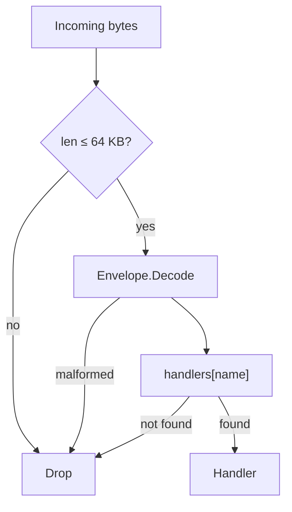
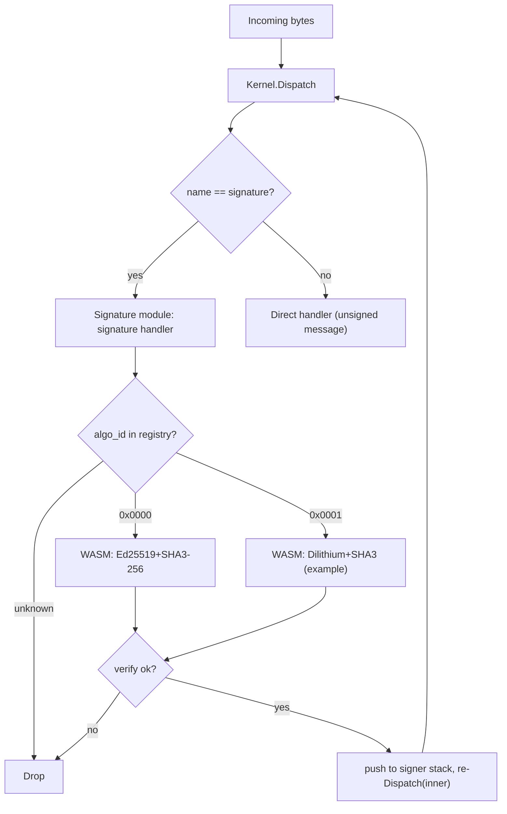

# Seed kernel: a self-bootstrapping message runtime

## 1. Vision

A minimal runtime where **everything is a message**. The kernel does one thing: parse an envelope and dispatch it to a handler registered under a **name**. Signing, authorization, capability gating, installation, and application logic are **modules** — layers that compose around the kernel like an onion. The system bootstraps from one trusted key (or no key at all, if that's what you want) into arbitrarily complex behaviour without the kernel knowing what any of it means.

Every binding is three orthogonal pieces: the **name** is the kernel's opaque dispatch key; the **bytes** are the WASM instance the kernel holds at that key; the **author** is the signer who installed it — a field in the installer's records, invisible to the kernel. The kernel is `handlers[name] → wasm_instance` plus dispatch; the signature module identifies authors; the installer binds names to bytes under a deployer-supplied **policy** that decides who may install what.

**Design principles:**

- The kernel is small enough to audit in a single sitting — one file, no cryptography, no authorization, no installation logic.
- The kernel makes one routing decision: look up the name and invoke the handler. Everything else, including how new handlers get installed, is a module concern.
- Modules form layers. Lower layers (signatures, installation) gate higher layers (apps like chat). Each layer can only see downward.
- Modules are independently usable — each is a standalone WASM module testable in isolation; nothing forces you to use them together.
- The same envelope works for tiny JSON payloads and large binary blobs.
- Cryptographic algorithms are pluggable; the kernel can survive a post-quantum transition without a protocol rewrite.
- The kernel compiles to WebAssembly so it runs anywhere.

**Layering model:**

```
┌─────────────────────────────────────────┐
│  App modules (chat, …)                  │  ← anything goes here
├─────────────────────────────────────────┤
│  Installer (+ deployer's policy)        │  ← binds names to bytes
├─────────────────────────────────────────┤
│  Signature                              │  ← identifies the author
├─────────────────────────────────────────┤
│  Kernel (envelope + dispatch by name)   │  ← one routing decision
└─────────────────────────────────────────┘
```

No layer has a hard dependency on the layer above or below it. You could replace the signature module with a different identity scheme, or run a deployment with no installer at all (handlers wired directly by the host). The onion describes a typical composition, not a required one.

---

## 1.1 Concepts at a glance

A reader's-digest mental model before the wire details:

- **Envelope.** 4-byte header + opaque `name` + opaque `payload`. The kernel's only routing decision is `handlers[name]`.
- **Name.** Opaque dispatch key. By convention `hash("seedkernel.bootstrap.v1:" + canonical)` for bootstrap handlers and free-form for app handlers — the policy (§7.4) decides what counts as a valid name for an install.
- **Handler.** A WASM module that exchanges bytes with the host through a fixed **scratch** offset in its own memory — no allocators across the boundary.
- **Signing is a wrapper, not a header field.** A signed message is an outer envelope (`name = signature`) whose payload is `(algo_id, signer, sig, inner_envelope)`. The signature handler verifies, pushes the signer, and re-dispatches the inner envelope.
- **Author** = top signer of the current dispatch. Read by handlers via `kernel.call(signature.signer, …)`.
- **Installer.** Holds `installations[name] → (author, bytes_hash, declared_caps, parent)` and accepts signed install messages. It calls a deployer-supplied **policy callback** to decide whether to honor an install; on approval it calls `SetHandler(name, instance)`.
- **Policy callback.** The only place "who is allowed to do what" is decided. The reference policy: *first install at a name — deployer chooses; subsequent install — same author plus parent points at current bytes_hash.*
- **Capability.** A declared property of an installation — which bridges this handler may reach. Stored alongside the binding in the installer's records, checked by bridges at I/O time.
- **Bridges** are `SetHandler`-installed handlers bound to one capability; they are the only code that performs real I/O.
- **Bootstrap.** Host wires the kernel, the signature module, and (optionally) the installer with its policy callback. After that, growth happens by signed install messages.

```
incoming bytes
   │
   ▼
kernel.dispatch(name) ──► handlers[name]
                            │
                            └─► kernel.call(name, payload) ──► other handler / bridge
```

**Want to see it run?** Build the WASM artifacts (see `WASM/package.json` scripts), then either run `node WASM/tests/run.mjs` for the end-to-end test + 10k-message benchmark, or serve `WASM/browser/` over HTTPS and open `chat-shell.html` in two browsers for a P2P chat demo (§12). The worked-example trace in §13 walks through the same pipeline byte-by-byte.

## 2. The Envelope

Every message shares a single envelope format. The envelope carries the bare minimum the kernel needs: a routing key (`name`) and an opaque payload. The kernel's only job is to look up the handler for the name and invoke it.

```
┌───────────────────────────────────────────────────────┐
│ magic: 2 bytes          (0x5344 — ASCII "SD")         │
│ version: 1 byte         (0x01)                        │
│ name_len: 1 byte                                      │
│ name: [var bytes]       (opaque dispatch key)         │
│ payload: [remainder of buffer]                        │
└───────────────────────────────────────────────────────┘
```

Four bytes of fixed header, then the name, then the payload runs to the end of the buffer. The total envelope (all fields) must not exceed 65,536 bytes (§2.2). `name_len` must be at least 1; a zero-length name is invalid and will be rejected by the kernel.

| Field | Size | Description |
| --- | --- | --- |
| `magic` | 2 bytes | `0x5344` — identifies a seed kernel envelope |
| `version` | 1 byte | Protocol version (`0x01`) |
| `name_len` | 1 byte | Length of the name (1–255 bytes; `0` is invalid) |
| `name` | variable | Opaque dispatch key; meaning is a convention, not a kernel concern |
| `payload` | to end | The message body — handler-defined |

The kernel does not interpret the payload. Installation, signature wrapping, capability declarations, and every other piece of structure live inside the payload of some specific name and are the concern of the handler registered for that name, not the kernel.

### 2.1 Signing is a wrapper, not a field

To sign a message, you wrap an envelope inside another envelope whose `name` is the signature module. The outer payload carries the algorithm id, signer pubkey, the signature, and the inner envelope bytes. The signature module re-dispatches the inner envelope after verifying. Wire layout and details are in §6.3.

This makes signing **opt-in per message** and **composable**: you can have unsigned messages alongside signed ones, and you can stack wrappers (e.g. encrypted-then-signed, or hybrid sigs) without ever changing the envelope format.

### 2.2 Maximum message size (64 KB)

The kernel enforces a hard upper bound of **65,536 bytes** on the total envelope (header + name + payload). The kernel rejects any buffer larger than this limit before parsing.

**Rationale.** Signature verification dominates per-message cost (§11). Capping the envelope at 64 KB bounds the worst-case data a `verify` call must process, keeping per-message latency predictable and preventing a single oversized message from stalling the pipeline. For use cases that need to reference large data (files, images, firmware blobs), the payload carries a **content hash** — the digest of the external data under the envelope's signature suite — and consumers retrieve the actual bytes from an external store. The signature still covers the hash, so integrity is preserved end-to-end; the kernel just never has to move the bulk data through its dispatch path.

This limit applies to the **outermost** envelope on the wire. For signature wrappers (§2.1), the 64 KB budget includes the outer framing, the signature fields, and the complete inner envelope. Implementations should account for wrapper overhead — ~140 bytes for Ed25519 with 32-byte SHA-3 names (4 envelope header + 32 name + 2 algo + 2 signer_len + 32 pubkey + 2 sig_len + 64 sig), larger for PQ suites — when sizing inner payloads.

The 64 KB limit is a protocol constant, not a per-deployment configuration knob. Keeping it fixed avoids interoperability splits where one node accepts messages another rejects.

**Install messages** (handled by the installer, §7) carry name, capability, and parent metadata plus a WASM module inside their payload, and so are subject to the same 64 KB cap. The reference implementation modules are well within budget (kernel.wasm ~8 KB, bootstrap.wasm ~11 KB — see §11.2). Signature suites (which may be larger, especially post-quantum suites) are installed by the same mechanism and follow the same 64 KB limit.

### 2.3 Maximum signature wrapping depth

The signature module MUST reject any `signature` envelope when the signer stack already contains `MAX_SIGNATURE_DEPTH` entries. **`MAX_SIGNATURE_DEPTH` is a protocol constant equal to `4`.**

**Rationale.** Each signature wrapper costs one verify (~95 µs for Ed25519 on a modern core). Per-wrapper overhead is ~140 bytes for Ed25519 (§2.2), so a 64 KB envelope can in principle nest ~475 wrappers. Without a cap, a single inbound message can force that many verifies (~45 ms CPU), turning a tiny attacker input into a CPU-amplification DoS. Capping depth at 4 supports realistic use cases (single-sig, hybrid Ed25519+PQ, key-rotation overlays, an attestation envelope) while keeping per-message verify cost bounded.

This limit is enforced by the signature handler reading the current signer stack length before verifying — implementations do not need a separate counter. The 4-entry cap aligns with the authorization model in §6.5: the operative authorization is always the top signer, so deeper wrappers add no semantic value the kernel can use.

---

## 3. The kernel

The kernel has one message-driven path: parse an envelope and dispatch its payload to the handler registered for the name. It also exposes `SetHandler` (§3.1) — a host-level method for directly installing or replacing any handler. `SetHandler` is the **only** install path the kernel knows about; message-driven installation, when a deployment wants it, is a handler like any other (§7).

**"Drop" semantics.** Throughout this document, **drop** means "silently ignore: no response is generated, no error is propagated to the sender." Implementations MAY log or meter dropped messages but MUST NOT return a synchronous error or surface a side-effect. The kernel never produces unsolicited responses — every reply travels in a fresh envelope under the relevant app handler's policy.

```
dispatch(bytes):
  if len(bytes) > MAX_ENVELOPE_BYTES:                 drop
  envelope = parse(bytes)
  if envelope == null:                                drop  // bad magic, version, name_len, or truncation
  if handlers[envelope.name] is null:                 drop
  handlers[envelope.name](envelope.payload)
```

A module can call another module using `kernel.call`. The kernel knows nothing about signers, authors, or capabilities — that state lives in the signature module (§6.5) and the installer (§7). Any handler that needs to know who signed the current message calls `kernel.call` to `signature.signer`.

**Single-threaded dispatch.** A kernel instance dispatches one message at a time. The signer stack (§6.5), the call-depth counter, and the caller stack (used by `kernel.caller`) are all per-instance; the host MUST NOT enter `dispatch` re-entrantly except via `kernel.call`. Concurrent inbound traffic is the host's concern — typically by serializing onto a single event loop or running independent kernel instances per worker.



### 3.1 Host-level handler management (`SetHandler`)

The kernel exposes a single method for the host to manage handlers directly:

```
kernel.SetHandler(name, handler)
```

`SetHandler` installs or replaces the handler for the given `name`. If a handler already exists for that `name`, it is replaced. If `handler` is null, the handler is removed. The kernel never holds two entries for the same `name`; replace is in-place. `SetHandler` itself returns nothing — it is a side-effecting primitive on the kernel's handler table. The reference host wraps it with a thin `host.register(name, handler) → handlerId` convenience that allocates an internal handler id (used by `host.blockFromCall`, §4.4) and then performs the underlying `SetHandler` call.

`SetHandler` is the only way handlers enter or leave the kernel's table. There is no message kind for installation, no privileged "register" path, and no protected-vs-unprotected distinction — every entry in the table arrived via the same call. Handlers installed by `SetHandler` have **no installer record**: they are invisible to the installer's tables (§7) and, in particular, the capability index (§8). The host is responsible for whatever attribution and policy it cares about; the kernel just stores the function pointer.

The capability consequence is structural: because `SetHandler`-installed handlers have no entry in the installer's records, every capability lookup against them returns the empty set, and every bridge check against them fails. This is the reason signature and any other bootstrap handler can never reach an I/O bridge — not a rule stated in any module's code, but a fact that falls out of the API surface. The installer (§7) is the only path that *populates* the capability index, and it does so for the WASM handlers it installs.

`SetHandler` is internal to the host process — it is a direct method call, never reachable from inbound messages or WASM handlers. The host controls access through its own authentication (process-level permissions, operator console, HSM, or whatever is appropriate for the deployment). The kernel does not define an access control policy for `SetHandler`; that is the host's responsibility.

The same call the host uses during bootstrap (§10) remains available afterward for emergency replacement of any handler, including bootstrap handlers like `signature` and the installer itself. Message-driven installation lives in the installer (§7); the host-level `SetHandler` path is the emergency fallback.

### 3.2 The installer (optional)

Most deployments want to install new handlers by sending signed messages, not by direct host wiring. The system provides this through an **installer**: a host-side handler that turns signed install messages into `SetHandler` calls under a deployer-supplied policy. The installer is not part of the kernel — it is one more handler the host wires via `SetHandler` during bootstrap. Frozen-config deployments simply skip it and grow no further.

The installer is described in detail in §7. Its surface is two ideas:

- **An install message** binds a `name` to WASM bytes, claiming `(declared_caps, parent)`. The author is the top signer.
- **A policy callback** decides whether to honor each install. The reference policy is in §7.4.

A signed install message reaches the installer exactly like any other signed envelope: the signature wrapper verifies, pushes the signer, and re-dispatches; the kernel routes the inner envelope to `handlers[install]`; the installer runs.

---

## 4. WASM Handler Contract

All WASM interfaces are specified as raw WASM function signatures. Any language that compiles to WASM (AssemblyScript, C#, Rust, C, Zig, Go) can implement these.

Handlers exchange messages with the host through a **scratch region** in their own linear memory. There is no allocator contract, no pointers crossing the boundary, no buffer lifetimes for the handler author to reason about — just "read input here, write output there, return the length."

### 4.1 Exports (handler must provide)

| Export name | WASM type | Description |
| --- | --- | --- |
| `memory` | linear memory | Handler's memory; the host reads input from and writes output to the scratch offset within it. |
| `scratch` | `global i32` | Byte offset into `memory` where the host places input and reads output. Set once during instantiation; the host reads it once after instantiation and the handler MUST NOT change it afterward. |
| `handle` | `(i32) → i32` | `(input_len) → output_len` — process the message at `scratch` and return the response length. |

**I/O protocol.** Before each call, the host writes the input bytes at offset `scratch` (up to the configured scratch size — default 128 KB, set per handler at instantiation). The handler reads its input from `scratch`, writes its response back at `scratch` (overwriting the input is fine), and returns the number of response bytes. Return `0` for "no response." The host reads `output_len` bytes at `scratch` after `handle` returns and does not touch the region again until the next call.

Memory outside the scratch region is the handler's private state — statics, globals, whatever allocator it wants for its own bookkeeping. None of that is exposed to the host.

### 4.2 Imports (host provides to handler)

The host exposes these under the import module `"kernel"`. These are the **only** host imports — everything else (author queries, capability lookups, logging) is accessed via `kernel.call` to the appropriate module.

| Import name | WASM signature | Description |
| --- | --- | --- |
| `call` | `(i32, i32, i32, i32) → i32` | `(name_ptr, name_len, payload_ptr, payload_len) → response_len` — synchronous dispatch to the handler registered for the given name. The four pointers are into the **caller's own memory** (anywhere the caller likes). The response is written into the caller's scratch region; the return value is the response length, or `-1` on error (no handler registered, call depth exceeded, response too large for caller's scratch). See §4.4. |
| `caller` | `(i32) → i32` | `(out_ptr) → name_len` — writes the name of the handler that invoked the current `kernel.call` into caller memory at `out_ptr` and returns its length. Returns `0` (writing nothing) when there is no parent frame — i.e. when the handler was reached by direct envelope dispatch rather than through `kernel.call`. The return is unambiguous because valid names are always at least 1 byte (§15). Primarily used by I/O bridges (§9) to identify the caller for capability checks. |

### 4.3 Sandboxing

- Handlers have **no** filesystem, network, or clock access.
- Memory is bounded by what the handler's WASM module declares (and ultimately by the host engine's own memory limits); the kernel imposes no per-handler memory cap of its own.
- A handler can only affect the outside world by `kernel.call` to other handlers. Bridges (handlers that perform real I/O) additionally require the calling handler to have declared the bridge's capability at install time (§7.2, §8). The default is no capabilities; every declaration is explicit at install time.

> **Compute exhaustion is the host's problem.** WebAssembly engines on the JavaScript platform expose no native fuel/timeout mechanism, so this protocol does not specify one. Deployers concerned about runaway handlers should run dispatch in a Worker with a watchdog, or pre-validate handler bytecode in the installer's policy callback (forbid loops above a budget, recursion, etc.) before installing. The kernel exposes the call-depth bound (§4.4) but does not bound per-handler execution time.

### 4.4 Synchronous cross-module calls (`kernel.call`)

`kernel.call` performs a synchronous dispatch to the handler registered for the given `name`. The host wires the two handlers together by copying through their scratch regions:

1. Host reads `name_len` bytes from caller memory at `name_ptr`, and `payload_len` bytes at `payload_ptr`. (These pointers are into caller memory — anywhere the caller put them; they do not need to be in scratch.)
2. Host looks up the target handler. If none is registered, returns `-1`.
3. Host writes the payload bytes into the target's scratch region and calls `target.handle(payload_len)`.
4. Target reads input, writes response at its own scratch, returns `response_len`.
5. Host reads `response_len` bytes from the target's scratch and writes them into the caller's scratch region.
6. Host returns `response_len` to the caller. The caller reads its response from its own `scratch` offset.

**Semantics:**

- The callee sees raw payload bytes at its scratch — there is no envelope wrapping. Routing is by `name` only.
- The callee cannot distinguish an inbound envelope from a `kernel.call`. It sees input at scratch and writes output at scratch.
- Calls are **re-entrant**: A can call B can call C. The host enforces a maximum call depth (default 8); exceeding it returns `-1`.
- **The caller's scratch is overwritten when the callee returns a non-empty response.** A handler that still needs its original input across a `kernel.call` must copy it into private memory before calling — assume the worst, since any response overwrites scratch unconditionally. When the callee returns no bytes (return value `0`), the caller's scratch is left untouched, so callers MUST NOT rely on `kernel.call` to clear scratch. If a handler holds secrets in scratch and needs them cleared regardless of callee behaviour, it must zero scratch itself.
- If the callee's response exceeds the caller's scratch size, the host returns `-1` and writes nothing. Tune scratch size per handler if you expect large responses.

**Mutating handlers are not callable via `kernel.call`.** Any handler that mutates kernel or installer state — i.e. that calls `kernel.SetHandler`, registers a signature suite, or modifies the installer's records — MUST cause `kernel.call` to return `-1` *before* the target handler is invoked. The check belongs at the call router (the host's `kernel.call` import), not inside the handlers; without it, an in-handler `kernel.call` could mutate state under the current top signer's authority without that signer's intent. These handlers run only at top-level dispatch, where the signature wrapper has already verified the outer signature. Read-only queries (`signature.signer`, `installer.lookup`, `installer.caps_of`) remain freely callable.

The reference host auto-blocks the two bootstrap mutating handlers (`signature` and `install`). Deployer-added mutators MUST be marked blocked via `host.blockFromCall(handlerId)` immediately after `host.register`.

**Replay protection (mandatory for state-mutating handlers).** Every mutator that acts under the top signer's authority — `install` and any deployer-added equivalent — MUST consume a `u32` big-endian sequence number as the *first* field of its payload and MUST drop the message if `seq <= last_seen[(signer.algoId, signer.pubkey)]`. The seq check MUST run before any state mutation; cheap-drop checks MAY run first to avoid polluting the seq table with messages that would have been refused anyway. The high-water mark is per-signer-per-handler and **persists across deny-listing or other policy changes** (tombstone-forever) — re-admitting a previously-denied signer MUST NOT rewind their sequence, or pre-denial wire bytes could be replayed after the re-admission. Senders pick strictly increasing seqs (gaps are fine); on counter loss, jump forward conservatively.

The `signature` wrapper is on the blocklist but consumes no `seq`: it does not act under any signer's authority — it *establishes* the top signer — and its push/pop of the signer stack leaves no persistent state to replay. The two protections target different threats: `seq` cuts off wire replay of authorized mutations; the blocklist cuts off in-pipeline corruption of kernel state.

### 4.5 Memory model

There is no allocator contract and no pointer ownership to track. Every buffer that crosses a boundary lives in the scratch region of one module and is copied by the host into the scratch region of another (or to/from the transport). The host never holds a pointer into a handler's memory across a return into that handler, and never writes outside its scratch region.

What this rules out:

- No allocator to implement, no `alloc` export, no free, no recycling.
- No pointer-lifetime mistakes — the only buffer the host touches is at a known fixed offset and gets fully overwritten on the next call.
- No shared memory between modules; every cross-module byte is a host-mediated copy.
- A buggy or malicious handler can corrupt only its own scratch and its own private memory. It cannot corrupt the host, another handler, or the kernel.

The one rule a handler author has to internalize is the one in §4.4: a `kernel.call` overwrites your scratch with the response. If you still need the input, copy it first.
> **Note.** Signature suite modules (§6.6) are the one exception to this contract. A suite has multi-argument primitives (`hash(data)`, `verify(pubkey, sig, data)`) that don't fit the single-buffer scratch model cleanly, so the suite contract uses an explicit `alloc` and pointer arguments. Suite authors are crypto specialists writing thin wrappers around existing libraries; the small extra ceremony is acceptable in that niche.
---

## 5. Layering and composition

Modules form an onion. Each layer wraps the layers above it and depends only on the layers below.

```
┌──────────────────────────────────┐
│   App modules                    │
│   (chat, …)                      │
│                                  │
│   handlers dispatched normally   │
├──────────────────────────────────┤
│   I/O bridges (optional)         │
│   (net, ui, fs, clock, …)        │
│                                  │
│   SetHandler-installed           │
│   caller-capability checked      │
├──────────────────────────────────┤
│   Installer (optional)           │
│                                  │
│   parses install messages        │
│   runs policy callback           │
│   holds (author, bytes_hash,     │
│         caps, parent) records    │
├──────────────────────────────────┤
│   Signature                      │
│                                  │
│   signature wrapper              │
│   signer stack                   │
├──────────────────────────────────┤
│   Kernel                         │
│                                  │
│   envelope parsing               │
│   dispatch by name               │
└──────────────────────────────────┘
```

### 5.1 Modules in the reference implementation

A one-line per layer index — full details live in §6 (Signature), §7 (Installer), §8 (Capabilities), §9 (Bridges), and §12 (App examples).

| Layer | Modules | What lives there |
| --- | --- | --- |
| **1: Signature** | Signature | Algorithm suites, signer stack, wrapper verification. |
| **2: Installer** | Installer | The install message handler, the install records, the policy callback. Also where the capability index lives, since caps are a property of installs. |
| **2.5: I/O bridges** | Deployer-defined (`net.send`, `ui.write`, `fs.read`, `clock.now`, …) | The only code that performs real I/O. `SetHandler`-installed, one capability each. |
| **3: App modules** | Chat (example) | User-facing handlers installed via signed install messages. |

Each module is in its own file and can be used standalone — the signature module is testable without a kernel, the installer is testable without bridges, and chat is just a handler testable without signatures. All inter-module queries go through `kernel.call` to the target module's name (e.g. `signature.signer`, `installer.lookup`, `installer.caps_of`).

**The hash function used for id derivation.** Throughout this section, `hash(…)` means the **genesis suite's hash** (§6.2) — the only hash function guaranteed to exist at boot. In the reference implementation that is SHA-3-256 (32-byte output). A deployment that swaps genesis suite swaps the hash: every derived `name` and `cap_id` shifts, so the bootstrap seeds in §10 must be re-derived. Pick the genesis suite once and treat it as a deployment-wide constant.

**Naming convention for bootstrap handlers:** `name = hash("seedkernel.bootstrap.v1:" + canonical_name)`. There is no installer record to mix in — these handlers are seeded by the host via `SetHandler` (§3.1), not by a signed message.

**Naming convention for app handlers:** free-form within whatever the policy approves. The reference policy (§7.4) places no constraint on names beyond uniqueness — first installer at a name owns it, and only that author can update it. Deployers who want author-scoped namespaces (so two parties can each have their own `chat` without conflict) can require names of the form `hash(canonical || author_pubkey)` in their policy callback. The kernel is indifferent.

---

## 6. The signature module

This is where pluggable signatures live. The signature module maintains a registry of **algorithm suites** identified by `algo_id` and owns the `signature` name — a wrapper format that lets any envelope be signed.

### 6.1 Algorithm suite

An algorithm suite is a bundle of:

| Operation | Purpose | Example (suite 0x0000) |
| --- | --- | --- |
| `hash(data) → bytes` | Produce a name from a canonical string | SHA-3-256 → 32 bytes |
| `verify(pubkey, signature, data) → bool` | Verify a message signature | Ed25519 |

Each suite declares fixed sizes (key length, sig max length, hash length) used for sanity-checking the wrapper payload. Signing is a sender-side operation and lives in the host (no WASM export — see §6.6).

### 6.2 The Genesis suite (algo_id = 0x0000)

The signature module needs *something* to verify the very first message. By convention:

- **algo_id 0x0000** = Ed25519 + SHA-3-256
- It is delivered as a **separate WASM module** (e.g. libsodium compiled to WASM), loaded at boot time.
- The host trusts it **by hash** — the expected SHA-3-256 hash of the genesis WASM module is the one cryptographic constant in the bootstrap configuration.
- It can never be removed, but it **can be superseded** for all new messages by registering a new suite (§6.4).

The kernel itself does not know about a genesis suite. The hash is held by the host's bootstrap code, which inserts the suite into the signature module's registry before any messages are dispatched.

During a PQ migration, Ed25519 is typically the **outer** wrapper and the new PQ suite is the **inner** one. See §6.5 (wrapping convention).

### 6.3 The `signature` wrapper

Signing is a wrapper message. To send a signed inner envelope, build the inner envelope as normal, then wrap it:

```
outer envelope:
  name          = signature name id
  payload       = [ algo_id:     2 bytes (u16)            ]
                  [ signer_len:  2 bytes (u16)            ]
                  [ signer:      var bytes (public key)   ]
                  [ sig_len:     2 bytes (u16)            ]
                  [ signature:   var bytes                ]
                  [ inner_envelope: remainder of payload  ]
```

The inner envelope is a complete envelope — including its own magic, version, name, and payload.

The signature is computed over `inner_envelope` — the raw bytes of the inner envelope, including its own framing. Re-enveloping (relaying) is lossless: the inner bytes don't change, so the signature remains valid.

After verification, the inner envelope re-enters the pipeline and dispatches normally. The signature module registers a single handler for `signature`; that handler's verify-time flow is:



Unknown `algo_id`s drop because the suite was never registered (§6.4); only suites in the registry can be verified against.

### 6.4 Registering new algorithms

New signature suites are installed via the normal installer path (§7). To register a new suite, send a signed install message whose target name is the conventional suite slot `hash("seedkernel.signature.suite." + algo_id_hex)` and whose WASM body implements the suite contract (§6.6). The signature module reads from these slots when looking up suites by `algo_id`, so an install at the right name is all that's required.

The deployer's policy callback (§7.3) governs who may register suites — the same callback that governs every other install. There is no separate "trust for signature.register" path; "may this signer install at the suite slot for `algo_id N`?" is just a policy question. The reference policy's first-install/same-author rule (§7.4) applies: the first installer at a suite slot owns it and is the only author who can replace its WASM later.

Once a new suite is registered, messages signed under it should be wrapped per §6.5: the new suite is the **innermost** signer (the operative authorizer); legacy-suite wrappers go on the outside.

**Duplicate registration.** The reference policy's same-author requirement prevents a different signer from replacing a suite once installed. To rotate a suite, deployers allocate a new `algo_id` and install at the new slot. The genesis suite (`algo_id 0x0000`) is seeded by host-side `SetHandler` at bootstrap and cannot be replaced through the installer at all — the installer refuses replacement of slots seeded by `SetHandler` (§7.4). Emergency replacement of the genesis suite uses `SetHandler` directly, like any other host-side intervention.

**Lazy validation.** The signature module does not verify that the bytes at a suite slot actually implement the suite contract at install time. If the bytes don't export `verify`, the first message signed under that `algo_id` fails verification and drops. This is intentional — schema/interface checking is the installer policy's job if a deployment cares (it can validate exports before approving), and the security-relevant path (verify failure → drop) is fail-safe regardless.

### 6.5 Signer stack (signature module internals)

The signature module maintains a **signer stack** — an internal list that tracks which keys have been verified during the current top-level dispatch. The kernel doesn't know it exists.

**Lifecycle.** Every accepted `signature` wrapper pushes one entry, executes the inner dispatch synchronously, and pops on return. Stack depth therefore equals the number of nested `signature` wrappers active at the current point in the pipeline, capped at `MAX_SIGNATURE_DEPTH` (§2.3).

```
signature-envelope  (algo = Ed25519,  signer = A)        ← outer
  └─ signature-envelope  (algo = Dilithium, signer = B)  ← inner
       └─ inner envelope  (the actual message)

stack while the actual message handler runs: [A, B]   (A pushed first, B on top)
```

**Query API — `signature.signer`.** Any handler may call `kernel.call(signature.signer, …)` to read the current stack. The query handler ignores its payload (zero bytes is canonical) and returns `[count u8] [algo_id u16][pubkey_len u16][pubkey ..]*` in push order — outermost signer first, top signer last. Empty stack returns `[0x00]`. `pubkey_len` is u16 big-endian so post-quantum suites with multi-kilobyte public keys (e.g. ML-DSA) fit without truncation. The stack is scoped to the *top-level* dispatch, so nested `kernel.call` frames see exactly the same answer; the question "who signed the message that caused this chain of calls?" is well-defined everywhere in the chain.

**Author = top signer.** When the installer (§7) or any other handler asks "who is the author of this dispatch," the answer is the **top** (innermost) signer. Outer wrappers attest but do not lend authority: if A wraps B's envelope, the action is B's intent; A's wrapping is part of the audit trail, not part of the authorization. Application handlers reading `signature.signer` may apply any policy they like (e.g. require *all* signers to satisfy some property); only the installer's reference policy is top-only.

**PQ wrapping convention.** Whichever algorithm is operative MUST be the **innermost** wrapper. A PQ rollout signs PQ first and optionally wraps Ed25519 on top: every layer still has to verify (so a break in either algorithm fails the message), but authorization sits with PQ. Inverting the order would silently downgrade authorization to Ed25519.

### 6.6 Suite WASM contract

A signature-suite module installed via the installer (§6.4) MUST export the following. This is the one place in the protocol where a handler exposes more than the standard scratch ABI (§4) — a suite has multi-argument primitives that don't fit a single-buffer model, so it provides an explicit allocator and pointer arguments instead.

| Export name | WASM signature | Description |
| --- | --- | --- |
| `memory` | linear memory | Suite's memory; the host copies pubkey / sig / data into it before calling `verify`. |
| `verify` | `(i32, i32, i32, i32, i32, i32) → i32` | `(pubkey_ptr, pubkey_len, sig_ptr, sig_len, data_ptr, data_len) → 1 if valid` |
| `alloc` | `(i32) → i32` | `(size) → ptr` — allocate memory the host writes into before calling `verify` / `hash` |
| `hash` *(optional)* | `(i32, i32, i32) → i32` | `(data_ptr, data_len, out_ptr) → hash_len` — only used if the host routes id derivation through the suite. The reference host hashes directly via its bundled libsodium (§5.1) and never calls suite `hash`, so genesis suites can omit it; non-genesis suites may export it for hosts that do. |
| `dealloc` *(optional)* | `(i32) → void` | Counterpart to `alloc`. The reference host pre-allocates suite scratch once and reuses it, so `dealloc` is rarely called; suites may omit it. |

The signer-query schema (`signature.signer`) is described in §6.5 — it is exposed by the signature module itself, not by suite modules.

---

## 7. The installer module

The installer accepts signed install messages, runs a deployer-supplied policy callback to decide whether to honor them, and on approval calls `SetHandler(name, instance)`. It also holds the records that make `caps_of` and `lookup` queries possible.

### 7.1 Install records

The installer maintains one table:

```
installations[name] → {
  author:         (algo_id, pubkey)
  bytes_hash:     content hash of this install (the entire install payload)
  declared_caps:  list of cap_ids the handler may reach via bridges
  parent:         bytes_hash this install claims to supersede (empty if none)
  seq_high_water: per-(algoId, pubkey) replay protection counters
}
```

`bytes_hash` is the genesis-suite hash (§6.2) of the **entire install payload** — `seq`, `name`, declared caps, claimed parent, and the WASM body. The installer computes it directly from the inbound bytes; sender claims are never trusted. Hashing the whole payload makes `bytes_hash` a unique identifier for that specific signed install message: two republishes of the same content at different `seq` values produce distinct hashes, so a `parent` claim always points at exactly one historical wire message rather than at "any of N messages with the same content." Because `parent` is itself inside the hashed region, each version's `bytes_hash` transitively commits to its predecessor, and a name's current `bytes_hash` is in effect a Merkle root over its entire lineage. `parent` is metadata — the installer records it but does not require the parent bytes_hash to currently be installed (lineage chains are auditable from the bytes, not enforced at install time). The chain is singly-linked: only the immediate predecessor is recorded, so the deeper history is reconstructed by walking past install messages, not from the current record alone.

`SetHandler`-installed handlers have **no row** in this table. The capability index for them is therefore empty (§8.3), and they have no author of record. The host owns whatever metadata it cares about.

### 7.2 The install message

Signed install messages target `name = hash("seedkernel.bootstrap.v1:install")`. The payload:

```
install payload:
  seq:           4 bytes (u32 big-endian)         (§4.4 replay protection)
  name_len:      1 byte
  name:          var bytes                         (the name to bind)
  caps_count:    1 byte                            (0 = no capabilities requested)
  caps:          caps_count × [cap_id_len u8][cap_id: var bytes]
  parent_len:    1 byte                            (0 = no claimed predecessor)
  parent:        var bytes                         (parent_len bytes; predecessor's bytes_hash)
  wasm:          remainder
```

A `caps_count` of `0` means the handler is pure computation — no bridge access of any kind. `cap_id` is opaque to the installer; by convention `hash("seedkernel.cap.v1:" + name)` using the genesis suite's hash. A `parent_len` of `0` means the install does not claim a predecessor — typical for the first version of a handler at a new name. When non-zero, `parent` is exactly the predecessor install's recorded `bytes_hash` — the genesis-suite hash (§6.2) of that earlier install's full payload (see §7.1 for what the hash covers) — and `parent_len` is the genesis suite's hash output length (32 bytes for the default SHA-3-256 suite). Senders typically obtain it from `installer.current_of` (§7.6), which returns the current `bytes_hash` in exactly the form to copy into `parent`; the reference policy's `existing.bytes_hash == parent` check is byte-for-byte equality on those hash bytes, so a mismatched length is a guaranteed drop.

When invoked, the installer:

1. Reads the top signer (the *author* of this install). If the stack is empty, drop — installs must be signed.
2. Parses the payload. Drop on malformed.
3. Computes `bytes_hash = genesis_hash(install_payload)` — the hash of the entire install payload, every byte from `seq` through the end of `wasm`. See §7.1 for the rationale (full content commitment, unique per signed install).
4. Consumes the `seq` and updates the per-`(algoId, pubkey)` high-water mark. Replays (`seq <= last_seen`) drop here, before any further state mutation.
5. Calls the deployer-supplied **policy callback** `approveInstall(name, author, bytes_hash, declared_caps, parent, existing_record_or_null) → bool`. If no callback is wired or it returns false, drop. With no callback wired, every install is dropped — installation is opt-in for the deployment.
6. Instantiates the WASM module against the host's handler ABI (§4) and calls `SetHandler(name, instantiatedHandler)`.
7. Writes the install record to `installations[name]`.

The order is deliberate: cheap parse checks first; replay protection before the policy callback (so a denied policy doesn't leave a polluted seq table); the policy callback runs against the *resolved* state (with `bytes_hash` already computed and any existing record fetched), so the policy never has to do that work itself.

### 7.3 The policy callback

The callback is the entire authorization story. It receives everything relevant:

- `name` — the name the install is targeting
- `author` — `(algo_id, pubkey)` of the top signer
- `bytes_hash` — the content hash of the WASM about to be installed
- `declared_caps` — the capabilities the handler claims it needs
- `parent` — the predecessor this install claims (empty if none)
- `existing_record_or_null` — the current installation at `name`, if any

It returns `true` to proceed with the install or `false` to drop. That is the full interface.

Deployers wire whatever policy fits their environment. Some examples:

- **Open registry.** `return true;` — anyone may install at any name. Useful for testing; obviously not appropriate for a production deployment with untrusted senders.
- **Author-allowlist.** `return author ∈ approved_keys;` — a fixed set of keys may install anything anywhere.
- **Reference policy.** `existing == null ? deployer_first_install(...) : (author == existing.author && existing.bytes_hash == parent);` — see §7.4.
- **Content-hash allowlist.** `return bytes_hash ∈ approved_hashes;` — only pre-audited binaries.
- **M-of-N quorum.** `return signature.all_signers().count(s => s ∈ approved_keys) ≥ M;` — requires reading the full signer stack rather than just the top signer.
- **Capability-restricted authors.** `return (declared_caps ⊆ allowed_caps[author]);` — different signers may install handlers with different capability profiles.

The callback may be arbitrarily expensive — the installer dispatches one install at a time and the policy decision is on the install hot path, but it is not on the message-dispatch hot path. A callback that consults an operator console or HSM is fine.

### 7.4 Default reference policy

The reference installer ships with a default policy that is easy to explain and behaves well under casual use. Two rules:

1. **First install at a name:** the deployer's choice. The reference implementation exposes a `firstInstallPolicy(name, author, bytes_hash, declared_caps)` sub-callback that the deployer wires. Common values are:
   - An author allowlist (closed registry — only specified keys may claim new names).
   - A naming-convention check (e.g. names must be of the form `hash(canonical || author_pubkey)`, structurally proving the author claimed the name for themselves).
   - `return true` (open registry).
2. **Subsequent install at the same name:** the install must be signed by the existing author and must claim the current `bytes_hash` as its parent. In code:
   ```
   return author == existing.author && existing.bytes_hash == parent
   ```

   The strict `parent == existing.bytes_hash` form is the reference choice, not a protocol requirement. Every install flows through `approveInstall`, so a deployer who wants to permit gaps — accepting any ancestor in the name's lineage so a node that missed an intermediate install can still upgrade, or skipping the parent check entirely — encodes that in the callback. The lineage stays signed-and-auditable either way; the policy decides how tight the parent claim has to be.

These two rules give you everything you'd usually want without any extra machinery:

- **Squat-resistant.** Once an author has bound a name, no one else can take it over — their install fails rule 2.
- **Upgrades just work.** The author installs a new version, sets `parent = current_bytes_hash`, signs with the same key. All conditions are met; the binding updates in place.
- **Lineage is verifiable.** The chain of `parent → previous bytes_hash` across a name's history is a singly-linked, signed hash chain. Given the full series of install messages, anyone can walk it from the current version back to genesis. A node that never saw an intermediate install lacks the bytes_hash of that link and cannot bridge past the gap on its own — it sees only the current record's immediate parent.
- **Forks are explicit and non-hostile.** Anyone may install their own fork at a *different* name with `parent = your_bytes_hash`. The chain shows the relationship; no one had to assert anything special.
- **Delegation is just an upgrade.** To hand a name over, the current author installs a new version whose handler treats some other key as the relevant authority going forward, and (optionally) the installer records the new author. The kernel doesn't care; the install record is the source of truth.
- **Slots seeded by `SetHandler` are refused.** If there is no record for `name` but `kernel.handlers[name]` is non-null, the slot was seeded via host-side `SetHandler` (a bootstrap entry like the signature handler). The installer refuses to overlay it. To replace such a slot, the host uses `SetHandler` directly.

The reference policy is one specific way of saying "trust the original author." Deployments with different needs — quorum-controlled production registries, content-hash allowlists, delegation hierarchies — replace `firstInstallPolicy` or the whole callback. Everything else in the system behaves the same.

### 7.5 Revocation

There is no separate revocation cascade. Revocation is something the policy expresses, plus a small mechanism the installer exposes for undoing previous installs.

**Removing an install.** The installer exposes `installer.remove(name)` as a host-side method (callable by the host directly, not via messages — like `SetHandler`). It clears `installations[name]` and calls `SetHandler(name, null)`. Used by operators for emergency cleanup or by message-driven revocation handlers a deployer chooses to add.

**Message-driven revocation.** A deployer who wants signed messages to be able to revoke installs adds a `revoke` handler that:

1. Identifies the author (top signer).
2. Decides — through its own logic, which the deployer writes — whether this author is permitted to revoke this name. The reference suggestion: only the install's current author may revoke it; in trust-chain-like deployments, an ancestor authority may revoke a descendant's installs.
3. Calls `installer.remove(name)` on approval.

**Post-revocation behaviour.** Removing an install clears the slot. Anyone may then re-install at the same name under rule 1 of the reference policy, or the deployer's policy can maintain a deny-list to prevent specific bytes_hashes or specific authors from reclaiming. The kernel doesn't enforce permanence; the policy callback does, if a deployment wants permanence.

### 7.6 Query handlers

The installer exposes read-only queries via `kernel.call`:

| Name | Payload | Response |
| --- | --- | --- |
| `installer.lookup` | `[name_len u8][name ..]` | `[0]` if not installed, else `[1] [algo_id u16][pubkey_len u16][pubkey ..] [hash_len u8][bytes_hash ..] [parent_len u8] [parent_hash ..]` (`parent_len = 0` means no parent) |
| `installer.caps_of` | `[name_len u8][name ..]` | `[count u8] [cap_id_len u8][cap_id ..]*` — declared caps; `[0]` for unknown or `SetHandler`-installed slots |
| `installer.current_of` | `[name_len u8][name ..]` | `[hash_len u8][bytes_hash ..]` — the current bytes_hash, used by clients constructing upgrade installs to fill in `parent`; `[0]` for unknown |

These are the standard surface bridges and app modules use to read installer state. The mutating handler (`install`) is on the `kernel.call` blocklist (§4.4); the queries above are not.

---

## 8. Capabilities

Capabilities are a property of *installed handlers*. The installer records them at install time alongside author and bytes_hash; bridges check them at I/O time. There is no separate capability module — the data lives in the installer's records, accessed via `installer.caps_of`.

### 8.1 Caps as install-record fields

`declared_caps` rides along with every install (§7.2). It is set once when the policy callback approves and cleared when the install is removed. The policy is the only place where "should this handler be allowed to claim these caps?" is decided — the same callback that decides "should this install be honored at all?" sees the cap list and can refuse on that basis.

A handler that wants additional caps later must reinstall (under the reference policy, that means: the same author signs a new install at the same name with the larger cap list, claiming the current bytes_hash as a parent). The policy callback gets to refuse the upgrade if the new caps are too broad.

### 8.2 Bridge check pattern

Every bridge begins with the same preamble:

```
caller_name = kernel.caller()
caller_caps = kernel.call(installer.caps_of, caller_name)
if my_cap_id ∉ caller_caps: return -1
# ...perform I/O, or enqueue request and return correlation id for async...
```

**`kernel.caller()` is not an author.** It returns the *name* of the handler that invoked the current `kernel.call`, not a key. A bridge whose policy depends on the **author** (rather than on which handler was called) MUST additionally consult `signature.signer`. The two answer different questions: `kernel.caller` answers "which handler is asking me to do this?" and `signature.signer` answers "whose signed message kicked off this chain?". Most bridges only need the former, since capabilities are attached to handlers (via the install record's `declared_caps`), not to keys directly.

### 8.3 Structural sandbox invariant

`SetHandler`-installed handlers have no install record. `installer.caps_of` returns `[0]` for them. Every bridge check against them therefore fails. Signature and any other bootstrap handler cannot reach any bridge — not because of a rule in their code, but because they have no cap entry to match. This is the structural reason why a compromised bootstrap handler still can't open a socket.

---

## 9. I/O Bridges

A bridge is a `SetHandler`-installed handler bound to one capability. Bridges are the only code in the system that performs real I/O; everything else is pure computation inside the WASM sandbox.

Every bridge runs the preamble in §8.2 before performing I/O.

Bridges are deployer-defined. The installer does not care about their semantics — the policy callback gates whether handlers may declare bridges' capabilities, and bridges themselves gate per-call access. Illustrative examples:

| Bridge name | Capability | Payload shape | Host action |
| --- | --- | --- | --- |
| `net.send` | `net` | `[addr_len u8][addr][bytes ..]` | open/reuse socket, send |
| `ui.write` | `ui` | `[channel_len u8][channel][bytes ..]` | enqueue on UI event bus |
| `fs.read` | `fs` | `[path_len u8][path ..]` | read file, return bytes |
| `clock.now` | `clock` | (empty) | return u64 unix ms |

Inbound I/O (packets, UI events, timer ticks) re-enters the kernel via the normal envelope pipeline; from a handler's perspective, an inbound message is indistinguishable from any other dispatched one.

**Async bridges** use paired envelopes: the bridge returns a correlation id immediately, and the host later delivers the result as a fresh envelope addressed to the originating handler. This keeps bridge handlers synchronous and avoids blocking the event loop in browser hosts.

---

## 10. Bootstrap Sequence

Bootstrap is the host's job, not the kernel's. The host instantiates the kernel and the two modules, then composes the onion.

```mermaid
sequenceDiagram
    participant Host as Host
    participant K as Kernel
    participant SIG as Signature Module
    participant INS as Installer

    Note over Host: === Layer 0: Kernel ===
    Host->>K: new Kernel()

    Note over Host: === Layer 1: Signature ===
    Host->>SIG: new SignatureModule()
    Note over Host: 1. Load genesis signature suite (verified by hash).
    Host->>SIG: RegisterSuite(genesisSuite)  // algo 0x0000
    Note over Host: 2. Set the signature wrapper handler AND the signer-query handler.
    Host->>K: SetHandler(signatureName, sig.SignatureHandler)
    Host->>K: SetHandler(signatureSignerName, sig.SignerQueryHandler)

    Note over Host: === Layer 2: Installer (optional) ===
    Host->>INS: new Installer(kernel)
    Host->>INS: approveInstall = (name, author, bytesHash, caps, parent, existing) => ...
    Note over Host: The reference policy (§7.4) is the default; deployers override.
    Host->>K: SetHandler(installName, ins.Handler)
    Host->>K: SetHandler(installerLookupName, ins.LookupQuery)
    Host->>K: SetHandler(installerCapsOfName, ins.CapsOfQuery)
    Host->>K: SetHandler(installerCurrentOfName, ins.CurrentOfQuery)
    Note over Host: With no installer wired, the deployment is frozen — no message-driven installs.
    Note over Host: With it wired but no approveInstall callback, every install is dropped.

    Note over Host: === Layer 2.5: I/O bridges (optional, deployer-defined) ===
    Host->>K: SetHandler(netSendName, host.NetSendBridge)
    Host->>K: SetHandler(uiWriteName, host.UiWriteBridge)
    Host->>K: SetHandler(fsReadName, host.FsReadBridge)
    Note over Host: Bridges are native host code, not WASM. Each is bound to one capability.

    Note over Host: === Layer 3: App modules (optional) ===
    Note over Host: Chat (and any other app modules) are installed via signed install messages.
```

The kernel's role in this sequence is: store handlers and dispatch messages. Everything else — author identification, install records, policy gating, capability bookkeeping — is the host wiring modules together. Signature verification happens once at the `signature` entry point. The installer turns signed install messages into `SetHandler` calls and records each install's metadata so bridges can authorise their callers at I/O time. App modules above layer 2 are installed by sending signed messages addressed to the installer.

### 10.1 Post-bootstrap replacement

The `SetHandler` calls during bootstrap are not special bootstrap-only operations. The same `kernel.SetHandler(name, handler)` method (§3.1) remains available to the host after bootstrap. If a bug is found in the signature module, the installer, or any other bootstrap handler, the host can replace it at any time:

```
kernel.SetHandler(signatureName, patchedSignatureHandler)
```

This does not depend on the message pipeline — the host calls it directly, bypassing `signature` and the installer. This is deliberate: if the component you need to fix is the one that verifies messages, no signed message can authorize the fix. The host controls access to `SetHandler` through its own security model (process-level permissions, operator console, HSM, or whatever is appropriate for the deployment).

**Message-driven replacement of bootstrap handlers.** The installer handles new installs of *app* handlers under its policy. Replacing a *bootstrap* handler (signature, installer itself) is a different threat model — the reference policy refuses to install over a slot that was seeded via `SetHandler` precisely because that's how bootstrap handlers arrive. Deployers who want signed-message authority to swap a bootstrap handler can wire a separate `bootstrap.replace` handler after bootstrap, with whatever authorization rules fit (single root key, M-of-N quorum, etc.). It is treated like any other mutating handler — added to the `kernel.call` blocklist (§4.4), gated by signature verification at top-level dispatch.

The host-level `SetHandler` path remains available regardless as the emergency fallback for cases where the message pipeline itself is compromised.

---

## 11. Performance

Benchmarks verify 10,000 signed messages (Ed25519, genesis suite) through the full kernel pipeline vs. a plain signature-verify baseline. Each message is a `signature` wrapper around a `chat.text` inner envelope (~221 bytes on the wire).

### 11.1 Kernel pipeline vs. raw verify

Measured in Node.js with `performance.now()` on an AMD Ryzen 7 PRO 7840U. The kernel and signature/installer are separate `.wasm` modules (AssemblyScript). A JavaScript host orchestrates both and provides Ed25519 via libsodium (also WASM). Each signed message crosses 7 WASM boundary crossings and ~6 memory copies.

| Method | Node.js |
|---|---|
| Kernel pipeline (decode + verify + dispatch) | 834 ms (~83 µs/msg) |
| Plain Ed25519 verify only | 810 ms (~81 µs/msg) |
| **Overhead** | **~2.9%** |

The Ed25519 verify dominates. The per-message sandbox tax pays for: host→kernel.wasm (parse envelope, find handler), kernel.wasm→host (invoke_handler callback), host→signature.wasm (parse signature wrapper), signature.wasm→host (ed25519_verify), host→kernel.wasm (dispatch inner), kernel.wasm→host (invoke_handler for inner handler), host→signature.wasm (pop_signer).

Collapsing the previous version's trust + capability + install machinery into a single installer module (with capability data folded into install records) means fewer cross-module queries on the install hot path, but installation is not on the message hot path, so the overhead ratio for the steady-state pipeline is unchanged from the previous baseline.

### 11.2 Distribution Size

| Component | Size |
|---|---|
| kernel.wasm | 6 KB |
| bootstrap.wasm (signature + trust table) | 12 KB |
| host/*.js (host orchestration) | 69 KB |
| libsodium.wasm (Ed25519 + SHA-3-256, default genesis suite) | ~350 KB |
| **Total deployment with default genesis suite** | **~380 KB** |

The kernel and signature/installer modules are pure protocol logic — no cryptographic code — and together come to ~18 KB of WASM. The `host/*.js` host layer orchestrates both WASM modules, wires bootstrap, and provides the `kernel.call` import. libsodium is the host's choice of default genesis suite, not part of the protocol; a different deployment could swap in any suite that satisfies §6.6. A future post-quantum suite installed at a new suite slot (§6.4) would be a larger module because it bundles its own algorithm implementation.

---

## 12. Example app layer: chat (`chat-shell.html`)

Chat is the simplest possible app module: a single handler installed at a `chat.text` name. After the signature+installer layer is bootstrapped, the application handler itself is trivial — it receives a verified, dispatched envelope and does whatever it wants with the payload.

`WASM/browser/chat-shell.html` is a runnable end-to-end demo of the whole stack: a browser shell that owns only the kernel, the signature module, the installer, a WebRTC transport, and a sandboxed iframe — every byte of chat UI and logic arrives as a signed WASM artifact installed at runtime.

On load it generates an Ed25519 identity, instantiates `kernel.wasm` + the signature/installer module, and wires a permissive first-install policy that approves installs signed by the local identity. The user then picks a chat app from a dropdown (`v1 — text only`, `v2 — text + image + nick`), the shell signs the corresponding WASM artifact under the local key, sends it to the installer, and the policy callback approves it — the same pipeline the protocol describes for any signed install. Upgrading from v1 to v2 is an install at the same name with `parent = v1_bytes_hash`, signed by the same key — the reference policy approves it without further intervention.

Peers connect via WebRTC using a perfect-negotiation mesh: either directly through the **Invite** / **Accept** tabs (copy-paste an SDP blob, no server involved), or via an optional signaling relay (`scripts/relay.mjs`) configured from the **Network** tab. Once a data channel is open, binary frames over it are raw kernel envelopes — `host.dispatch` is called with the bytes verbatim, signatures verify against the peer's pubkey, and the inner `chat.text` (or v2 name) envelope routes to the installed handler. String frames on the same channel are reserved for transport-level renegotiation between that pair. A `Start call` button additionally negotiates audio/video tracks over the same `RTCPeerConnection`, rendered as per-peer tiles above the chat UI.

The wire is DTLS underneath: WebRTC data channels run over DTLS (Datagram Transport Layer Security — TLS adapted for datagram transport, with the same handshake, key exchange, and per-record encryption-plus-MAC), so every dc is confidential and integrity-protected by default. But DTLS alone only authenticates "the other end of this handshake," not "the holder of kernel pubkey *X*." To bind the two, each peer signs its SDP's `a=fingerprint` lines under its kernel key and ships the signature alongside the offer/answer (RFC 8827 §5.6.4); the receiver verifies that signature against the fingerprint it actually sees in the SDP before touching the session. From then on, bytes coming out of that DTLS tunnel are provably from the holder of that pubkey. As defense-in-depth the dc receive path also pins each binary frame's outer signer to the pubkey bound to that channel, so a future unsigned-envelope code path could not smuggle in envelopes signed by some other key. Signaling itself (the SDP blob, copy-pasted or relayed) is not encrypted — but a relay cannot swap in its own fingerprint without producing a valid signature under some pubkey, at which point the swap shows up as "a different peer," not as impersonation. Kernel envelopes themselves are signed, not encrypted; confidentiality on the wire comes entirely from the DTLS layer underneath.

The shell never sees plaintext message content beyond what the iframe chooses to render: the chat handler runs inside the kernel, talks to its UI through a scoped `chat.ui` bridge name (declared as a capability at install time, §8), and the iframe is `sandbox="allow-scripts allow-forms"` with no same-origin access to the shell.

To run it locally: build the WASM artifacts (`kernel.wasm`, the signature/installer module, and the chat app modules) into `WASM/build/`, then serve `WASM/browser/` over HTTPS (the bundled `localhost+1.pem` / `localhost+1-key.pem` are mkcert certs for `localhost`) and open `chat-shell.html` in two browsers to chat between them.

---

## 13. End-to-end worked example

A signed `chat.text` message arriving at a fully bootstrapped node, traced through every boundary. Assume `<keyA>` was used to install the chat handler at name `chat.text@keyA` (the canonical name the deployer's first-install policy approves under), so the chat handler is in the kernel's table and `installations[chat.text@keyA]` has the corresponding record. The message below is signed by `<keyA>`.

**Wire bytes (outermost → innermost):**

```
outer envelope (the bytes that hit the kernel)
  magic       = 5344
  version     = 01
  name_len    = 20
  name        = hash("seedkernel.bootstrap.v1:signature")
  payload     = signature wrapper:
    algo_id     = 0000                              ← Ed25519+SHA-3-256 (genesis)
    signer_len  = 0020                              ← u16 BE: 32 bytes
    signer      = <keyA pubkey>
    sig_len     = 0040
    sig         = <Ed25519(inner_envelope, keyA_sk)>
    inner_envelope:                                 ← raw bytes, signature covers these
      magic     = 5344
      version   = 01
      name_len  = 20
      name      = chat.text@keyA  (the name the installer recorded)
      payload   = "hello, world"
```

**Pipeline trace:**

1. **Host receives bytes** from the transport, copies them into kernel memory, calls `kernel.dispatch(ptr, len)`.
2. **Kernel `dispatch`**: `len ≤ 65536` ✓; parse succeeds with `magic=SD`, `version=01`. Look up `handlers[<signature name>]` → found (installed by `SetHandler` at bootstrap). Call `invoke_handler(...)`.
3. **Host `invoke_handler`** routes to the signature handler, copies the payload into signature module memory, calls `signature.handle_signature(ptr, len)`.
4. **Signature handler**: depth = 0 < 4 ✓. Parse `algo_id=0` → genesis. `signer_len=32` matches Ed25519. Call `ed25519_verify(pubkey, sig, inner_envelope_bytes)` (host import → libsodium). Verify returns 1. **Push `(0, <keyA>)` onto the signer stack.** Stash inner bytes. Return 1.
5. **Host re-enters the kernel** with the inner bytes: `kernel.dispatch(innerPtr, innerLen)`.
6. **Kernel `dispatch`** (recursive): parse succeeds, look up `handlers[chat.text@keyA]` → found (installed earlier by the installer). Call `invoke_handler(...)`.
7. **Host `invoke_handler`** routes to keyA's chat handler WASM instance. Copy payload `"hello, world"` into the chat module's scratch region. Call `chat.handle(12)`.
8. **Chat handler** reads from scratch, prints (or appends to a buffer), returns `0` (no response). Inbound dispatch ignores the response.
9. **Inner dispatch returns**, host calls `signature.pop_signer()` — stack is now empty.
10. **Outer `dispatch` returns** to the host. Done.

If the chat handler had wanted to know *who sent this*, it would have called `kernel.call(signature.signer, [])` between steps 7 and 8 and received `[01] [00 00] [00 20] [<keyA pubkey>]` — count=1, algo_id=0, pubkey_len=32 (u16 BE), 32 pubkey bytes.

If the chat handler had wanted to log via a `ui.write` bridge, it would have called `kernel.call(ui.write, payload)`. The `ui.write` bridge would then call `kernel.caller()` to get `chat.text@keyA`, then `kernel.call(installer.caps_of, chat.text@keyA)` to get the declared caps for that name, check that `ui ∈ caps`, and only then perform the I/O.

That's the entire pipeline. Every step is a synchronous call across one of three boundaries: kernel/host, signature/host, or app-handler/host. Nothing else is moving.

---

## 14. Background

This project was inspired by the [8k-demo](https://github.com/ssbc/8k-demo) P2P project built on top of secure scuttlebutt running in the browser. The goal was to strip it down to the bare essentials and make the core as small as possible, moving functionality into modules to be distributed in whatever fashion.

## 15. Protocol constants

All limits and reserved values in one place. Multi-byte integers are big-endian throughout the protocol.

| Constant | Value | Where enforced | Notes |
| --- | --- | --- | --- |
| `MAGIC` | `0x5344` ("SD") | Envelope decode | First 2 bytes of every envelope. |
| `VERSION` | `0x01` | Envelope decode | Only accepted version. |
| `MAX_ENVELOPE_BYTES` | `65536` | Kernel dispatch + encode | Hard cap on the outermost envelope (§2.2). |
| `MIN_NAME_LEN` | `1` | Envelope decode | `name_len = 0` is invalid. |
| `MAX_NAME_LEN` | `255` | Envelope encode | One-byte length prefix. |
| `MAX_SIGNATURE_DEPTH` | `4` | Signature handler | Max nested `signature` wrappers per inbound message (§2.3). |
| `MAX_CALL_DEPTH` | `8` (default) | `kernel.call` host import | Re-entrant call cap; host configurable. |
| `DEFAULT_SCRATCH_SIZE` | `131072` (128 KB) | Handler instantiation | Per-handler scratch region; host configurable. |
| `GENESIS_ALGO_ID` | `0x0000` | Signature module | Reserved for the genesis suite (§6.2). |

Reserved-value handling: any envelope whose `magic`, `version`, or `name_len` is outside the table above is **dropped** (see §3 for what *drop* means).
