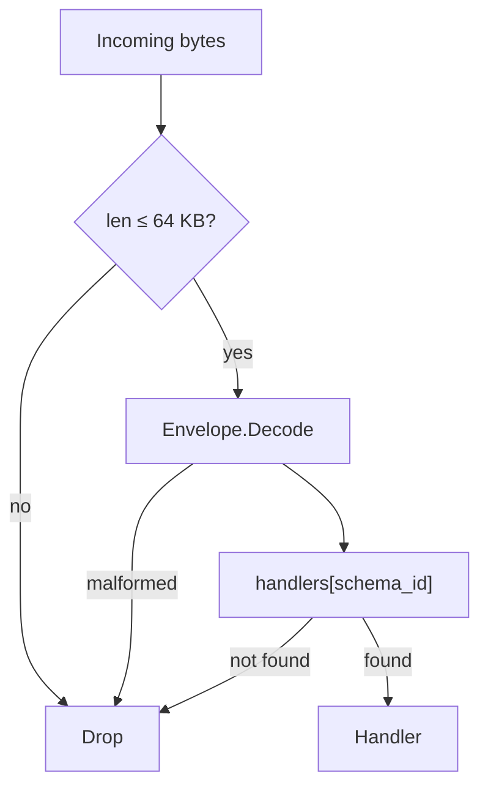
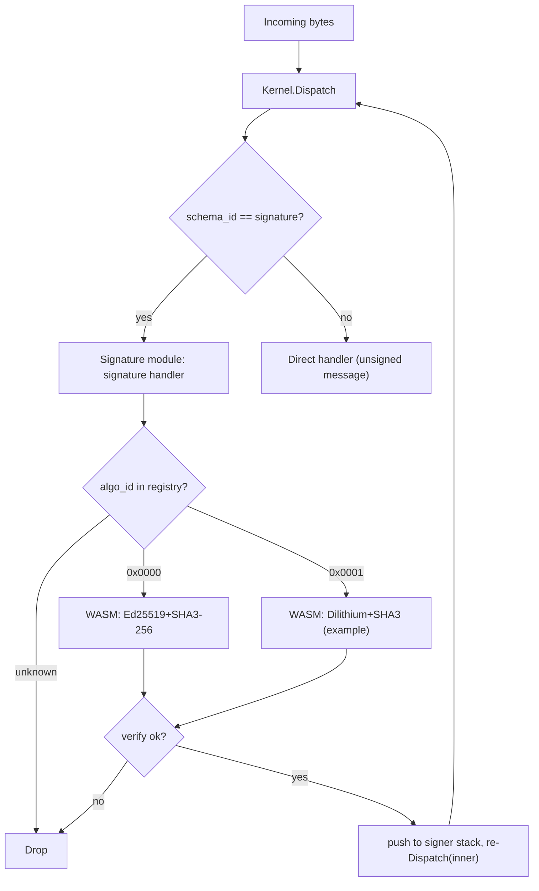
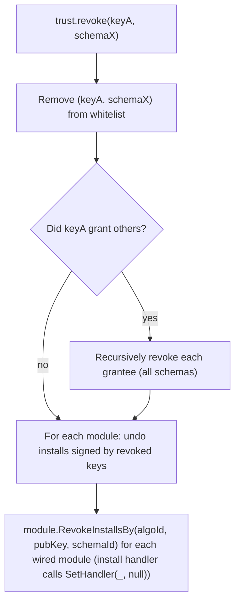
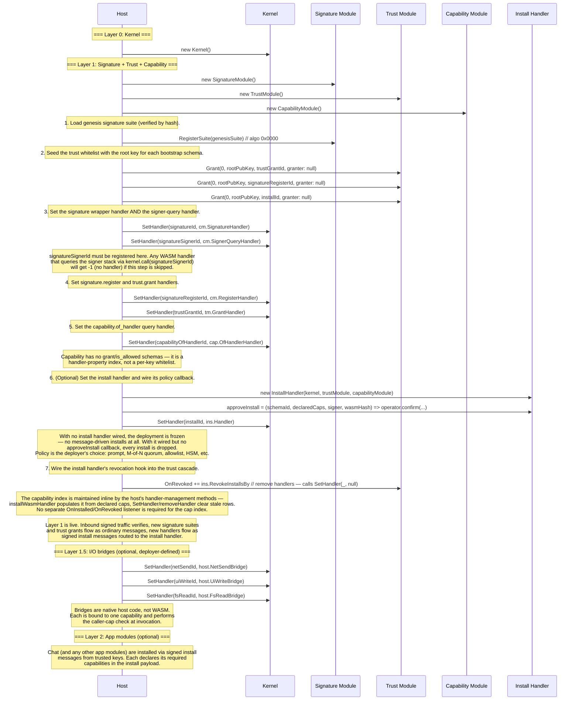

# Seed kernel: a self-bootstrapping message runtime

## 1. Vision

A minimal runtime where **everything is a message**. The kernel does one thing: parse an envelope and dispatch it to a registered handler. Signature verification, trust, type metadata, installation, and application logic are **modules** — layers that compose around the kernel like an onion. The system bootstraps from a single trusted key into arbitrarily complex behaviour without the kernel knowing what any of it means.

**Design principles:**

- The kernel is small enough to audit in a single sitting — one file, no cryptography, no trust, no policy, no installation logic.
- The kernel makes one routing decision: look up the schema_id and invoke the handler. Everything else, including how new handlers get installed, is a module concern.
- Modules form layers. Lower layers (signatures, trust) gate higher layers (apps like chat). Each layer can only see downward.
- Modules are independently usable — each is a standalone WASM module testable in isolation; nothing forces you to use them together.
- The same envelope works for tiny JSON payloads and large binary blobs.
- Cryptographic algorithms are pluggable; the kernel can survive a post-quantum transition without a protocol rewrite.
- The kernel compiles to WebAssembly so it runs anywhere.

**Layering model:**

```
┌─────────────────────────────────────────┐
│  App modules (chat, …)                  │  ← just examples; anything goes here
├─────────────────────────────────────────┤
│  Signatures + Trust                     │  ← typical first bootstrap; replaceable
├─────────────────────────────────────────┤
│  Kernel (envelope + dispatch)           │  ← one routing decision
└─────────────────────────────────────────┘
```

No layer has a hard dependency on the layer above or below it. You could replace signatures and trust with a completely different security model, or skip them entirely for a trusted environment. The onion describes a typical composition, not a required one.

---

## 1.1 Concepts at a glance

A reader's-digest mental model before the wire details:

- **Envelope.** 4-byte header + opaque `schema_id` + opaque `payload`. The kernel's only routing decision is `handler[schema_id]`.
- **Schema_id.** Opaque dispatch key. By convention `hash(name)` for bootstrap handlers and `hash(name || installer_pubkey)` for app handlers, but the kernel never interprets it.
- **Handler.** A WASM module that exchanges bytes with the host through a fixed **scratch** offset in its own memory — no allocators across the boundary.
- **Signing is a wrapper, not a header field.** A signed message is an outer envelope (`schema_id = signature`) whose payload is `(algo_id, signer, sig, inner_envelope)`. The signature handler verifies, pushes the signer, and re-dispatches the inner envelope.
- **Trust** gates *who may extend the system* — a flat whitelist keyed by `(algo_id, pubkey, schema_id)` consulted before any state-mutating handler runs. **Capability** gates *who may reach outside it* — a per-handler property set at install time, checked by bridges against `capability.of_handler`. No per-key capability whitelist.
- **Bridges** are `SetHandler`-installed handlers bound to one capability; they are the only code that performs real I/O.
- **Install handler (optional).** Host-side handler that turns signed install messages into `SetHandler` calls after a trust check and a deployer-supplied policy callback. Frozen-config deployments omit it.
- **Bootstrap** seeds the trust whitelist with one root key per privileged schema and `SetHandler`-installs the signature, trust, capability, and (optionally) install handlers. After that, growth happens by signed install messages.

```
incoming bytes
   │
   ▼
kernel.dispatch(schema_id) ──► handler[schema_id]
                                  │
                                  └─► kernel.call(schema_id, payload) ──► other handler / bridge
```

**Want to see it run?** Build the WASM artifacts (see `WASM/package.json` scripts), then either run `node WASM/tests/run.mjs` for the end-to-end test + 10k-message benchmark, or serve `WASM/browser/` over HTTPS and open `chat-shell.html` in two browsers for a P2P chat demo (§12). The worked-example trace in §13 walks through the same pipeline byte-by-byte.

## 2. The Envelope

Every message shares a single envelope format. The envelope carries the bare minimum the kernel needs: a type tag (`schema_id`) and an opaque payload. The kernel's only job is to look up the handler for the schema_id and invoke it.

```
┌───────────────────────────────────────────────────────┐
│ magic: 2 bytes          (0x5344 — ASCII "SD")         │
│ version: 1 byte         (0x01)                        │
│ schema_id_len: 1 byte                                 │
│ schema_id: [var bytes]  (opaque dispatch key)         │
│ payload: [remainder of buffer]                        │
└───────────────────────────────────────────────────────┘
```

Four bytes of fixed header, then the schema_id, then the payload runs to the end of the buffer. The total envelope (all fields) must not exceed 65,536 bytes (§2.2). `schema_id_len` must be at least 1; a zero-length schema_id is invalid and will be rejected by the kernel.

| Field | Size | Description |
|---|---|---|
| `magic` | 2 bytes | `0x5344` — identifies a seed kernel envelope |
| `version` | 1 byte | Protocol version (`0x01`) |
| `schema_id_len` | 1 byte | Length of the schema identifier (1–255 bytes; `0` is invalid) |
| `schema_id` | variable | Opaque dispatch key; by convention a hash, but the kernel does not interpret it |
| `payload` | to end | The message body — handler-defined |

The kernel does not interpret the payload. Installation, signature wrapping, capability declarations, and every other piece of structure live inside the payload of some specific schema and are the concern of the handler registered for that schema, not the kernel.

### 2.1 Signing is a wrapper, not a Field

To sign a message, you wrap an envelope inside another envelope whose `schema_id` is the signature module. The outer payload carries the algorithm id, signer pubkey, the signature and inner envelope bytes. The signature module re-dispatches the inner envelope after verifying. Wire layout and details are in §6.3.

This makes signing **opt-in per message** and **composable**: you can have unsigned messages alongside signed ones, and you can stack wrappers (e.g. encrypted-then-signed, or hybrid sigs) without ever changing the envelope format.

### 2.2 Maximum message size (64 KB)

The kernel enforces a hard upper bound of **65,536 bytes** on the total envelope (header + schema_id + payload). The kernel rejects any buffer larger than this limit before parsing.

**Rationale.** Signature verification dominates per-message cost (§11). Capping the envelope at 64 KB bounds the worst-case data a `verify` call must process, keeping per-message latency predictable and preventing a single oversized message from stalling the pipeline. For use cases that need to reference large data (files, images, firmware blobs), the payload carries a **content hash** — the digest of the external data under the envelope's signature suite — and consumers retrieve the actual bytes from an external store. The signature still covers the hash, so integrity is preserved end-to-end; the kernel just never has to move the bulk data through its dispatch path.

This limit applies to the **outermost** envelope on the wire. For signature wrappers (§2.1), the 64 KB budget includes the outer framing, the signature fields, and the complete inner envelope. Implementations should account for wrapper overhead — ~140 bytes for Ed25519 with 32-byte SHA-3 schema_ids (4 envelope header + 32 schema_id + 2 algo + 2 signer_len + 32 pubkey + 2 sig_len + 64 sig), larger for PQ suites — when sizing inner payloads.

The 64 KB limit is a protocol constant, not a per-deployment configuration knob. Keeping it fixed avoids interoperability splits where one node accepts messages another rejects.

**Install messages** (handled by the optional install handler, §3.2) carry a capability header followed by a WASM module inside their payload, and so are subject to the same 64 KB cap. The reference implementation modules are well within budget (kernel.wasm ~8 KB, bootstrap.wasm ~11 KB — see §11.2). Signature suites (which may be larger, especially post-quantum suites) are registered via `signature.register` (§6.4) and follow the same 64 KB limit.

### 2.3 Maximum signature wrapping depth

The signature module MUST reject any `signature` envelope when the signer stack already contains `MAX_SIGNATURE_DEPTH` entries. **`MAX_SIGNATURE_DEPTH` is a protocol constant equal to `4`.**

**Rationale.** Each signature wrapper costs one verify (~95 µs for Ed25519 on a modern core). Per-wrapper overhead is ~140 bytes for Ed25519 (§2.2), so a 64 KB envelope can in principle nest ~475 wrappers. Without a cap, a single inbound message can force that many verifies (~45 ms CPU), turning a tiny attacker input into a CPU-amplification DoS. Capping depth at 4 supports realistic use cases (single-sig, hybrid Ed25519+PQ, key-rotation overlays, an attestation envelope) while keeping per-message verify cost bounded.

This limit is enforced by the signature handler reading the current signer stack length before verifying — implementations do not need a separate counter. The 4-entry cap aligns with the authorization model in §6.5: the operative authorization is always the top signer, so deeper wrappers add no semantic value the kernel can use.

---

## 3. The kernel

The kernel has one message-driven path: parse an envelope and dispatch its payload to the handler registered for the schema_id. It also exposes `SetHandler` (§3.1) — a host-level method for directly installing or replacing any handler. `SetHandler` is the **only** install path the kernel knows about; message-driven installation, when a deployment wants it, is a handler like any other (§3.2).

**"Drop" semantics.** Throughout this document, **drop** means "silently ignore: no response is generated, no error is propagated to the sender." Implementations MAY log or meter dropped messages but MUST NOT return a synchronous error or surface a side-effect. The kernel never produces unsolicited responses — every reply travels in a fresh envelope under the relevant app handler's policy.

```
dispatch(bytes):
  if len(bytes) > MAX_ENVELOPE_BYTES:                 drop
  envelope = parse(bytes)
  if envelope == null:                                drop  // bad magic, version, schema_id_len, or truncation
  if handlers[envelope.schema_id] is null:            drop
  handlers[envelope.schema_id](envelope.payload)
```

A module can call another module using `kernel.call`. The kernel knows nothing about signers — that state lives entirely in the signature module (§6.5). Any handler that needs to know who signed the current message calls `kernel.call` to `signature.signer`.

**Single-threaded dispatch.** A kernel instance dispatches one message at a time. The signer stack (§6.5), the call-depth counter, and the caller stack (used by `kernel.caller`) are all per-instance; the host MUST NOT enter `dispatch` re-entrantly except via `kernel.call`. Concurrent inbound traffic is the host's concern — typically by serializing onto a single event loop or running independent kernel instances per worker.



### 3.1 Host-level handler management (`SetHandler`)

The kernel exposes a single method for the host to manage handlers directly:

```
kernel.SetHandler(schemaId, handler)
```

`SetHandler` installs or replaces the handler for the given `schema_id`. If a handler already exists for that `schema_id`, it is replaced. If `handler` is null, the handler is removed. The kernel never holds two entries for the same `schema_id`; replace is in-place. `SetHandler` itself returns nothing — it is a side-effecting primitive on the kernel's handler table. The reference host wraps it with a thin `host.register(schema_id, handler) → handlerId` convenience that allocates an internal handler id (used by `host.blockFromCall`, §4.4) and then performs the underlying `SetHandler` call; deployers wiring host-side handlers like `bootstrap.replace` (§10.1) use that wrapper.

`SetHandler` is the only way handlers enter or leave the kernel's table. There is no message kind for installation, no privileged "register" path, and no protected-vs-unprotected distinction — every entry in the table arrived via the same call. Handlers installed by `SetHandler` have **no signer and no capability entry**: they are invisible to both the trust whitelist and the capability index (§8). The host is responsible for whatever attribution and policy it cares about; the kernel just stores the function pointer.

The capability consequence is structural: because `SetHandler` handlers have no entry in the capability index, `capability.of_handler` returns the empty set for them, and every capability check against them fails. This is the reason signature, trust, and any other bootstrap handler can never reach an I/O bridge — not a rule stated in the signature module's code, but a fact that falls out of the API surface. The install handler (§3.2) is the only host-side handler that *populates* the capability index, and it does so for the WASM handlers it installs, not for itself.

`SetHandler` is internal to the host process — it is a direct method call, never reachable from inbound messages or WASM handlers. The host controls access through its own authentication (process-level permissions, operator console, HSM, or whatever is appropriate for the deployment). The kernel does not define an access control policy for `SetHandler`; that is the host's responsibility.

The same call the host uses during bootstrap (§10) remains available afterward for emergency replacement of any handler, including bootstrap handlers like `signature` and `trust.grant`. If a deployment wants message-driven installation or replacement of handlers, the install handler (§3.2) — or a narrower `bootstrap.replace` style handler (§10.1) — provides it; both are host-side handlers that wrap `SetHandler`.

### 3.2 The install handler (optional)

Most deployments want to install new handlers by sending signed messages, not by direct host wiring. The system provides this through an **install handler**: a host-side handler bound to a known `install` schema that turns a signed install message into a `SetHandler` call. The install handler is not part of the kernel — it is one more handler the host wires via `SetHandler` during bootstrap. Frozen-config deployments simply skip it and grow no further.

A signed install message reaches the install handler exactly like any other signed envelope: the signature wrapper verifies, pushes the signer, and re-dispatches; the kernel routes the inner envelope to `handlers[install]`; the install handler runs.

The reference install handler accepts the following payload:

```
install payload:
  seq:        4 bytes (u32 big-endian)         (§4.4 replay protection)
  caps_count: 1 byte                           (0 = no capabilities requested)
  caps:       caps_count × [cap_id_len u8][cap_id: var bytes]
  target_schema_len: 1 byte
  target_schema:     [var bytes]
  wasm:       remainder
```

A `caps_count` of `0` means the handler is pure computation — no bridge access of any kind. `cap_id` is opaque to the kernel; by convention `hash("seedkernel.cap.v1:" + name)` using the genesis suite's hash (see §5.1).

When invoked, the handler:

1. Reads the top signer. If the stack is empty, the install is dropped — installs must be signed.
2. Calls the trust module's `is_trusted` to confirm the signer is whitelisted for the `install` schema. If not, drop. The trust check runs *before* seq consumption (§4.4 cheap-drop guidance) so that an attacker generating fresh keypairs cannot grow the install handler's per-signer high-water-mark table without bound.
3. Consumes the §4.4 sequence number from the first 4 bytes of the payload and updates the per-signer high-water mark; replays (`seq <= last_seen`) drop here, before any further state mutation.
4. Parses the capability declaration and target `schema_id` from the payload.
5. Applies the **replacement policy**: if the install handler's attribution table already has a row for `target_schema_id`, the new installer must match it `(algoId, pubKey)`-exactly; if there is no row but the kernel slot is occupied, the slot was seeded via host-side `SetHandler` (a bootstrap entry) and the install is refused. Drop on either mismatch.
6. Calls the deployer-supplied **policy callback** `approveInstall(targetSchemaId, declaredCaps, signer, wasmHash) → bool`. `wasmHash` is the genesis-suite hash (SHA-3-256) of the WASM bytes about to be installed; the callback uses it to distinguish "the binary we audited" from "some other binary signed by the same key" without having to re-hash the bytes. If no callback is wired or it returns false, drop. (With no callback wired, every install is dropped — installation is opt-in for the deployment.)
7. Instantiates the WASM module against the host's handler ABI (§4) and calls `SetHandler(targetSchemaId, instantiatedHandler)`. The host populates the capability index with the declared caps as part of installation.
8. Records the installer attribution `(algo_id, pubkey, targetSchemaId)` in the install handler's own table for revocation cascades.

The trust check is the eligibility prefilter; the policy callback is the deployer's gate (operator console, allowlist, HSM, M-of-N quorum, …). Both must accept.

**Installer-match invariant.** Every install handler operation that touches the kernel slot — replacement (step 5) and revocation — requires the acting key to match the stored installer `(algoId, pubKey)` exactly. The kernel itself imposes no such check (`SetHandler` is unconditional); the invariant lives in the install handler's attribution table. Under the recommended schema_id derivation (§5.1) this falls out for free — only the original installer can reproduce their own `schema_id` — but the table enforces it even when raw-byte schema_ids, collisions, or post-hoc whitelist edits put two keys at the same slot. Without attribution, revoking key B could unregister a handler that key A installed (both wrong and exploitable).

**Revocation cascade.** The install handler exposes `RevokeInstallsBy(algoId, pubKey, schemaId)` and is wired into the trust module's `OnRevoked` cascade (§7.3). When triggered with a matching installer, it calls `SetHandler(targetSchemaId, null)` and clears its own attribution row; the host's handler-management bookkeeping clears the matching capability-index row (§8.4) inline. App-layer modules with per-installer state (e.g. a naming module) wire their own `RevokeInstallsBy` into the cascade at install time.

**Replacing the install handler itself** uses host-side `SetHandler` directly — it has no attribution row for itself, and even a deployer-driven replacement should go through the operator console, not a signed message. Treat it like any other bootstrap handler. Because attribution lives in this handler rather than the kernel, swapping in a different install policy (content-addressed, quorum, replay-protected, …) is just swapping a handler — no kernel patch.

---

## 4. WASM Handler Contract

All WASM interfaces are specified as raw WASM function signatures. Any language that compiles to WASM (AssemblyScript, C#, Rust, C, Zig, Go) can implement these.

Handlers exchange messages with the host through a **scratch region** in their own linear memory. There is no allocator contract, no pointers crossing the boundary, no buffer lifetimes for the handler author to reason about — just "read input here, write output there, return the length."

### 4.1 Exports (handler must provide)

| Export name | WASM type | Description |
|---|---|---|
| `memory` | linear memory | Handler's memory; the host reads input from and writes output to the scratch offset within it. |
| `scratch` | `global i32` | Byte offset into `memory` where the host places input and reads output. Set once during instantiation; the host reads it once after instantiation and the handler MUST NOT change it afterward. |
| `handle` | `(i32) → i32` | `(input_len) → output_len` — process the message at `scratch` and return the response length. |

**I/O protocol.** Before each call, the host writes the input bytes at offset `scratch` (up to the configured scratch size — default 128 KB, set per handler at instantiation). The handler reads its input from `scratch`, writes its response back at `scratch` (overwriting the input is fine), and returns the number of response bytes. Return `0` for "no response." The host reads `output_len` bytes at `scratch` after `handle` returns and does not touch the region again until the next call.

Memory outside the scratch region is the handler's private state — statics, globals, whatever allocator it wants for its own bookkeeping. None of that is exposed to the host.

### 4.2 Imports (host provides to handler)

The host exposes these under the import module `"kernel"`. These are the **only** host imports — everything else (trust checks, signer queries, logging) is accessed via `kernel.call` to the appropriate module.

| Import name | WASM signature | Description |
|---|---|---|
| `call` | `(i32, i32, i32, i32) → i32` | `(schema_id_ptr, schema_id_len, payload_ptr, payload_len) → response_len` — synchronous dispatch to the handler registered for the given schema_id. The four pointers are into the **caller's own memory** (anywhere the caller likes). The response is written into the caller's scratch region; the return value is the response length, or `-1` on error (no handler registered, call depth exceeded, response too large for caller's scratch). See §4.4. |
| `caller` | `(i32) → i32` | `(out_ptr) → schema_id_len` — writes the schema_id of the handler that invoked the current `kernel.call` into caller memory at `out_ptr` and returns its length. Returns `0` (writing nothing) when there is no parent frame — i.e. when the handler was reached by direct envelope dispatch rather than through `kernel.call`. The return is unambiguous because valid schema_ids are always at least 1 byte (§15). Primarily used by I/O bridges (§9) to identify the caller for capability checks. |

### 4.3 Sandboxing

- Handlers have **no** filesystem, network, or clock access.
- Memory is bounded by what the handler's WASM module declares (and ultimately by the host engine's own memory limits); the kernel imposes no per-handler memory cap of its own.
- A handler can only affect the outside world by `kernel.call` to other handlers. Bridges (handlers that perform real I/O) additionally require the calling handler to have declared the bridge's capability at install time (§3.2, §8). The default is no capabilities; every declaration is explicit at install time.

> **Compute exhaustion is the host's problem.** WebAssembly engines on the JavaScript platform expose no native fuel/timeout mechanism, so this protocol does not specify one. Deployers concerned about runaway handlers should run dispatch in a Worker with a watchdog, or pre-validate handler bytecode in the install handler's policy callback (forbid loops above a budget, recursion, etc.) before installing. The kernel exposes the call-depth bound (§4.4) but does not bound per-handler execution time.

### 4.4 Synchronous cross-module calls (`kernel.call`)

`kernel.call` performs a synchronous dispatch to the handler registered for the given `schema_id`. The host wires the two handlers together by copying through their scratch regions:

1. Host reads `schema_id_len` bytes from caller memory at `schema_id_ptr`, and `payload_len` bytes at `payload_ptr`. (These pointers are into caller memory — anywhere the caller put them; they do not need to be in scratch.)
2. Host looks up the target handler. If none is registered, returns `-1`.
3. Host writes the payload bytes into the target's scratch region and calls `target.handle(payload_len)`.
4. Target reads input, writes response at its own scratch, returns `response_len`.
5. Host reads `response_len` bytes from the target's scratch and writes them into the caller's scratch region.
6. Host returns `response_len` to the caller. The caller reads its response from its own `scratch` offset.

**Semantics:**

- The callee sees raw payload bytes at its scratch — there is no envelope wrapping. Routing is by `schema_id` only.
- The callee cannot distinguish an inbound envelope from a `kernel.call`. It sees input at scratch and writes output at scratch.
- Calls are **re-entrant**: A can call B can call C. The host enforces a maximum call depth (default 8); exceeding it returns `-1`.
- **The caller's scratch is overwritten when the callee returns a non-empty response.** A handler that still needs its original input across a `kernel.call` must copy it into private memory before calling — assume the worst, since any response overwrites scratch unconditionally. When the callee returns no bytes (return value `0`), the caller's scratch is left untouched, so callers MUST NOT rely on `kernel.call` to clear scratch. If a handler holds secrets in scratch and needs them cleared regardless of callee behaviour, it must zero scratch itself.
- If the callee's response exceeds the caller's scratch size, the host returns `-1` and writes nothing. Tune scratch size per handler if you expect large responses.

**Mutating handlers are not callable via `kernel.call`.** Any handler that mutates kernel, trust, or signature state — i.e. that calls `kernel.SetHandler`, registers a signature suite, or modifies the trust table — MUST cause `kernel.call` to return `-1` *before* the target handler is invoked. The check belongs at the call router (the host's `kernel.call` import), not inside the handlers; without it, an in-handler `kernel.call` could mutate state under the current top signer's authority without that signer's intent. These handlers run only at top-level dispatch, where the signature wrapper has already verified the outer signature. Read-only bootstrap queries (`signature.signer`, `trust.is_trusted`, `capability.of_handler`) remain freely callable.

The reference host auto-blocks the four bootstrap mutating handlers (`signature`, `signature.register`, `trust.grant`, and `install` when wired). Deployer-added mutators like `bootstrap.replace` (§10.1) MUST be marked blocked via `host.blockFromCall(handlerId)` immediately after `host.register`.

**Replay protection (mandatory for state-mutating handlers).** Every mutator that acts under the top signer's authority — `trust.grant`, `signature.register`, `install`, and any deployer-added equivalent — MUST consume a `u32` big-endian sequence number as the *first* field of its payload and MUST drop the message if `seq <= last_seen[(signer.algoId, signer.pubkey)]`. The seq check MUST run before any state mutation; cheap-drop checks (most importantly trust) MAY run first to avoid polluting the seq table with untrusted entries. The high-water mark is per-signer-per-handler and **persists across trust revocation** (tombstone-forever) — re-granting trust to a revoked key MUST NOT rewind its sequence, or pre-revocation wire bytes could be replayed after the re-grant. Senders pick strictly increasing seqs (gaps are fine); on counter loss, jump forward conservatively.

The `signature` wrapper is on the blocklist but consumes no `seq`: it does not act under any signer's authority — it *establishes* the top signer — and its push/pop of the signer stack leaves no persistent state to replay. The two protections target different threats: `seq` cuts off wire replay of authorized mutations; the blocklist cuts off in-pipeline corruption of kernel state.

### 4.5 Memory model

There is no allocator contract and no pointer ownership to track. Every buffer that crosses a boundary lives in the scratch region of one module and is copied by the host into the scratch region of another (or to/from the transport). The host never holds a pointer into a handler's memory across a return into that handler, and never writes outside its scratch region.

What this rules out:

- No allocator to implement, no `alloc` export, no free, no recycling.
- No pointer-lifetime mistakes — the only buffer the host touches is at a known fixed offset and gets fully overwritten on the next call.
- No shared memory between modules; every cross-module byte is a host-mediated copy.
- A buggy or malicious handler can corrupt only its own scratch and its own private memory. It cannot corrupt the host, another handler, or the kernel.

The one rule a handler author has to internalize is the one in §4.4: a `kernel.call` overwrites your scratch with the response. If you still need the input, copy it first.

> **Note.** Signature suite modules (§6.6) are the one exception to this contract. A suite has multi-argument primitives (`hash(data)`, `verify(pubkey, sig, data)`) that don't fit the single-buffer scratch model cleanly, so the suite contract uses an explicit `alloc` and pointer arguments. Suite authors are crypto specialists writing thin wrappers around existing libraries; the small extra ceremony is acceptable in that niche.

---

## 5. Layering and composition

Modules form an onion. Each layer wraps the layers above it and depends only on the layers below.

```
          ┌──────────────────────────────────┐
          │   App modules                    │
          │   (chat, …)                      │
          │                                  │
          │   handlers dispatched normally   │
          ├──────────────────────────────────┤
          │   I/O bridges (optional)         │
          │   (net, ui, fs, clock, …)        │
          │                                  │
          │   SetHandler-installed           │
          │   caller-capability checked      │
          ├──────────────────────────────────┤
          │   Install handler (optional)     │
          │                                  │
          │   parses install messages        │
          │   trust + policy + SetHandler    │
          │   installer attribution          │
          ├──────────────────────────────────┤
          │   Signature + Trust + Capability │
          │                                  │
          │   signature wrapper              │
          │   trust whitelist                │
          │   capability handler index       │
          ├──────────────────────────────────┤
          │   Kernel                         │
          │                                  │
          │   envelope parsing               │
          │   dispatch by schema_id          │
          └──────────────────────────────────┘
```

### 5.1 Modules in the reference implementation

A one-line per layer index — full schema details live in §6 (Signature), §7 (Trust), §8 (Capability), §9 (Bridges), and §12 (App examples).

| Layer | Modules | What lives there |
|---|---|---|
| **1: Bootstrap** | Signature, Trust, Capability, (optional) Install | Algorithm suites, signer stack, extension whitelist (trust), handler→cap index (capability), the install handler that turns signed install messages into `SetHandler` calls. |
| **1.5: I/O bridges** | Deployer-defined (`net.send`, `ui.write`, `fs.read`, `clock.now`, …) | The only code that performs real I/O. `SetHandler`-installed, one capability each. |
| **2: App modules** | Chat (example) | User-facing handlers installed via signed `install` messages (when the install handler is wired). |

Each module is in its own file and can be used standalone — trust is a flat whitelist testable without a kernel, capability is a handler→caps index testable in isolation, and chat is just a handler testable without signatures. All inter-module queries go through `kernel.call` to the target module's schema (e.g. `signature.signer`, `trust.is_trusted`, `capability.of_handler`). Host-side wiring (the trust module's `OnRevoked` callback and the install handler's `RevokeInstallsBy`) is described in each module's section.

**The hash function used for id derivation.** Throughout this section, `hash(…)` means the **genesis suite's hash** (§6.2) — the only hash function guaranteed to exist at boot. In the reference implementation that is SHA-3-256 (32-byte output). A deployment that swaps genesis suite swaps the hash: every derived `schema_id` and `cap_id` shifts, so the trust whitelist seeds in §10 must be re-derived. Pick the genesis suite once and treat it as a deployment-wide constant.

**Schema IDs for bootstrap handlers** are unscoped: `schema_id = hash("seedkernel.bootstrap.v1:" + name)`. There is no installer to mix in (these handlers are seeded by the host via `SetHandler` (§3.1), not by a signed message). A separate naming layer (when present) can bind human-readable names to the resulting schema_id bytes.

**Schema IDs for post-bootstrap (app) handlers** installed via the install handler MUST incorporate the installer's public key:

```
schema_id = hash(canonical_name || installer_pubkey)   // byte concatenation
```

Two different keys registering a handler for the same canonical name then produce different `schema_id` bytes by construction, so installs cannot collide by accident.

**Scope of the requirement.** The kernel does not enforce this derivation form — it routes by raw `schema_id` bytes and has no view of the canonical name. Compliance is the **sender's** responsibility, much like compliance with the 64 KB envelope cap is the sender's. What the install handler does enforce, regardless of how the schema_id was derived, is the installer-match invariant on revocation (§3.2): even if a sender chooses raw or unscoped bytes and two installers end up at the same `schema_id`, `RevokeInstallsBy` will only remove the one that actually matches the revoked key.

**Consequences for consumers:**

1. **Addressing.** Consumers must know the installer's pubkey to reach an app handler — not just its canonical name. In a trust-scoped system you already need to know who you trust; the pubkey is that anchor. A separate naming layer can bind human-readable names to key-scoped schema_ids for convenience, but that lives outside the kernel.
2. **Replace semantics.** Because only the original installer's key can reproduce the same `schema_id` under the recommended derivation, install re-registration is naturally idempotent across senders — only the installer can target their own slot. The install handler's installer-match check makes this safe even when the derivation form is bypassed.

---

## 6. The signature module

This is where pluggable signatures lives. The signature module maintains a registry of **algorithm suites** identified by `algo_id` and owns the `signature` schema — a wrapper format that lets any envelope be signed. Together with the trust module, it forms the first layer above the kernel.

### 6.1 Algorithm suite

An algorithm suite is a bundle of:

| Operation | Purpose | Example (suite 0x0000) |
|---|---|---|
| `hash(data) → bytes` | Produce a schema_id from a canonical name | SHA-3-256 → 32 bytes |
| `verify(pubkey, signature, data) → bool` | Verify a message signature | Ed25519 |

Each suite declares fixed sizes (key length, sig max length, hash length) used for sanity-checking the wrapper payload. Signing is a sender-side operation and lives in the host (no WASM export — see §6.6).

### 6.2 The Genesis suite (algo_id = 0x0000)

The signature module needs *something* to verify the very first message. By convention:

- **algo_id 0x0000** = Ed25519 + SHA-3-256
- It is delivered as a **separate WASM module** (e.g. libsodium compiled to WASM), loaded at boot time.
- The host trusts it **by hash** — the expected SHA-3-256 hash of the genesis WASM module is the one cryptographic constant in the bootstrap configuration.
- It can never be removed, but it **can be superseded** for all new messages.

The kernel itself does not know about a genesis suite. The hash is held by the host's bootstrap code, which inserts the suite into the signature module's registry before any messages are dispatched.

During a PQ migration, Ed25519 is typically the **outer** wrapper and the new PQ suite is the **inner** one. See §6.5 (wrapping convention).

### 6.3 The `signature` wrapper

Signing is a wrapper message. To send a signed inner envelope, build the inner envelope as normal, then wrap it:

```
outer envelope:
  schema_id     = signature schema id
  payload       = [ algo_id:     2 bytes (u16)            ]
                  [ signer_len:  2 bytes (u16)            ]
                  [ signer:      var bytes (public key)   ]
                  [ sig_len:     2 bytes (u16)            ]
                  [ signature:   var bytes                ]
                  [ inner_envelope: remainder of payload  ]
```

The inner envelope is a complete envelope — including its own magic, version, schema_id, and payload.

The signature is computed over `inner_envelope` — the raw bytes of the inner envelope, including its own framing. Re-enveloping (relaying) is lossless: the inner bytes don't change, so the signature remains valid.

After verification, the inner envelope re-enters the pipeline and dispatches normally. The signature module registers a single handler for `signature`; that handler's verify-time flow is:



Unknown `algo_id`s drop because the suite was never registered via `signature.register` (§6.4); only suites in the registry can be verified against.

### 6.4 Registering new algorithms

The message `signature.register` (handled by the signature module) installs a new algorithm suite as a WASM module. This adds a suite to the signature module's internal registry; it does not install a kernel handler. The handler queries `signature.signer` to identify the signer and checks it against the trust module before accepting.

Once a new suite is registered, messages signed under it should be wrapped per §6.5: the new suite is the **innermost** signer (the operative authorizer); legacy-suite wrappers go on the outside.

The `signature.register` payload begins with a fixed-size **metadata header** followed by the raw WASM module bytes:

```
payload = [ metadata header ][ WASM module bytes ]

Metadata header (fixed layout):
  seq:          4 bytes (u32 big-endian)       (§4.4 replay protection)
  algo_id:      2 bytes (u16)
  hash_len:     1 byte
  pubkey_len:   2 bytes (u16)
  sig_max_len:  2 bytes (u16)
  name_len:     1 byte
  name:         [var bytes, UTF-8]
```

The WASM module must implement the suite contract in §6.6.

**Duplicate registration.** Implementations MUST reject `signature.register` for an `algo_id` already in the registry. Allowing a re-register would let a trusted signer swap suite WASM behind the back of consumers who validated `(pubkey_len, sig_max_len)` against the metadata at install time — the new WASM may expect different sizes than the metadata still advertises. The genesis suite (`algo_id 0x0000`) cannot be replaced (§6.2). To rotate a suite, deployers must allocate a new `algo_id`. The `seq` prefix is the §4.4 replay-protection obligation — uniform across all mutating handlers — and applies in addition to (not instead of) per-`algo_id` duplicate rejection.

**Trust requirement.** The top signer must be in the trust whitelist for the `signature.register` schema (§6.5). This is the highest-privilege operation in the system — a malicious signature suite could accept any signature.

Using this system a post-quantum migration path is available and handled directly using messages.

### 6.5 Signer stack (signature module internals)

The signature module maintains a **signer stack** — an internal list that tracks which keys have been verified during the current top-level dispatch. The kernel doesn't know it exists.

**Lifecycle.** Every accepted `signature` wrapper pushes one entry, executes the inner dispatch synchronously, and pops on return. Stack depth therefore equals the number of nested `signature` wrappers active at the current point in the pipeline, capped at `MAX_SIGNATURE_DEPTH` (§2.3).

```
signature-envelope  (algo = Ed25519,  signer = A)        ← outer
  └─ signature-envelope  (algo = Dilithium, signer = B)  ← inner
       └─ inner envelope  (the actual message)

stack while the actual message handler runs: [A, B]   (A pushed first, B on top)
```

**Query API — `signature.signer`.** Any handler may call `kernel.call(signature.signer, …)` to read the current stack. The query handler ignores its payload (zero bytes is canonical) and returns `[count u8] [algo_id u16][pubkey_len u16][pubkey ..]*` in push order — outermost signer first, top signer last. Empty stack returns `[0x00]`. `pubkey_len` is u16 big-endian so post-quantum suites with multi-kilobyte public keys (e.g. ML-DSA) fit without truncation. The stack is scoped to the *top-level* dispatch, so nested `kernel.call` frames see exactly the same answer; the question "who signed the message that caused this chain of calls?" is well-defined everywhere in the chain.

**Authorization rule — top signer wins.** When the stack has more than one entry, the **top** (innermost) signer is the operative authorizer for every built-in check. Outer wrappers attest but do not lend authority: if A wraps B's envelope, the action is B's intent; A's trust grants do not flow to B. All three built-in checks consult only the top signer:

| Check | Site | Test |
|---|---|---|
| `install` handler eligibility | Install handler (§3.2) | top signer trusted for the `install` schema |
| `trust.grant` mutation | Trust module | top signer trusted for `trust.grant`; granter is recorded as the top signer |
| `signature.register` install | Signature module | top signer trusted for `signature.register` |

Application handlers reading `signature.signer` may apply any policy they like (e.g. require *all* signers trusted); only the kernel's own paths are top-only. The rule also bounds the search — no implementation needs to walk a deep stack for authorization.

**PQ wrapping convention.** Whichever algorithm is operative MUST be the **innermost** wrapper. A PQ rollout signs PQ first and optionally wraps Ed25519 on top: every layer still has to verify (so a break in either algorithm fails the message), but authorization sits with PQ. Inverting the order would silently downgrade authorization to Ed25519.

### 6.6 Suite WASM contract

A signature-suite module installed via `signature.register` (§6.4) MUST export the following. This is the one place in the protocol where a handler exposes more than the standard scratch ABI (§4) — a suite has multi-argument primitives that don't fit a single-buffer model, so it provides an explicit allocator and pointer arguments instead.

| Export name | WASM signature | Description |
|---|---|---|
| `memory` | linear memory | Suite's memory; the host copies pubkey / sig / data into it before calling `verify`. |
| `verify` | `(i32, i32, i32, i32, i32, i32) → i32` | `(pubkey_ptr, pubkey_len, sig_ptr, sig_len, data_ptr, data_len) → 1 if valid` |
| `alloc` | `(i32) → i32` | `(size) → ptr` — allocate memory the host writes into before calling `verify` / `hash` |
| `hash` *(optional)* | `(i32, i32, i32) → i32` | `(data_ptr, data_len, out_ptr) → hash_len` — only used if the host routes id derivation through the suite. The reference host hashes directly via its bundled libsodium (§5.1) and never calls suite `hash`, so genesis suites can omit it; non-genesis suites may export it for hosts that do. |
| `dealloc` *(optional)* | `(i32) → void` | Counterpart to `alloc`. The reference host pre-allocates suite scratch once and reuses it, so `dealloc` is rarely called; suites may omit it. |

The signer-query schema (`signature.signer`) is described in §6.5 — it is exposed by the signature module itself, not by suite modules.

---

## 7. The Trust Module

The trust module is the gatekeeper for **extending the kernel**. It owns a flat whitelist keyed by `(algo_id, pubkey, schema_id)` and answers "is this signer in the set for this schema?". Modules that mutate their own state (`signature.register`, `trust.grant`) and the install handler (§3.2) call it directly.

A whitelist entry means different things depending on the schema:

- **In-system mutations** (`trust.grant`, `signature.register`) — trust is the **sole** authority; the mutation runs once the signature wrapper accepts.
- **Handler installs through the install handler** — trust is only the eligibility prefilter. The actual install is gated by the install handler's deployer-supplied policy callback, so adding arbitrary WASM always requires an explicit deployer-side decision.

### 7.1 Trust Table

| Algo | Public Key | Schema ID | Granted By |
|---|---|---|---|
| 0 | `<root key>` | `trust.grant` id | (host bootstrap) |
| 0 | `<root key>` | `signature.register` id | (host bootstrap) |
| 0 | `<root key>` | `install` id | (host bootstrap) |
| 0 | `<key A>` | `chat.text` id | `<root key>` |
| 0 | `<key B>` | `chat.text` id | `<key A>` |
| 1 | `<PQ key X>` | `trust.grant` id | `<root key>` |

The "root" entries are initial seeds inserted by the host during bootstrap — one per bootstrap schema. The trust module has no special concept of a root key; the "root key" is simply the public key the host provides to the bootstrap constructor. It is an arbitrary key pair generated by the deployer, not hardcoded to any specific value. Each entry records its **granter** so revocation can cascade (§7.3).

### 7.2 The `trust.grant` Message

There is exactly one schema, `trust.grant`, carrying one of two actions. The JSON below is illustrative — the wire format is binary.

```json
{
  "action": "grant",
  "algo_id": 0,
  "pubkey": "<hex of grantee>",
  "schema_id": "<hex of target schema>"
}
```

```json
{
  "action": "revoke",
  "algo_id": 0,
  "pubkey": "<hex of grantee>",
  "schema_id": "<hex of target schema>"
}
```

The actual binary payload format is:

```
[seq u32 BE][action u8 (0=grant, 1=revoke)][algo_id u16][pubkey_len u16][pubkey ..][schema_id_len u8][schema_id ..]
```

`seq` is the §4.4 replay-protection sequence number for the *signer* (the key that wraps this payload, not the key being granted/revoked). The handler tracks the high-water mark per (algoId, signer-pubkey) and drops any payload with `seq <= last_seen`. Without this, an attacker with capture access to the wire could replay an old "grant" message to undo a later revocation.

`action` MUST be `0` (grant) or `1` (revoke). All other values are reserved; implementations MUST drop the message rather than coerce unknown actions into either operation.

**Authorization.** The handler queries `signature.signer` (§6.5) to identify the signer. It then checks the signer against its own whitelist to confirm the signer is trusted for the `trust.grant` schema. If the message is unsigned (empty signer stack), it is rejected. A key trusted for `trust.grant` can grant other keys trust for any schema_id, and can revoke entries whose chain of granters leads back to itself.

### 7.3 Revocation Cascades and De-registration

Revoking a key for a schema has two effects:

1. The `(algo_id, pubkey, schema_id)` entry is removed from the whitelist.
2. Modules that track installs by signer are notified so they can undo the corresponding work (e.g. unregister a handler, remove a type binding).

To make this possible, every module that tracks per-installer state exposes a `RevokeInstallsBy(algoId, pubKey, schemaId)` method and records the signer alongside each install. At bootstrap, the host wires the install handler's `RevokeInstallsBy` into the trust module's `OnRevoked` callback. When the install handler removes a kernel entry via `SetHandler(_, null)`, the host's handler-management code clears the matching capability-index row (§8.4) inline — no separate `RevokeInstallsBy` hook on the capability module is wired or needed. The signature module's algorithm-suite registry is intentionally non-removable (§6.4 rejects duplicate `algo_id` registration; suites are rotated by allocating a new `algo_id`), so it also exposes no revoke hook. App-layer modules with per-installer state (e.g. a naming module that tracks who registered each name binding) wire their own `RevokeInstallsBy` into the cascade at install time, not at kernel bootstrap.

When trust revokes a key, it fires the callbacks and each wired module checks whether the revoked key was responsible for its installs, removing only those that match.

Listeners run in registration order, and the install handler's `RevokeInstallsBy` removes the kernel handler synchronously (which clears the matching capability-index row inline). Listeners registered after the install handler will therefore observe the post-removal state when they query the about-to-die handler. Modules that need to record audit metadata before the handler disappears should register their listener *before* `registerInstallHandler` runs.

Revocation **cascades** down the grant tree: revoking a key also revokes every key it transitively granted (across **all schemas**, not just the schema named in the revoke call), and de-registers everything any of those keys installed. This is intentional — a key's authority is indivisible in the trust model. If you revoke keyA's ability to grant trust for schema X, you simultaneously invalidate every handler keyA installed and every key keyA granted trust for any other schema. Deployers who want finer-grained revocation should use separate keys for separate schemas rather than one key with broad trust.



### 7.4 WASM Contract (`trust.is_trusted`)

Other handlers can query the trust whitelist via `kernel.call`:

```
payload  = [algo_id u16][pubkey_len u16][pubkey ..][schema_id_len u8][schema_id ..]
response = kernel.call(trust_is_trusted_id, payload)
```

Returns `0x01` if the key is trusted for the given schema, `0x00` otherwise. This is primarily used by the install handler (§3.2) and by handlers that need to verify the signer is authorized (e.g. `trust.grant`, `signature.register`).

---

## 8. The Capability Module

Capability is a property of *installed* handlers, not of keys. There is no per-key capability whitelist and no `capability.grant` mutation. A handler's install-time declaration (carried in the install handler's payload, §3.2) names the capabilities it requires; the capability module records that declaration in a handler index after the install handler's policy callback accepts; bridges check the index at call time. The declared caps are surfaced to the policy callback so the host can refuse a `net`-grabbing handler from a signer who only ought to be installing UI code.

### 8.1 Handler index

The handler index is populated from the install handler's capability declaration at install time, with one row per installed handler:

| Schema ID | Declared capabilities | Installer |
|---|---|---|
| `chat.text`@keyA   | `ui`  | keyA |
| `sync.gossip`@keyA | `net` | keyA |

Rows are added when the install handler installs a handler and removed when the handler is unregistered (via revocation cascade or any other path that removes the kernel entry). `SetHandler`-installed handlers (§3.1) have **no** index entry — see §8.3.

### 8.2 The `capability.of_handler` schema

The capability module exposes a single read-only query:

- `capability.of_handler` — `[schema_id_len u8][schema_id ..]` → `[count u8] [cap_id_len u8][cap_id ..]*`. Returns the declared caps for the given `schema_id`. Returns `[0x00]` for unknown schemas, including all `SetHandler`-installed handlers.

### 8.3 Structural sandbox invariant

`SetHandler` handlers are absent from the handler index, so `capability.of_handler` returns `[0x00]` for them. Every bridge check against them therefore fails. Signature, trust, and any other bootstrap handler cannot reach any bridge — not because of a rule in their code, but because they have no cap entry to match. This is the structural reason why a compromised bootstrap handler still can't open a socket.

### 8.4 Index maintenance under revocation

When the trust module revokes a key and the install handler's cascade removes the handlers that key installed (§3.2, §7.3), the matching rows in the capability handler index must also disappear so `capability.of_handler` does not return stale caps for a slot the kernel has already cleared. The capability module exposes `RevokeInstallsBy(algoId, pubKey, schemaId)` with the same installer-match invariant as §3.2: a row is removed only if its installer matches `(algoId, pubKey)` exactly. The host wires this into trust's `OnRevoked` cascade alongside the install handler's own `RevokeInstallsBy`.

This is purely index maintenance, not authorisation: a key being revoked does not mean its caps were "withdrawn" — the handlers themselves are gone, and the index simply mirrors that.

---

## 9. I/O Bridges

A bridge is a `SetHandler`-installed handler bound to one capability. Bridges are the only code in the system that performs real I/O; everything else is pure computation inside the WASM sandbox.

Every bridge begins with the same preamble:

```
caller_schema = kernel.caller()
caller_caps   = kernel.call(capability.of_handler, caller_schema)
if my_cap_id ∉ caller_caps: return -1
# ...perform I/O, or enqueue request and return correlation id for async...
```

**`kernel.caller()` is not a signer.** It returns the `schema_id` of the handler that invoked the current `kernel.call`, not a key. A bridge whose policy depends on the **signer** (rather than on which handler was called) MUST additionally consult `signature.signer`. The two answer different questions: `kernel.caller` answers "which handler is asking me to do this?" and `signature.signer` answers "whose signed message kicked off this chain?". Most bridges only need the former, since capabilities are attached to handlers (via the install-time declaration in §3.2), not to keys directly.

Bridges are deployer-defined. The capability module does not care about their semantics — it just gates access. Illustrative examples:

| Bridge schema | Capability | Payload shape | Host action |
|---|---|---|---|
| `net.send` | `net` | `[addr_len u8][addr][bytes ..]` | open/reuse socket, send |
| `ui.write` | `ui` | `[channel_len u8][channel][bytes ..]` | enqueue on UI event bus |
| `fs.read` | `fs` | `[path_len u8][path ..]` | read file, return bytes |
| `clock.now` | `clock` | (empty) | return u64 unix ms |

Inbound I/O (packets, UI events, timer ticks) re-enters the kernel via the normal envelope pipeline; from a handler's perspective, an inbound message is indistinguishable from any other dispatched one.

**Async bridges** use paired envelopes: the bridge returns a correlation id immediately, and the host later delivers the result as a fresh envelope addressed to the originating handler. This keeps bridge handlers synchronous and avoids blocking the event loop in browser hosts.

---

## 10. Bootstrap Sequence

Bootstrap is the host's job, not the kernel's. The host instantiates the kernel and the modules, then composes the onion layer by layer.



The kernel's role in this sequence is: store handlers and dispatch messages. Everything else — eligibility checks, policy gating, capability declarations, attribution, revocation cascades — is the host wiring modules together. Signature verification happens once at the `signature` entry point. The install handler turns signed install messages into `SetHandler` calls and records each install's declared caps so bridges can authorise their callers at I/O time. App modules above layer 1 are installed by sending signed messages addressed to the install handler.

### 10.1 Post-Bootstrap Replacement

The `SetHandler` calls in steps 3–5 are not special bootstrap-only operations. The same `kernel.SetHandler(schemaId, handler)` method (§3.1) remains available to the host after bootstrap. If a bug is found in the signature module, the trust module, the capability module, or any other bootstrap handler, the host can replace it at any time:

```
kernel.SetHandler(signatureId, patchedSignatureHandler)
```

This does not depend on the message pipeline — the host calls it directly, bypassing `signature` and the trust module. This is deliberate: if the component you need to fix is the one that verifies messages, no signed message can authorize the fix. The host controls access to `SetHandler` through its own security model (process-level permissions, operator console, HSM, or whatever is appropriate for the deployment).

**Example: message-driven replacement of bootstrap handlers.** The install handler (§3.2) already gives you message-driven installation of *new* handlers. Replacing a *bootstrap* handler (signature, trust, capability, install itself) is a different threat model — the install handler's reference policy refuses to install over a slot that was seeded via `SetHandler` precisely because that's how bootstrap handlers arrive. Deployers who want signed-message authority to swap a bootstrap handler — can wire a separate `bootstrap.replace` handler after bootstrap:

```
// Host wires the handler (same-assembly, not WASM — it calls SetHandler internally).
// host.register installs the handler at the schema_id and returns its handler id;
// SetHandler is the kernel-level primitive (no return value) that host.register wraps.
const id = host.register(bootstrapReplaceId, bootstrapReplaceHandler)

// MANDATORY: bootstrap.replace mutates kernel state, so it must be blocked
// from kernel.call (§4.4). Without this, any registered handler could
// kernel.call(bootstrap.replace, ...) and swap out signature itself under
// the current top signer's authority.
host.blockFromCall(id)

// Host grants the root key (or a quorum) trust for this schema
trustModule.Grant(0, rootPubKey, bootstrapReplaceId, granter: null)
```

A signed message with `schema_id = bootstrap.replace` then flows through the normal pipeline: `signature` verifies the signature and the handler calls `kernel.SetHandler(targetSchemaId, newHandler)` internally. The payload would carry the target schema_id and the replacement WASM module bytes.

This is **not included in the default bootstrap** — it is the most dangerous handler in the system, since a compromised `bootstrap.replace` could swap out `signature` itself. Deployers add it when they need it and gate it through whatever trust policy fits their environment (single root key, M-of-N quorum, etc.). The host-level `SetHandler` path remains available regardless as the emergency fallback for cases where the message pipeline itself is compromised.

---

## 11. Performance

Benchmarks verify 10,000 signed messages (Ed25519, genesis suite) through the full kernel pipeline vs. a plain signature-verify baseline. Each message is a `signature` wrapper around a `chat.text` inner envelope (~221 bytes on the wire).

### 11.1 Kernel pipeline vs. raw verify

Measured in Node.js with `performance.now()` on an AMD Ryzen 7 PRO 7840U. The kernel and signature/trust are separate `.wasm` modules (AssemblyScript). A JavaScript host orchestrates both and provides Ed25519 via libsodium (also WASM). Each signed message crosses 7 WASM boundary crossings and ~6 memory copies.

| Method | Node.js |
|---|---|
| Kernel pipeline (decode + verify + dispatch) | 1,040 ms (~104 µs/msg) |
| Plain Ed25519 verify only | 954 ms (~95 µs/msg) |
| **Overhead** | **~7–10%** |

The Ed25519 verify dominates. The per-message sandbox tax pays for: host→kernel.wasm (parse envelope, find handler), kernel.wasm→host (invoke_handler callback), host→bootstrap.wasm (parse signature wrapper), bootstrap.wasm→host (ed25519_verify), host→kernel.wasm (dispatch inner), kernel.wasm→host (invoke_handler for inner handler), host→bootstrap.wasm (pop_signer).

The added security checks (installer tracking on register/revoke, signature-depth cap, top-signer authorization, action-byte range checks, handler-index sync) sit off the per-message hot path or amount to single-comparison guards. The overhead ratio stays within measurement noise of the pre-review baseline.

### 11.2 Distribution Size

| Component | Size |
|---|---|
| kernel.wasm | 8 KB |
| bootstrap.wasm (signature + trust table) | 11 KB |
| seedkernel.js (host orchestration) | 12 KB |
| libsodium.wasm (Ed25519 + SHA-3-256, default genesis suite) | ~350 KB |
| **Total deployment with default genesis suite** | **~380 KB** |

The kernel and signature/trust modules are pure protocol logic — no cryptographic code — and together come to ~20 KB of WASM. The `seedkernel.js` host layer orchestrates both WASM modules, wires bootstrap, and provides the `kernel.call` import. libsodium is the host's choice of default genesis suite, not part of the protocol; a different deployment could swap in any suite that satisfies §6.6. A future post-quantum suite registered via `signature.register` would be a larger module because it bundles its own algorithm implementation.

---

## 12. Example app layer: chat (`chat-shell.html`)

Chat is the simplest possible app module: a single handler registered for `chat.text`. After the signature+trust layer is bootstrapped, the application handler itself is trivial — it receives a verified, dispatched envelope and does whatever it wants with the payload.

`WASM/browser/chat-shell.html` is a runnable end-to-end demo of the whole stack: a browser shell that owns only the kernel, the install handler, a WebRTC transport, and a sandboxed iframe — every byte of chat UI and logic arrives as a signed WASM artifact installed at runtime.

On load it generates an Ed25519 identity, instantiates `kernel.wasm` + `bootstrap.wasm` (signature, trust, install), and self-grants trust for `install` and `chat.*` under that identity. The user then picks a chat app from a dropdown (`v1 — text only`, `v2 — text + image + nick`), the shell signs the corresponding WASM artifact under the local key, sends it to the install handler, and the policy callback approves it — the same pipeline the protocol describes for any signed install.

Peers connect via WebRTC using a perfect-negotiation mesh: either directly through the **Invite** / **Accept** tabs (copy-paste an SDP blob, no server involved), or via an optional signaling relay (`scripts/relay.mjs`) configured from the **Network** tab. Once a data channel is open, binary frames over it are raw kernel envelopes — `host.dispatch` is called with the bytes verbatim, signatures verify against the peer's pubkey, and the inner `chat.text` (or v2 schema) envelope routes to the installed handler. String frames on the same channel are reserved for transport-level renegotiation between that pair. A `Start call` button additionally negotiates audio/video tracks over the same `RTCPeerConnection`, rendered as per-peer tiles above the chat UI.

The wire is DTLS underneath: WebRTC data channels run over DTLS (Datagram Transport Layer Security — TLS adapted for datagram transport, with the same handshake, key exchange, and per-record encryption-plus-MAC), so every dc is confidential and integrity-protected by default. But DTLS alone only authenticates "the other end of this handshake," not "the holder of kernel pubkey *X*." To bind the two, each peer signs its SDP's `a=fingerprint` lines under its kernel key and ships the signature alongside the offer/answer (RFC 8827 §5.6.4); the receiver verifies that signature against the fingerprint it actually sees in the SDP before touching the session. From then on, bytes coming out of that DTLS tunnel are provably from the holder of that pubkey. As defense-in-depth the dc receive path also pins each binary frame's outer signer to the pubkey bound to that channel, so a future unsigned-envelope code path could not smuggle in envelopes signed by some other key. Signaling itself (the SDP blob, copy-pasted or relayed) is not encrypted — but a relay cannot swap in its own fingerprint without producing a valid signature under some pubkey, at which point the swap shows up as "a different peer," not as impersonation. Kernel envelopes themselves are signed, not encrypted; confidentiality on the wire comes entirely from the DTLS layer underneath.

The shell never sees plaintext message content beyond what the iframe chooses to render: the chat handler runs inside the kernel, talks to its UI through a scoped `chat.ui` bridge schema (§5.1 scoping rules), and the iframe is `sandbox="allow-scripts allow-forms"` with no same-origin access to the shell. Replacing the chat app with a new signed artifact (e.g. switching v1 → v2 live) goes through the install handler's replacement policy (§3.2): same installer key, new WASM hash, policy callback re-prompts.

To run it locally: build the WASM artifacts (`kernel.wasm`, `bootstrap.wasm`, and the chat app modules) into `WASM/build/`, then serve `WASM/browser/` over HTTPS (the bundled `localhost+1.pem` / `localhost+1-key.pem` are mkcert certs for `localhost`) and open `chat-shell.html` in two browsers to chat between them.

---

## 13. End-to-end worked example

A signed `chat.text` message arriving at a fully bootstrapped node, traced through every boundary. Assume `<root>` was the bootstrap key, `<keyA>` was granted trust for `chat.text@keyA`, and an earlier signed install message from `<keyA>` was approved by the install handler's policy callback (so the chat handler is already in the kernel's table). The message below is signed by `<keyA>`.

**Wire bytes (outermost → innermost):**

```
outer envelope (the bytes that hit the kernel)
  magic       = 5344
  version     = 01
  schema_len  = 20
  schema_id   = hash("seedkernel.bootstrap.v1:signature")
  payload     = signature wrapper:
    algo_id     = 0000                              ← Ed25519+SHA-3-256 (genesis)
    signer_len  = 0020                              ← u16 BE: 32 bytes
    signer      = <keyA pubkey>
    sig_len     = 0040
    sig         = <Ed25519(inner_envelope, keyA_sk)>
    inner_envelope:                                 ← raw bytes, signature covers these
      magic      = 5344
      version    = 01
      schema_len = 20
      schema_id  = hash("chat.text" || <keyA pubkey>)
      payload    = "hello, world"
```

**Pipeline trace:**

1. **Host receives bytes** from the transport, copies them into kernel memory, calls `kernel.dispatch(ptr, len)`.
2. **Kernel `dispatch`**: `len ≤ 65536` ✓; parse succeeds with `magic=SD`, `version=01`. Look up `handlers[<signature schema_id>]` → found (installed by `SetHandler` at bootstrap step 4). Call `invoke_handler(...)`.
3. **Host `invoke_handler`** routes to the signature handler ID, copies the payload into bootstrap memory, calls `bootstrap.handle_signature(ptr, len)`.
4. **Signature handler** (in bootstrap.wasm): depth = 0 < 4 ✓. Parse `algo_id=0` → genesis. `signer_len=32` matches Ed25519. Call `ed25519_verify(pubkey, sig, inner_envelope_bytes)` (host import → libsodium). Verify returns 1. **Push `(0, <keyA>)` onto the signer stack.** Stash inner bytes in `_innerBuffer`. Return 1.
5. **Host re-enters the kernel** with the inner bytes: `kernel.dispatch(innerPtr, innerLen)`.
6. **Kernel `dispatch`** (recursive): parse succeeds, look up `handlers[chat.text@keyA]` → found (installed earlier by the install handler). Call `invoke_handler(...)`.
7. **Host `invoke_handler`** routes to keyA's chat handler WASM instance. Copy payload `"hello, world"` into the chat module's scratch region at `chat.scratch` (the offset read once at instantiation). Call `chat.handle(12)`.
8. **Chat handler** reads from scratch, prints (or appends to a buffer), returns `0` (no response). Inbound dispatch ignores the response.
9. **Inner dispatch returns**, host calls `bootstrap.pop_signer()` — stack is now empty.
10. **Outer `dispatch` returns** to the host. Done.

If the chat handler had wanted to know *who sent this*, it would have called `kernel.call(signature.signer, [])` between steps 7 and 8 and received `[01] [00 00] [00 20] [<keyA pubkey>]` — count=1, algo_id=0, pubkey_len=32 (u16 BE), 32 pubkey bytes.

If the chat handler had wanted to log via a `ui.write` bridge, it would have called `kernel.call(ui.write, payload)`. The `ui.write` bridge would then call `kernel.caller()` to get `chat.text@keyA`, then `kernel.call(capability.of_handler, chat.text@keyA)` to get the cap list, check that `ui ∈ caps`, and only then perform the I/O.

That's the entire pipeline. Every step is a synchronous call across one of three boundaries: kernel/host, bootstrap/host, or app-handler/host. Nothing else is moving.

---

## 14. Background

This project was inspired by the [8k-demo](https://github.com/ssbc/8k-demo) P2P project built on top of secure scuttlebutt running in the browser.
I wanted to strip it down to the bare essentials and make the core as small as possible, moving functionality into modules to be distributed in
whatever fashion.

## 15. Protocol constants

All limits and reserved values in one place. Multi-byte integers are big-endian throughout the protocol.

| Constant | Value | Where enforced | Notes |
|---|---|---|---|
| `MAGIC` | `0x5344` ("SD") | Envelope decode | First 2 bytes of every envelope. |
| `VERSION` | `0x01` | Envelope decode | Only accepted version. |
| `MAX_ENVELOPE_BYTES` | `65536` | Kernel dispatch + encode | Hard cap on the outermost envelope (§2.2). |
| `MIN_SCHEMA_ID_LEN` | `1` | Envelope decode | `schema_id_len = 0` is invalid. |
| `MAX_SCHEMA_ID_LEN` | `255` | Envelope encode | One-byte length prefix. |
| `MAX_SIGNATURE_DEPTH` | `4` | Signature handler | Max nested `signature` wrappers per inbound message (§2.3). |
| `MAX_CALL_DEPTH` | `8` (default) | `kernel.call` host import | Re-entrant call cap; host configurable. |
| `DEFAULT_SCRATCH_SIZE` | `131072` (128 KB) | Handler instantiation | Per-handler scratch region; host configurable. |
| `GENESIS_ALGO_ID` | `0x0000` | Signature module | Reserved for the genesis suite (§6.2). |

Reserved-value handling: any envelope whose `magic`, `version`, or `schema_id_len` is outside the table above is **dropped** (see §3 for what *drop* means).
