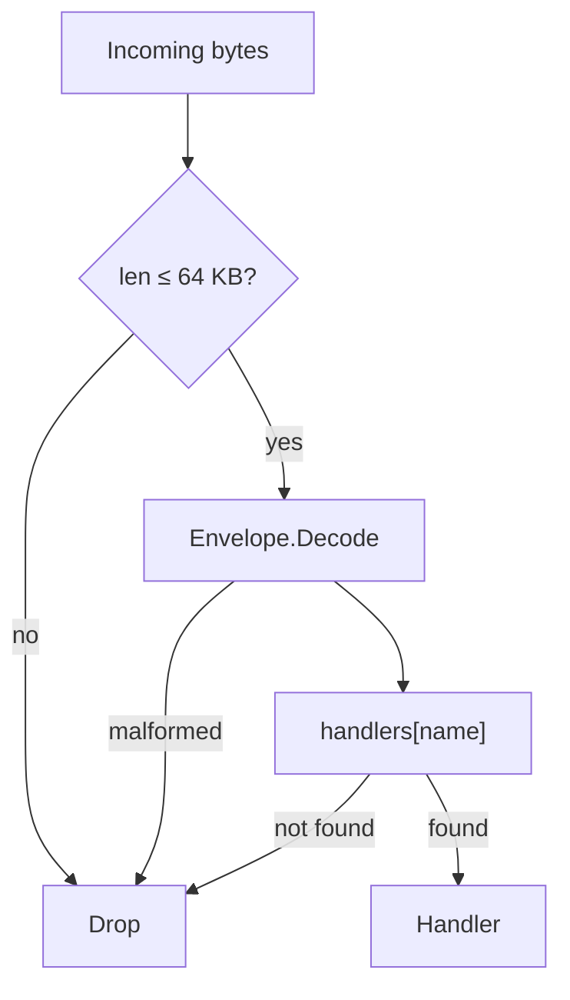
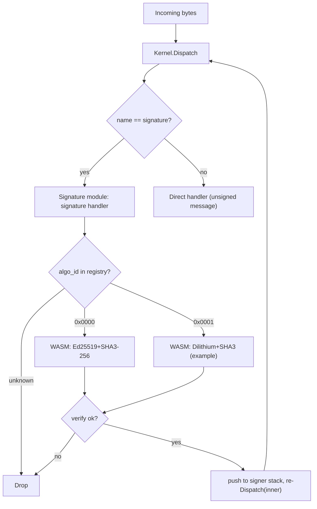

# Seed kernel: a self-bootstrapping message runtime

## 1. Vision

A minimal runtime where **everything is a message**. The kernel does one thing: parse an envelope and dispatch it to a handler registered under a **name**. Signing, authorization, capability gating, installation, and application logic are **modules** — layers that compose around the kernel like an onion. The system bootstraps from one trusted key (or no key at all, if that's what you want) into arbitrarily complex behaviour without the kernel knowing what any of it means.

Every binding is three orthogonal pieces: the **name** is the kernel's opaque dispatch key; the **bytes** are the WASM instance the kernel holds at that key; the **author** is the signer who installed it — a field in the installer's records, invisible to the kernel. The kernel is `handlers[name] → wasm_instance` plus dispatch; the signature module identifies authors; the installer binds names to bytes under a deployer-supplied **policy** that decides who may install what.

**Design principles:**

- The kernel is small enough to audit in a single sitting — one file, no cryptography, no authorization, no installation logic.
- The kernel makes one routing decision: look up the name and invoke the handler. Everything else, including how new handlers get installed, is a module concern.
- Modules form layers. Lower layers (signatures, installation) gate higher layers (apps like chat). Each layer can only see downward.
- Modules are independently usable — each is a standalone WASM module testable in isolation; nothing forces you to use them together.
- The same envelope works for tiny JSON payloads and large binary blobs.
- Cryptographic algorithms are pluggable; the kernel can survive a post-quantum transition without a protocol rewrite.
- The kernel compiles to WebAssembly so it runs anywhere.

The reference composition stacks app modules → installer (optional) → signature → kernel; §5 diagrams it.

---

### 1.1 Concepts at a glance

A reader's-digest mental model; full details follow in §2–§10.

- **Envelope** — `magic | version | name_len | name | payload` (§2). The kernel's only routing decision is `handlers[name]`.
- **Name** — opaque dispatch key; convention `hash("seedkernel.bootstrap.v1:" + canonical)` for bootstrap handlers, free-form for apps under the policy's discretion.
- **Handler** — a WASM module that exchanges bytes with the host through a fixed scratch offset in its own memory (§4).
- **Signing is a wrapper, not a header field.** A signed message is an outer envelope with `name = signature` whose payload carries `(algo_id, signer, sig, inner_envelope)` (§6.3).
- **Author** — top signer of the current dispatch, read via `kernel.call(signature.signer, …)` (§6.5).
- **Installer** — holds install records, accepts signed install messages, runs a deployer-supplied policy callback on each (§7).
- **Policy callback** — the only authorization decision point. Reference policy: deployer chooses first installer at a name; subsequent installs require same author + parent; any capability grant or broadening needs explicit acknowledgement (§7.4).
- **Capability** — a declared property of an installation, checked by bridges at I/O time (§8).
- **Bridges** — `SetHandler`-installed handlers bound to one capability; the only code that performs real I/O (§9).
- **Bootstrap** — host wires kernel, signature, and (optionally) installer; growth then happens via signed installs (§10).
- **Runtime / shell** — the deployable artifact: kernel + signature + installer under a policy, plus raw-byte capability backends (`crypto`, `net`, `fs`, `clock`) and a zero-authority JS confinement host. It loads a **signed bundle** and *becomes* that app — chat (§12) and [seed store](https://github.com/arj03/seedstore) are two (§13).
- **Bundle** — an app as signed content: an author-signed manifest committing to module hashes, a guest program, and the capability domains the guest is granted, alongside each module's ordinary §7.2 install envelope (§13.4).
- **Guest** — zero-authority JS confined in a QuickJS realm; its only reach is the `host.call(op, bytes)` seam into the cap-bridge, restricted to the domains its bundle's manifest declares (§13.2–§13.3).

```
incoming bytes
   │
   ▼
kernel.dispatch(name) ──► handlers[name]
                            │
                            └─► kernel.call(name, payload) ──► other handler / bridge
```

**Want to see it run?** Build the WASM artifacts (see `WASM/package.json` scripts), then either run `node WASM/tests/run.mjs` for the end-to-end test + 10k-message benchmark, or serve `WASM/browser/` over HTTPS and open `chat-shell.html` in two browsers for a P2P chat demo (§12). The worked-example trace in §14 walks through the same pipeline byte-by-byte.

## 2. The Envelope

Every message shares a single envelope format. The envelope carries the bare minimum the kernel needs: a routing key (`name`) and an opaque payload. The kernel's only job is to look up the handler for the name and invoke it.

```
┌───────────────────────────────────────────────────────┐
│ magic: 2 bytes          (0x5344 — ASCII "SD")         │
│ version: 1 byte         (0x01)                        │
│ name_len: 1 byte                                      │
│ name: [var bytes]       (opaque dispatch key)         │
│ payload: [remainder of buffer]                        │
└───────────────────────────────────────────────────────┘
```

Four bytes of fixed header, then the name, then the payload runs to the end of the buffer. The total envelope (all fields) must not exceed 65,536 bytes (§2.2). `name_len` must be at least 1; a zero-length name is invalid and will be rejected by the kernel.

| Field | Size | Description |
| --- | --- | --- |
| `magic` | 2 bytes | `0x5344` — identifies a seed kernel envelope |
| `version` | 1 byte | Protocol version (`0x01`) |
| `name_len` | 1 byte | Length of the name (1–255 bytes; `0` is invalid) |
| `name` | variable | Opaque dispatch key; meaning is a convention, not a kernel concern |
| `payload` | to end | The message body — handler-defined |

The kernel does not interpret the payload. Installation, signature wrapping, capability declarations, and every other piece of structure live inside the payload of some specific name and are the concern of the handler registered for that name, not the kernel.

### 2.1 Signing is a wrapper, not a field

To sign a message, you wrap an envelope inside another envelope whose `name` is the signature module. The outer payload carries the algorithm id, signer pubkey, the signature, and the inner envelope bytes. The signature module re-dispatches the inner envelope after verifying. Wire layout and details are in §6.3.

This makes signing **opt-in per message** and **composable**: you can have unsigned messages alongside signed ones, and you can stack wrappers (e.g. encrypted-then-signed, or hybrid sigs) without ever changing the envelope format.

### 2.2 Maximum message size (64 KB)

The kernel enforces a hard upper bound of **65,536 bytes** on the total envelope (header + name + payload). The kernel rejects any buffer larger than this limit before parsing.

**Rationale.** Signature verification dominates per-message cost (§11). Capping the envelope at 64 KB bounds the worst-case data a `verify` call must process, keeping per-message latency predictable and preventing a single oversized message from stalling the pipeline. For use cases that need to reference large data (files, images, firmware blobs), the payload carries a **content hash** — the digest of the external data under the envelope's signature suite — and consumers retrieve the actual bytes from an external store. The signature still covers the hash, so integrity is preserved end-to-end; the kernel just never has to move the bulk data through its dispatch path.

This limit applies to the **outermost** envelope on the wire. For signature wrappers (§2.1), the 64 KB budget includes the outer framing, the signature fields, and the complete inner envelope. Implementations should account for wrapper overhead — ~140 bytes for Ed25519 with 32-byte SHA-3 names (4 envelope header + 32 name + 2 algo + 2 signer_len + 32 pubkey + 2 sig_len + 64 sig), larger for PQ suites — when sizing inner payloads.

The 64 KB limit is a protocol constant, not a per-deployment configuration knob. Keeping it fixed avoids interoperability splits where one node accepts messages another rejects.

**Install messages** (handled by the installer, §7) carry name, capability, and parent metadata plus a WASM module inside their payload, and so are subject to the same 64 KB cap. The reference implementation modules are well within budget (see §11.2 for sizes). Signature suites (which may be larger, especially post-quantum suites) are installed by the same mechanism and follow the same 64 KB limit.

### 2.3 Maximum signature wrapping depth

The signature module MUST reject any `signature` envelope when the signer stack already contains `MAX_SIGNATURE_DEPTH` entries. **`MAX_SIGNATURE_DEPTH` is a protocol constant equal to `4`.**

**Rationale.** Each signature wrapper costs one verify (~95 µs for Ed25519 on a modern core). Per-wrapper overhead is ~140 bytes for Ed25519 (§2.2), so a 64 KB envelope can in principle nest ~475 wrappers. Without a cap, a single inbound message can force that many verifies (~45 ms CPU), turning a tiny attacker input into a CPU-amplification DoS against the single-threaded dispatch loop. Capping depth at 4 supports realistic use cases (single-sig, hybrid Ed25519+PQ, key-rotation overlays, an attestation envelope) while keeping per-message verify cost bounded.

This limit is enforced by the signature handler reading the current signer stack length before verifying — implementations do not need a separate counter. The 4-entry cap aligns with the authorization model in §6.5: the operative authorization is always the top signer, so deeper wrappers add no semantic value the kernel can use.

---

## 3. The kernel

The kernel has one message-driven path: parse an envelope and dispatch its payload to the handler registered for the name. It also exposes `SetHandler` (§3.1) — a host-level method for directly installing or replacing any handler. `SetHandler` is the **only** install path the kernel knows about; message-driven installation, when a deployment wants it, is a handler like any other (§7).

**"Drop" semantics.** Throughout this document, **drop** means "silently ignore: no response is generated, no error is propagated to the sender." Implementations MAY log or meter dropped messages but MUST NOT return a synchronous error or surface a side-effect. The kernel never produces unsolicited responses — every reply travels in a fresh envelope under the relevant app handler's policy.

```
dispatch(bytes):
  if len(bytes) > MAX_ENVELOPE_BYTES:                 drop
  envelope = parse(bytes)
  if envelope == null:                                drop  // bad magic, version, name_len, or truncation
  if handlers[envelope.name] is null:                 drop
  handlers[envelope.name](envelope.payload)
```

A module can call another module using `kernel.call`. The kernel knows nothing about signers, authors, or capabilities — that state lives in the signature module (§6.5) and the installer (§7). Any handler that needs to know who signed the current message calls `kernel.call` to `signature.signer`.

**Single-threaded dispatch.** A kernel instance dispatches one message at a time. The signer stack (§6.5), the call-depth counter, and the caller stack (used by `kernel.caller`) are all per-instance; the host MUST NOT enter `dispatch` re-entrantly except via `kernel.call`. Concurrent inbound traffic is the host's concern — typically by serializing onto a single event loop or running independent kernel instances per worker.



### 3.1 Host-level handler management (`SetHandler`)

The kernel exposes a single method for the host to manage handlers directly:

```
kernel.SetHandler(name, handler)
```

`SetHandler` installs or replaces the handler for the given `name`. If a handler already exists for that `name`, it is replaced. If `handler` is null, the handler is removed. The kernel never holds two entries for the same `name`; replace is in-place. `SetHandler` itself returns nothing — it is a side-effecting primitive on the kernel's handler table. The reference host wraps it with a thin `host.register(name, handler) → handlerId` convenience that allocates an internal handler id (used by `host.blockFromCall`, §4.4) and then performs the underlying `SetHandler` call.

`SetHandler` is the only way handlers enter or leave the kernel's table. There is no message kind for installation, no privileged "register" path, and no protected-vs-unprotected distinction — every entry in the table arrived via the same call. Handlers installed by `SetHandler` have **no installer record**: they are invisible to the installer's tables (§7) and, in particular, the capability index (§8). The host is responsible for whatever attribution and policy it cares about; the kernel just stores the function pointer.

Because `SetHandler`-installed handlers have no installer record, they also have no capability entries; see §8.3 for why this means bootstrap handlers cannot reach any I/O bridge.

`SetHandler` is internal to the host process — it is a direct method call, never reachable from inbound messages or WASM handlers. The host controls access through its own authentication (process-level permissions, operator console, HSM, or whatever is appropriate for the deployment). The kernel does not define an access control policy for `SetHandler`; that is the host's responsibility.

The same call the host uses during bootstrap (§10) remains available afterward for emergency replacement of any handler, including bootstrap handlers like `signature` and the installer itself. Message-driven installation lives in the installer (§7); the host-level `SetHandler` path is the emergency fallback.

**Replacing installer-managed names.** When the host uses `SetHandler` to replace a handler that already has an installer record (§7.1), the kernel does not touch the record. Stale `installer.lookup` / `installer.caps_of` answers would then misauthorize the replacement at bridge checks — the old declared caps would still apply to brand-new bytes. The host MUST first call `installer.remove(name)` (§7.5) to clear the record and null the slot, then `SetHandler(name, newHandler)` to install the replacement. The replacement runs with no capability entries until the host explicitly wires them.

### 3.2 The installer (optional)

Most deployments want to install new handlers by sending signed messages, not by direct host wiring. The system provides this through an **installer**: a host-side handler that turns signed install messages into `SetHandler` calls under a deployer-supplied policy. The installer is not part of the kernel — it is one more handler the host wires via `SetHandler` during bootstrap. Frozen-config deployments simply skip it and grow no further.

The installer is described in detail in §7. Its surface is two ideas:

- **An install message** binds a `name` to WASM bytes, claiming `(declared_caps, parent)`. The author is the top signer.
- **A policy callback** decides whether to honor each install. The reference policy is in §7.4.

A signed install message reaches the installer exactly like any other signed envelope: the signature wrapper verifies, pushes the signer, and re-dispatches; the kernel routes the inner envelope to `handlers[install]`; the installer runs.

---

## 4. WASM Handler Contract

All WASM interfaces are specified as raw WASM function signatures. Any language that compiles to WASM (AssemblyScript, C#, Rust, C, Zig, Go) can implement these.

Handlers exchange messages with the host through a **scratch region** in their own linear memory. There is no allocator contract, no pointers crossing the boundary, no buffer lifetimes for the handler author to reason about — just "read input here, write output there, return the length."

### 4.1 Exports (handler must provide)

| Export name | WASM type | Description |
| --- | --- | --- |
| `memory` | linear memory | Handler's memory; the host reads input from and writes output to the scratch offset within it. |
| `scratch` | `global i32` | Byte offset into `memory` where the host places input and reads output. Set once during instantiation; the host reads it once after instantiation and the handler MUST NOT change it afterward. |
| `handle` | `(i32) → i32` | `(input_len) → output_len` — process the message at `scratch` and return the response length. |

**I/O protocol.** Before each call, the host writes the input bytes at offset `scratch` (up to the configured scratch size — default 128 KB, set per handler at instantiation). The handler reads its input from `scratch`, writes its response back at `scratch` (overwriting the input is fine), and returns the number of response bytes. Return `0` for "no response." The host reads `output_len` bytes at `scratch` after `handle` returns and does not touch the region again until the next call.

Memory outside the scratch region is the handler's private state — statics, globals, whatever allocator it wants for its own bookkeeping. None of that is exposed to the host.

### 4.2 Imports (host provides to handler)

The host exposes these under the import module `"kernel"`. These are the **only** host imports — everything else (author queries, capability lookups, logging) is accessed via `kernel.call` to the appropriate module.

| Import name | WASM signature | Description |
| --- | --- | --- |
| `call` | `(i32, i32, i32, i32) → i32` | `(name_ptr, name_len, payload_ptr, payload_len) → response_len` — synchronous dispatch to the handler registered for the given name. The four pointers are into the **caller's own memory** (anywhere the caller likes). The response is written into the caller's scratch region; the return value is the response length, or `-1` on error (no handler registered, call depth exceeded, response too large for caller's scratch). See §4.4. |
| `caller` | `(i32) → i32` | `(out_ptr) → total_len` — writes the caller stack at `out_ptr` in push order: `[count u8] [name1_len u8][name1 bytes] ... [nameK_len u8][nameK bytes]`. Outermost first, immediate caller last. Empty stack returns `[0x00]` (single byte, count=0) — the handler was reached by direct envelope dispatch rather than through `kernel.call`. The stack tracks `kernel.call` lineage only; signature-wrapper re-dispatch starts a fresh context (its lineage is the signer stack, §6.5). The host MAY originate a `kernel.call` chain to deliver async bridge responses (§9), in which case the stack is `[bridge_name]` for that frame — same shape as a synchronous call from the bridge, so the receiver's authentication check is identical. Count is bounded by `MAX_CALL_DEPTH`. Bridges read the last entry for capability checks (§8.2); other handlers may inspect the full stack for audit / logging. Treating non-top frames as authoritative invites confused-deputy mistakes — capability checks MUST use the immediate caller only. |

### 4.3 Safety & memory model

What a handler **cannot** do:

- Access the filesystem, network, or clock. The only outside-world reach is `kernel.call` to other handlers; bridges (handlers that perform real I/O) additionally require the caller to have declared the bridge's capability at install time (§7.2, §8). The default is no capabilities; every declaration is explicit.
- Allocate memory across the boundary. There is no allocator contract — every cross-module byte lives in one handler's scratch and is copied by the host into another's. The host never holds a pointer into a handler's memory across a return, and never writes outside the scratch region.
- Corrupt anything outside its own scratch and private memory. A buggy or malicious handler can scribble in itself but cannot touch the host, the kernel, or another handler.

What a handler **must** internalize:

- Memory is bounded by what the WASM module declares (and the host engine's own limits); the kernel imposes no per-handler cap.
- A `kernel.call` overwrites your scratch with the callee's response. If you still need the input, copy it first (§4.4).

> **Compute and memory exhaustion are the host's problem.** WebAssembly engines on the JavaScript platform expose no native fuel/timeout mechanism, so this protocol does not specify one. The depth caps (§2.3, §4.4) and the 64 KB envelope limit (§2.2) bound the verify-amplification and recursion vectors, but a single installed handler can still infinite-loop or declare a huge linear memory and OOM the single-threaded host — and a permissive registry (§7.4) multiplies that across many installs. Deployers concerned about runaway handlers should run dispatch in a Worker with a watchdog (for compute) and pre-validate handler bytecode in the installer's policy callback (cap declared memory, forbid unbounded loops/recursion, etc.) before installing. The kernel exposes the call-depth bound (§4.4) but does not bound per-handler execution time or memory footprint.

> **Note.** Signature suite modules (§6.6) are the one exception to the scratch-only memory model. A suite has multi-argument primitives that don't fit the single-buffer scratch model cleanly, so the suite contract uses an explicit `alloc` and pointer arguments. Suite authors are crypto specialists writing thin wrappers around existing libraries; the small extra ceremony is acceptable in that niche.

### 4.4 Synchronous cross-module calls (`kernel.call`)

`kernel.call` performs a synchronous dispatch to the handler registered for the given `name`. The host wires the two handlers together by copying through their scratch regions:

1. Host reads `name_len` bytes from caller memory at `name_ptr`, and `payload_len` bytes at `payload_ptr`. (These pointers are into caller memory — anywhere the caller put them; they do not need to be in scratch.)
2. Host looks up the target handler. If none is registered, returns `-1`.
3. Host writes the payload bytes into the target's scratch region and calls `target.handle(payload_len)`.
4. Target reads input, writes response at its own scratch, returns `response_len`.
5. Host reads `response_len` bytes from the target's scratch and writes them into the caller's scratch region.
6. Host returns `response_len` to the caller. The caller reads its response from its own `scratch` offset.

**Semantics:**

- The callee sees raw payload bytes at its scratch — there is no envelope wrapping. Routing is by `name` only.
- The callee cannot distinguish an inbound envelope from a `kernel.call`. It sees input at scratch and writes output at scratch.
- Calls are **re-entrant**: A can call B can call C. The host enforces a maximum call depth (default 8); exceeding it returns `-1`.
- **The caller's scratch is overwritten when the callee returns a non-empty response.** A handler that still needs its original input across a `kernel.call` must copy it into private memory before calling — assume the worst, since any response overwrites scratch unconditionally. When the callee returns no bytes (return value `0`), the caller's scratch is left untouched, so callers MUST NOT rely on `kernel.call` to clear scratch. If a handler holds secrets in scratch and needs them cleared regardless of callee behaviour, it must zero scratch itself.
- If the callee's response exceeds the caller's scratch size, the host returns `-1` and writes nothing. Tune scratch size per handler if you expect large responses.

**Handlers blocked from `kernel.call`.** Two kinds of handler MUST cause `kernel.call` to return `-1` *before* the target is invoked. The check belongs at the call router (the host's `kernel.call` import), not inside the handlers.

1. **State mutators** — handlers that call `kernel.SetHandler`, modify the installer's records, or write to the suite registry. Without the block, an in-handler `kernel.call` could mutate state under the current top signer's authority without that signer's intent.
2. **The `signature` wrapper itself** — it does not mutate persistent state, but it pushes a new entry onto the signer stack and re-dispatches. Allowing it via `kernel.call` would let an arbitrary handler reframe the active signer mid-chain and break the "top signer = author" rule.

Blocked handlers run only at top-level dispatch, where the signature wrapper has already verified the outer signature. Read-only queries (`signature.signer`, `installer.lookup`, `installer.caps_of`) remain freely callable.

The reference host auto-blocks the two bootstrap handlers `signature` and `install`. Deployer-added handlers in either class MUST be marked blocked via `host.blockFromCall(handlerId)` immediately after `host.register`.

**Replay protection (mandatory for state-mutating handlers).** Every mutator that acts under the top signer's authority — `install` and any deployer-added equivalent — MUST consume a `u32` big-endian sequence number as the *first* field of its payload and MUST drop the message if `seq <= last_seen[(handler, signer.pubkey)]`. The seq check MUST run before any state mutation; cheap-drop checks MAY run first to avoid polluting the seq table with messages that would have been refused anyway. The high-water mark is per-key-per-handler, lives in a persistent table that is **not** part of any install record (§7.1), and **persists across deny-listing, removal, or other policy changes** (tombstone-forever) — re-admitting (or `installer.remove` + re-installing) a previously-denied signer MUST NOT rewind their sequence, or pre-denial wire bytes could be replayed after the re-admission. Senders pick strictly increasing seqs (gaps are fine); on counter loss, jump forward conservatively.

The `signature` wrapper is on the blocklist but consumes no `seq`: it does not act under any signer's authority — it *establishes* the top signer — and its push/pop of the signer stack leaves no persistent state to replay. The two protections target different threats: `seq` cuts off wire replay of authorized mutations; the blocklist cuts off in-pipeline corruption of kernel state.

**Application handlers: replay protection is opt-in.** The protocol mandates `seq` only for handlers that mutate kernel-managed state (the installer and any deployer-added equivalent). Ordinary app handlers (chat, ...) are not on the blocklist, do not consume `seq` by default, and a signed envelope replayed verbatim onto the wire will re-verify and re-dispatch byte-identically — anyone who has ever seen the bytes can resend them. Whether that matters is application-specific: idempotent handlers (e.g. appending a chat line to a display log, where seeing the same message twice is a UX nit rather than a security failure) can ignore replays; handlers whose payload causes a meaningful state change (transferring an asset, casting a vote, flipping a switch, charging an account) MUST defend themselves. The mechanism is the same one this section prescribes for mutators — a `seq` field consumed before the action with a per-`(handler, signer.pubkey)` high-water mark keyed by the canonical public key — but the app chooses the field placement in its payload, the storage backing the counter, and whether related handlers share a high-water map or keep independent ones. Apps that need stronger guarantees than monotonic `seq` (e.g. exactly-once semantics across a network partition, or freshness windows) layer their own nonce / timestamp / challenge-response scheme on top; the kernel exposes no clock and offers no help here.

---

## 5. Layering and composition

Modules form an onion: each layer wraps the layers above it and depends only on the layers below (§1). No layer has a hard dependency on the layers around it — the onion is a typical composition, not a required one.

```
┌──────────────────────────────────┐
│   App modules                    │
│   (chat, …)                      │
│                                  │
│   handlers dispatched normally   │
├──────────────────────────────────┤
│   I/O bridges (optional)         │
│   (net, ui, fs, clock, …)        │
│                                  │
│   SetHandler-installed           │
│   caller-capability checked      │
├──────────────────────────────────┤
│   Installer (optional)           │
│                                  │
│   parses install messages        │
│   runs policy callback           │
│   holds (author, bytes_hash,     │
│         caps, parent) records    │
├──────────────────────────────────┤
│   Signature                      │
│                                  │
│   signature wrapper              │
│   signer stack                   │
├──────────────────────────────────┤
│   Kernel                         │
│                                  │
│   envelope parsing               │
│   dispatch by name               │
└──────────────────────────────────┘
```

### 5.1 Modules in the reference implementation

A one-line per layer index — full details live in §6 (Signature), §7 (Installer), §8 (Capabilities), §9 (Bridges), and §12 (App examples).

| Layer | Modules | What lives there |
| --- | --- | --- |
| **1: Signature** | Signature | Algorithm suites, signer stack, wrapper verification. |
| **2: Installer** | Installer | The install message handler, the install records, the policy callback. Also where the capability index lives, since caps are a property of installs. |
| **2.5: I/O bridges** | Deployer-defined (`net.send`, `ui.write`, `fs.read`, `clock.now`, …) | The only code that performs real I/O. `SetHandler`-installed, one capability each. |
| **3: App modules** | Chat (example) | User-facing handlers installed via signed install messages. |

Each module is in its own file and can be used standalone — the signature module is testable without a kernel, the installer is testable without bridges, and chat is just a handler testable without signatures. All inter-module queries go through `kernel.call` to the target module's name (e.g. `signature.signer`, `installer.lookup`, `installer.caps_of`).

**The hash function used for id derivation.** Throughout this section, `hash(…)` means the **genesis suite's hash** (§6.2) — the only hash function guaranteed to exist at boot. In the reference implementation that is SHA-3-256 (32-byte output). A deployment that swaps genesis suite swaps the hash: every derived `name` and `cap_id` shifts, so the bootstrap seeds in §10 must be re-derived. Pick the genesis suite once and treat it as a deployment-wide constant.

**Naming convention for bootstrap handlers:** `name = hash("seedkernel.bootstrap.v1:" + canonical_name)`. There is no installer record to mix in — these handlers are seeded by the host via `SetHandler` (§3.1), not by a signed message.

**Naming convention for app handlers:** free-form within whatever the policy approves. The reference policy (§7.4) places no constraint on names beyond uniqueness — first installer at a name owns it, and only that author can update it. Deployers who want author-scoped namespaces (so two parties can each have their own `chat` without conflict) can require names of the form `hash(canonical || author_pubkey)` in their policy callback. The kernel is indifferent.

---

## 6. The signature module

This is where pluggable signatures live. The signature module maintains a registry of **algorithm suites** identified by `algo_id` and owns the `signature` name — a wrapper format that lets any envelope be signed.

### 6.1 Algorithm suite

An algorithm suite is a bundle of:

| Operation | Purpose | Example (suite 0x0000) |
| --- | --- | --- |
| `hash(data) → bytes` | Produce a name from a canonical string | SHA-3-256 → 32 bytes |
| `verify(pubkey, signature, data) → bool` | Verify a message signature | Ed25519 |

Each suite declares fixed sizes (key length, sig max length, hash length) used for sanity-checking the wrapper payload. Signing is a sender-side operation and lives in the host (no WASM export — see §6.6).

### 6.2 The Genesis suite (algo_id = 0x0000)

The signature module needs *something* to verify the very first message. By convention:

- **algo_id 0x0000** = Ed25519 + SHA-3-256
- It is delivered as a **separate WASM module** (e.g. libsodium compiled to WASM), loaded at boot time.
- The host trusts it **by hash** — the expected SHA-3-256 hash of the genesis WASM module is the one cryptographic constant in the bootstrap configuration.
- It can never be removed, but it **can be superseded** for all new messages by registering a new suite (§6.4).

The kernel itself does not know about a genesis suite. The hash is held by the host's bootstrap code, which inserts the suite into the signature module's registry before any messages are dispatched.

During a PQ migration, Ed25519 is typically the **outer** wrapper and the new PQ suite is the **inner** one. See §6.5 (wrapping convention).

### 6.3 The `signature` wrapper

Signing is a wrapper message. To send a signed inner envelope, build the inner envelope as normal, then wrap it:

```
outer envelope:
  name          = signature name id
  payload       = [ algo_id:     2 bytes (u16)            ]
                  [ signer_len:  2 bytes (u16)            ]
                  [ signer:      var bytes (public key)   ]
                  [ sig_len:     2 bytes (u16)            ]
                  [ signature:   var bytes                ]
                  [ inner_envelope: remainder of payload  ]
```

The inner envelope is a complete envelope — including its own magic, version, name, and payload.

The signature is computed over `inner_envelope` — the raw bytes of the inner envelope, including its own framing. Re-enveloping (relaying) is lossless: the inner bytes don't change, so the signature remains valid.

**The outer `algo_id` and `signer` fields are not themselves covered by the signature.** Flipping `algo_id` on a captured message normally just causes verification to fail under the wrong suite (fail-safe), and `signer` is the key the suite verifies against, so a wrong value cannot verify. The one place this matters is replay state: it MUST NOT be namespaced by `algo_id` (§4.4), or an attacker who flips the unsigned `algo_id` could replay a message once per suite that happens to verify the same key (§6.4 rotation). Because identity is raw key bytes, the suite MUST also validate the public key — rejecting non-canonical or small-order encodings — before pushing it onto the signer stack, so that the same logical key cannot present two distinct byte encodings.

After verification, the inner envelope re-enters the pipeline and dispatches normally. The signature module registers a single handler for `signature`; that handler's verify-time flow is:



Unknown `algo_id`s drop because the suite was never registered (§6.4); only suites in the registry can be verified against.

### 6.4 Registering new algorithms

Suite modules are not regular kernel handlers — their `verify` / `hash` exports take multi-pointer arguments (§6.6) that don't fit the scratch ABI used by `kernel.call`. Each suite instance lives instead in a **suite registry**, indexed by `algo_id` and held host-side on the signature module's behalf. The signature module reaches suite primitives through a host import that the host dispatches to the right instance.

The genesis suite is seeded into this registry at bootstrap (§6.2, §10). To add another suite at runtime, send a signed install message targeting the conventional suite slot `hash("seedkernel.signature.suite.v1:" + algo_id_hex)`. The installer recognizes suite-slot names: it runs the same `approveInstall` policy callback as any other install, and on approval — instead of calling `SetHandler` — it asks the host to instantiate the WASM under the suite ABI and place the resulting instance in the registry under `algo_id`. The `(author, bytes_hash, declared_caps, parent)` record is still written to `installations[]` for audit and upgrade lineage; the kernel's handler table never holds a suite.

The deployer's policy callback (§7.3) governs who may register suites — the same callback that governs every other install. There is no separate "trust for signature.register" path; "may this signer install at the suite slot for `algo_id N`?" is just a policy question. The reference policy's first-install/same-author rule (§7.4) applies: the first installer at a suite slot owns it and is the only author who can replace its WASM later.

Once a new suite is registered, messages signed under it should be wrapped per §6.5: the new suite is the **innermost** signer (the operative authorizer); legacy-suite wrappers go on the outside.

**Duplicate registration.** The reference policy's same-author requirement prevents a different signer from replacing a suite once installed. To rotate a suite, deployers allocate a new `algo_id` and install at the new slot. The genesis suite (`algo_id 0x0000`) is seeded into the registry by the host at bootstrap (§10) and cannot be replaced through the installer at all — the installer refuses to overwrite a registry entry it did not place there. Emergency replacement of the genesis suite is a direct host-side write to the registry, like any other host-side intervention.

**Lazy validation.** The signature module does not verify that suite bytes actually implement the suite contract at install time. If the bytes don't export `verify`, the first message signed under that `algo_id` fails verification and drops. This is intentional — schema/interface checking is the installer policy's job if a deployment cares (it can inspect the WASM exports before approving, see §7.3), and the security-relevant path (verify failure → drop) is fail-safe regardless.

### 6.5 Signer stack (signature module internals)

The signature module maintains a **signer stack** — an internal list that tracks which keys have been verified during the current top-level dispatch. The kernel doesn't know it exists.

**Lifecycle.** Every accepted `signature` wrapper pushes one entry, executes the inner dispatch synchronously, and pops on return. Stack depth therefore equals the number of nested `signature` wrappers active at the current point in the pipeline, capped at `MAX_SIGNATURE_DEPTH` (§2.3).

```
signature-envelope  (algo = Ed25519,  signer = A)        ← outer
  └─ signature-envelope  (algo = Dilithium, signer = B)  ← inner
       └─ inner envelope  (the actual message)

stack while the actual message handler runs: [A, B]   (A pushed first, B on top)
```

**Query API — `signature.signer`.** Any handler may call `kernel.call(signature.signer, …)` to read the current stack. The query handler ignores its payload (zero bytes is canonical) and returns `[count u8] [algo_id u16][pubkey_len u16][pubkey ..]*` in push order — outermost signer first, top signer last. Empty stack returns `[0x00]`. `pubkey_len` is u16 big-endian so post-quantum suites with multi-kilobyte public keys (e.g. ML-DSA) fit without truncation. The stack is scoped to the *top-level* dispatch, so nested `kernel.call` frames see exactly the same answer; the question "who signed the message that caused this chain of calls?" is well-defined everywhere in the chain.

**Author = top signer.** When the installer (§7) or any other handler asks "who is the author of this dispatch," the answer is the **top** (innermost) signer. Outer wrappers attest but do not lend authority: if A wraps B's envelope, the action is B's intent; A's wrapping is part of the audit trail, not part of the authorization. Application handlers reading `signature.signer` may apply any policy they like (e.g. require *all* signers to satisfy some property); only the installer's reference policy is top-only.

**PQ wrapping convention.** Whichever algorithm is operative MUST be the **innermost** wrapper. A PQ rollout signs PQ first and optionally wraps Ed25519 on top: every layer still has to verify (so a break in either algorithm fails the message), but authorization sits with PQ. Inverting the order would silently downgrade authorization to Ed25519.

### 6.6 Suite WASM contract

A signature-suite module placed in the suite registry (§6.4) MUST export the following. The host calls these exports directly — not via `kernel.call` — when the signature module requests verification through the host's suite-dispatch import. This is the one place in the protocol where a WASM module exposes more than the standard scratch ABI (§4): a suite has multi-argument primitives that don't fit a single-buffer model, so it provides an explicit allocator and pointer arguments instead.

| Export name | WASM signature | Description |
| --- | --- | --- |
| `memory` | linear memory | Suite's memory; the host copies pubkey / sig / data into it before calling `verify`. |
| `verify` | `(i32, i32, i32, i32, i32, i32) → i32` | `(pubkey_ptr, pubkey_len, sig_ptr, sig_len, data_ptr, data_len) → 1 if valid` |
| `alloc` | `(i32) → i32` | `(size) → ptr` — allocate memory the host writes into before calling `verify` / `hash` |
| `hash` *(optional)* | `(i32, i32, i32) → i32` | `(data_ptr, data_len, out_ptr) → hash_len` — only used if the host routes id derivation through the suite. The reference host hashes directly via its bundled libsodium (§5.1) and never calls suite `hash`, so genesis suites can omit it; non-genesis suites may export it for hosts that do. |
| `dealloc` *(optional)* | `(i32) → void` | Counterpart to `alloc`. The reference host pre-allocates suite scratch once and reuses it, so `dealloc` is rarely called; suites may omit it. |

The signer-query schema (`signature.signer`) is described in §6.5 — it is exposed by the signature module itself, not by suite modules.

---

## 7. The installer module

The installer accepts signed install messages, runs a deployer-supplied policy callback to decide whether to honor them, and on approval calls `SetHandler(name, instance)`. It also holds the records that make `caps_of` and `lookup` queries possible.

### 7.1 Install records

The installer maintains two tables. The first is the install records:

```
installations[name] → {
  author:         (algo_id, pubkey)
  bytes_hash:     content hash of this install (the entire install payload)
  declared_caps:  list of cap_ids the handler may reach via bridges
  parent:         bytes_hash this install claims to supersede (empty if none)
}
```

The second is a **replay high-water table that is deliberately separate from the install records**:

```
seq_high_water[(handler, signer.pubkey)] → u32   // canonical-pubkey-keyed; see §4.4
```

It lives apart because the §4.4 replay counter must be **tombstone-forever**: `installer.remove` (§7.5) clears `installations[name]`, but it MUST NOT touch `seq_high_water`, or removing and re-admitting the same key would rewind `seq` to zero and let pre-removal wire messages replay. The separation is also structurally necessary — the `install` handler is `SetHandler`-seeded and so has *no* row in `installations[]` (it is invisible to the installer's own tables), so the installer's own replay counter cannot live in a per-name install record in the first place.

`bytes_hash` is the genesis-suite hash (§6.2) of the **entire install payload** — `seq`, `name`, declared caps, claimed parent, and the WASM body. The installer computes it directly from the inbound bytes; sender claims are never trusted. Hashing the whole payload makes `bytes_hash` a unique identifier for that specific signed install message: two republishes of the same content at different `seq` values produce distinct hashes, so a `parent` claim always points at exactly one historical wire message rather than at "any of N messages with the same content." Because `parent` is itself inside the hashed region, each version's `bytes_hash` transitively commits to its predecessor, and a name's current `bytes_hash` is in effect a Merkle root over its entire lineage. `parent` is metadata — the installer records it but does not require the parent bytes_hash to currently be installed (lineage chains are auditable from the bytes, not enforced at install time). The chain is singly-linked: only the immediate predecessor is recorded, so the deeper history is reconstructed by walking past install messages, not from the current record alone.

`SetHandler`-installed handlers have **no row** in this table. The capability index for them is therefore empty (§8.3), and they have no author of record. The host owns whatever metadata it cares about.

### 7.2 The install message

Signed install messages target `name = hash("seedkernel.bootstrap.v1:install")`. The payload:

```
install payload:
  seq:           4 bytes (u32 big-endian)         (§4.4 replay protection)
  name_len:      1 byte
  name:          var bytes                         (the name to bind)
  caps_count:    1 byte                            (0 = no capabilities requested)
  caps:          caps_count × [cap_id_len u8][cap_id: var bytes]
  parent_len:    1 byte                            (0 = no claimed predecessor)
  parent:        var bytes                         (parent_len bytes; predecessor's bytes_hash)
  wasm:          remainder
```

A `caps_count` of `0` means the handler is pure computation — no bridge access of any kind. `cap_id` is opaque to the installer; by convention `hash("seedkernel.cap.v1:" + name)` using the genesis suite's hash. A `parent_len` of `0` means the install does not claim a predecessor — typical for the first version of a handler at a new name. When non-zero, `parent` is exactly the predecessor install's recorded `bytes_hash` — the genesis-suite hash (§6.2) of that earlier install's full payload (see §7.1 for what the hash covers) — and `parent_len` is the genesis suite's hash output length (32 bytes for the default SHA-3-256 suite). Senders typically obtain it by reading the `bytes_hash` field from an `installer.lookup` response (§7.6); the reference policy's `existing.bytes_hash == parent` check is byte-for-byte equality on those hash bytes, so a mismatched length is a guaranteed drop.

When invoked, the installer:

1. Reads the top signer (the *author* of this install). If the stack is empty, drop — installs must be signed.
2. Parses the payload. Drop on malformed.
3. Computes `bytes_hash = genesis_hash(install_payload)` — the hash of the entire install payload, every byte from `seq` through the end of `wasm`. See §7.1 for the rationale (full content commitment, unique per signed install).
4. Consumes the `seq` and updates the `seq_high_water[(install, signer.pubkey)]` mark in the separate replay table (§7.1, §4.4) — never in the install record. Replays (`seq <= last_seen`) drop here, before any further state mutation.
5. Calls the deployer-supplied **policy callback** `approveInstall(name, author, bytes_hash, wasm, declared_caps, parent, existing_record_or_null) → bool`. If no callback is wired or it returns false, drop. With no callback wired, every install is dropped — installation is opt-in for the deployment.
6. For names matching the suite-slot convention (§6.4), instantiates the WASM under the suite ABI (§6.6) and places it in the suite registry under the encoded `algo_id` — `SetHandler` is **not** called. Otherwise instantiates against the standard handler ABI (§4) and calls `SetHandler(name, instantiatedHandler)`.
7. Writes the install record to `installations[name]` (for both paths).

The order is deliberate: cheap parse checks first; replay protection before the policy callback (so a denied policy doesn't leave a polluted seq table); the policy callback runs against the *resolved* state (with `bytes_hash` already computed and any existing record fetched), so the policy never has to do that work itself.

### 7.3 The policy callback

The callback is the entire authorization story. It receives everything relevant:

- `name` — the name the install is targeting
- `author` — `(algo_id, pubkey)` of the top signer
- `bytes_hash` — the content hash of the WASM about to be installed
- `wasm` — the raw WASM bytes. Pre-approved binaries match against `bytes_hash` cheaply; inspection-based policies (e.g. structural validation, instruction-set filtering, export-table checks for suites) get the bytes directly without re-hashing.
- `declared_caps` — the capabilities the handler claims it needs
- `parent` — the predecessor this install claims (empty if none)
- `existing_record_or_null` — the current installation at `name`, if any

It returns `true` to proceed with the install or `false` to drop. That is the full interface.

Deployers wire whatever policy fits their environment. Some examples:

- **Open registry.** `return true;` — anyone may install at any name *with any capabilities*. Because the install path is the same `host.dispatch` that handles remote peer frames (§12), this is remote installation of arbitrary WASM with arbitrary capability acquisition — effectively remote code execution with full I/O reach, not just a name-squatting risk. Useful only for local testing; never appropriate for a deployment exposed to untrusted senders.
- **Reference policy.** `(existing == null ? deployer_first_install(...) : author == existing.author && existing.bytes_hash == parent) && caps_acknowledged(...)` — author/parent gate plus a capability-acknowledgement gate; see §7.4.
- **Content-hash allowlist.** `return bytes_hash ∈ approved_hashes;` — only pre-audited binaries.

Other common patterns: fixed author allowlists, M-of-N quorums (requires reading the full signer stack via `signature.signer`), and capability-restricted authors (`declared_caps ⊆ allowed_caps[author]`).

The callback may be arbitrarily expensive — the installer dispatches one install at a time and the policy decision is on the install hot path, but it is not on the message-dispatch hot path. A callback that consults an operator console or HSM is fine.

### 7.4 Default reference policy

The reference installer ships with a default policy that is easy to explain. It is **not** a bare "trust the original author" rule, because that alone is not least-privilege: it would let a handler declare any capabilities on first install and silently broaden them on every upgrade. The default therefore has three rules — two for *who* may bind a name, one for *what capabilities* an install may acquire:

1. **First install at a name:** the deployer's choice. The reference implementation exposes a `firstInstallPolicy(name, author, bytes_hash, declared_caps)` sub-callback that the deployer wires. `declared_caps` is passed in precisely so this decision is capability-aware (rule 3). Common values are:
   - An author allowlist (closed registry — only specified keys may claim new names).
   - A naming-convention check (e.g. names must be of the form `hash(canonical || author_pubkey)`, structurally proving the author claimed the name for themselves).
   - `return true` (open registry). **Read the warning in §7.3 before using this** — combined with the fact that the same `host.dispatch` path carries remote peer frames and `install` messages (§12), an unconditional first-install policy is not merely name-squatting: it is remote installation of arbitrary WASM that can declare *any* capability, i.e. remote code execution with full I/O reach.
2. **Subsequent install at the same name:** the install must be signed by the existing author and must claim the current `bytes_hash` as its parent:
   ```
   author == existing.author && existing.bytes_hash == parent
   ```

   The strict `parent == existing.bytes_hash` form is the reference choice, not a protocol requirement. Every install flows through `approveInstall`, so a deployer who wants to permit gaps — accepting any ancestor in the name's lineage so a node that missed an intermediate install can still upgrade, or skipping the parent check entirely — encodes that in the callback. The lineage stays signed-and-auditable either way; the policy decides how tight the parent claim has to be.
3. **Capability acknowledgement (both paths).** Passing rules 1–2 establishes *who* may bind the name; it does not by itself grant *capabilities*. The reference policy treats any capability grant as requiring explicit acknowledgement:
   - An install that declares **no capabilities** (`caps_count == 0`, §7.2) is pure computation and is auto-accepted once rule 1 or 2 passes — there is nothing to escalate.
   - An install whose `declared_caps` is a subset of the existing record's `declared_caps` (same author re-publishing or narrowing) is auto-accepted — capabilities only ever shrink.
   - An install that **adds or broadens** a capability — a first install requesting any cap, or an upgrade whose `declared_caps` is not a subset of `existing.declared_caps` — is held for an explicit operator/user acknowledgement (the reference wiring exposes an `acknowledgeCaps(name, author, added_caps)` hook) and is dropped if not acknowledged. This is what closes the silent-escalation gap: a handler installed with `caps=[]` cannot upgrade itself to `caps=[net, fs]` just by being the same author with the right parent.

   A deployment that prefers maximal caution can require acknowledgement of *every* update, not only capability-broadening ones; the hook sees enough to make that choice. The point of the default is that capability changes are never silent.

These rules give you everything you'd usually want without any extra machinery:

- **Squat-resistant.** Once an author has bound a name, no one else can take it over — their install fails rule 2.
- **Upgrades just work.** The author installs a new version, sets `parent = current_bytes_hash`, signs with the same key. If the new version keeps the same capabilities (or fewer), the binding updates in place with no further interaction; an upgrade that broadens capabilities additionally needs the acknowledgement from rule 3 before it lands.
- **Lineage is verifiable.** The chain of `parent → previous bytes_hash` across a name's history is a singly-linked, signed hash chain. Given the full series of install messages, anyone can walk it from the current version back to genesis. A node that never saw an intermediate install lacks the bytes_hash of that link and cannot bridge past the gap on its own — it sees only the current record's immediate parent.
- **Forks are explicit and non-hostile.** Anyone may install their own fork at a *different* name with `parent = your_bytes_hash`. The chain shows the relationship; no one had to assert anything special.
- **Delegation is just an upgrade.** To hand a name over, the current author installs a new version whose handler treats some other key as the relevant authority going forward, and (optionally) the installer records the new author. The kernel doesn't care; the install record is the source of truth.
- **Slots seeded by `SetHandler` are refused.** If there is no record for `name` but `kernel.handlers[name]` is non-null, the slot was seeded via host-side `SetHandler` (a bootstrap entry like the signature handler). The installer refuses to overlay it. To replace such a slot, the host uses `SetHandler` directly.

The reference policy is one specific way of saying "trust the original author." Deployments with different needs — quorum-controlled production registries, content-hash allowlists, delegation hierarchies — replace `firstInstallPolicy` or the whole callback. Everything else in the system behaves the same.

### 7.5 Revocation

There is no separate revocation cascade. Revocation is something the policy expresses, plus a small mechanism the installer exposes for undoing previous installs.

**Removing an install.** The installer exposes `installer.remove(name)` as a host-side method (callable by the host directly, not via messages — like `SetHandler`). For ordinary handler installs it clears `installations[name]` and calls `SetHandler(name, null)`. It does **not** clear the `seq_high_water` table (§7.1): the replay high-water marks are tombstone-forever (§4.4), so re-installing at the same name later cannot rewind a signer's sequence. For suite-slot names (§6.4) it clears `installations[name]` and removes the corresponding entry from the suite registry — the kernel handler table is not touched (the slot was never in it). The genesis suite is never installer-managed (its registry entry was placed by the host, not by an install), so `installer.remove` on the genesis slot is a no-op; removing the genesis suite requires a direct host-side write to the registry. Used by operators for emergency cleanup or by message-driven revocation handlers a deployer chooses to add.

**Message-driven revocation.** A deployer who wants signed messages to be able to revoke installs adds a `revoke` handler that:

1. Identifies the author (top signer).
2. Decides — through its own logic, which the deployer writes — whether this author is permitted to revoke this name. The reference suggestion: only the install's current author may revoke it; in trust-chain-like deployments, an ancestor authority may revoke a descendant's installs.
3. Calls `installer.remove(name)` on approval.

**Post-revocation behaviour.** Removing an install clears the slot. Anyone may then re-install at the same name under rule 1 of the reference policy, or the deployer's policy can maintain a deny-list to prevent specific bytes_hashes or specific authors from reclaiming. The kernel doesn't enforce permanence; the policy callback does, if a deployment wants permanence.

**Compromised key recovery.** Under the strict reference policy a compromised key can keep installing new versions of its handlers indefinitely — `author == existing.author` still matches. The protocol does not bake in a single recovery model; *who* may override the original author is a deployment policy question. Three deployer-side responses exist, and most production deployments will want at least one:

- **Deny-list in `approveInstall`.** Refuse installs where `author` is in a deployment-maintained revoked set. The set is out-of-band state, distributed by whatever channel the deployment trusts (operator console, gossip, signed update from a higher authority). This stops new installs but does not by itself remove the compromised handler that is already in place.
- **Host-side `installer.remove`.** The operator clears the compromised handler directly. Pair with a deny-list so the same key cannot re-install immediately afterward.
- **A deployer-defined `revoke` handler** as described above, signed by a higher authority (operator key, M-of-N quorum). On approval it calls `installer.remove`.

The replay-protection counter (§4.4) persists across denial, so re-admitting a previously-revoked key never lets pre-revocation messages replay.

### 7.6 Query handlers

The installer exposes read-only queries via `kernel.call`:

| Name | Payload | Response |
| --- | --- | --- |
| `installer.lookup` | `[name_len u8][name ..]` | `[0]` if not installed, else `[1] [algo_id u16][pubkey_len u16][pubkey ..] [hash_len u8][bytes_hash ..] [parent_len u8] [parent_hash ..]` (`parent_len = 0` means no parent). Clients constructing upgrade installs read `bytes_hash` from this response to fill in their `parent`. |
| `installer.caps_of` | `[name_len u8][name ..]` | `[count u8] [cap_id_len u8][cap_id ..]*` — declared caps; `[0]` for unknown or `SetHandler`-installed slots |

These are the standard surface bridges and app modules use to read installer state. The mutating handler (`install`) is on the `kernel.call` blocklist (§4.4); the queries above are not.

---

## 8. Capabilities

Capabilities are a property of *installed handlers*. The installer records them at install time alongside author and bytes_hash; bridges check them at I/O time. There is no separate capability module — the data lives in the installer's records, accessed via `installer.caps_of`.

### 8.1 Caps as install-record fields

`declared_caps` rides along with every install (§7.2). It is set once when the policy callback approves and cleared when the install is removed. The policy is the only place where "should this handler be allowed to claim these caps?" is decided — the same callback that decides "should this install be honored at all?" sees the cap list and can refuse on that basis.

A handler that wants additional caps later must reinstall (under the reference policy, that means: the same author signs a new install at the same name with the larger cap list, claiming the current bytes_hash as a parent). The reference policy does not grant the broadened caps silently — a same-author, correct-parent upgrade that *adds or broadens* a capability is held for explicit acknowledgement before it lands (§7.4 rule 3), while an install that requests no new caps applies automatically.

### 8.2 Bridge check pattern

Every bridge begins with the same preamble:

```
stack = kernel.caller()              # [count u8] [len1 u8][name1] ... [lenK u8][nameK]
if stack.count == 0: return -1       # reached by direct envelope dispatch, not by kernel.call
caller_name = stack.last_entry       # the immediate caller, last in push order
caller_caps = kernel.call(installer.caps_of, caller_name)
if my_cap_id ∉ caller_caps: return -1
# ...perform I/O, or enqueue request and return correlation id for async...
```

**`kernel.caller` is not an author.** It returns *names* of handlers in the `kernel.call` chain, not keys. A bridge whose policy depends on the **author** (rather than on which handler was called) MUST additionally consult `signature.signer`. The two answer different questions: `kernel.caller` answers "which handler is asking me to do this?" and `signature.signer` answers "whose signed message kicked off this chain?". Most bridges only need the former, since capabilities are attached to handlers (via the install record's `declared_caps`), not to keys directly. The deeper entries in the caller stack are for audit / logging — the capability check above MUST use the immediate (last) caller only.

**Whether the input was signed is orthogonal to whether the bridge fires.** Signing is opt-in per message (§2.1) and the bridge check is caller-*name*-based, not signer-based. So an *unsigned* envelope dispatched directly to a capable handler will drive that handler's bridge I/O with an empty signer stack — nothing in the kernel, installer, or bridge layer requires the triggering envelope to have been signed. An app author MUST NOT assume "my handler only ever runs on signed input." If a handler's behaviour depends on the caller's identity (not just on holding a capability), it MUST consult `signature.signer` itself and refuse when the stack is empty or the signer is not authorized. The chat demo gets this for free only because its inbound frames are signed and the signer is pinned to the DTLS channel (§12); the core protocol does not enforce it. See §15.

### 8.3 Structural sandbox invariant

`SetHandler`-installed handlers have no install record. `installer.caps_of` returns `[0]` for them. Every bridge check against them therefore fails. Signature and any other bootstrap handler cannot reach any bridge — not because of a rule in their code, but because they have no cap entry to match. This is the structural reason why a compromised bootstrap handler still can't open a socket.

---

## 9. I/O Bridges

A bridge is a `SetHandler`-installed handler bound to one capability. Bridges are the only code in the system that performs real I/O; everything else is pure computation inside the WASM sandbox.

Every bridge runs the preamble in §8.2 before performing I/O.

Bridges are deployer-defined. The installer does not care about their semantics — the policy callback gates whether handlers may declare bridges' capabilities, and bridges themselves gate per-call access. Illustrative examples:

| Bridge name | Capability | Payload shape | Host action |
| --- | --- | --- | --- |
| `net.send` | `net` | `[addr_len u8][addr][bytes ..]` | open/reuse socket, send |
| `ui.write` | `ui` | `[channel_len u8][channel][bytes ..]` | enqueue on UI event bus |
| `fs.read` | `fs` | `[path_len u8][path ..]` | read file, return bytes |
| `clock.now` | `clock` | (empty) | return u64 unix ms |

Inbound I/O (packets, UI events, timer ticks) re-enters the kernel via the normal envelope pipeline; from a handler's perspective, an inbound message is indistinguishable from any other dispatched one.

**Async bridges.** When the underlying I/O cannot complete synchronously, the bridge returns a correlation id immediately (as the `kernel.call` response) and the host parks the request keyed by that id. When the I/O completes, the host delivers the result via `kernel.call` *from the bridge's name* to the originating handler — **not** by dispatching a fresh envelope into the kernel. Typically the call targets the originator's own main name, with the correlation id carried inside the payload so the originator can pair the response to its earlier request. This keeps bridge handlers synchronous (no blocking the event loop in browser hosts) and reuses the existing caller-stack mechanism for authenticity.

The originating handler MUST authenticate the response by checking `kernel.caller()` against the expected bridge name before treating the payload as a response. The rule is the inverse of §8.2: there, a bridge checks its caller's caps; here, the receiver checks the caller's identity. Without this check, a malicious handler could call the same callback name with a forged response and the receiver would have no way to tell it apart from a real bridge call. Pinning delivery to `kernel.call` from the bridge's name closes that confused-deputy gap — a forged response carries the forger's name as caller, not the bridge's.

A "fresh envelope" delivery (via `host.dispatch`) would arrive with an empty caller stack and empty signer stack, indistinguishable from any other locally-injected envelope; the protocol does not use that path for async responses for that reason. Genuinely unsolicited inputs (the inbound-I/O paragraph above) still arrive that way, but they are not bound to a specific in-flight request and carry their own authentication (a wire signature for network packets, or the host's own trust in its UI / clock source).

---

## 10. Bootstrap Sequence

Bootstrap is the host's job, not the kernel's. The host instantiates the kernel and the two modules, then composes the onion.

1. Instantiate the kernel.
2. Load the genesis signature suite (verified by hash) into the signature module's suite registry.
3. `SetHandler` for the `signature` wrapper and the `signature.signer` query handler.
4. *(Optional — needed for message-driven installation.)* Instantiate the installer and wire `approveInstall(name, author, bytesHash, wasm, caps, parent, existing) => …`. With no installer wired, the deployment is frozen. With it wired but no callback, every install is dropped.
5. `SetHandler` for `install`, `installer.lookup`, and `installer.caps_of`.
6. *(Optional.)* `SetHandler` for I/O bridges (`net.send`, `ui.write`, `fs.read`, …). Bridges are native host code, each bound to one capability.
7. *(Optional.)* App modules (chat, …) arrive after this point as signed install messages — no further host wiring needed.

The kernel's role in this sequence is: store handlers and dispatch messages. Everything else — author identification, install records, policy gating, capability bookkeeping — is the host wiring modules together. Signature verification happens once at the `signature` entry point. The installer turns signed install messages into `SetHandler` calls and records each install's metadata so bridges can authorise their callers at I/O time. App modules above layer 2 are installed by sending signed messages addressed to the installer.

### 10.1 Post-bootstrap replacement

The `SetHandler` calls during bootstrap are not special bootstrap-only operations. The same `kernel.SetHandler(name, handler)` method (§3.1) remains available to the host after bootstrap. If a bug is found in the signature module, the installer, or any other bootstrap handler, the host can replace it at any time:

```
kernel.SetHandler(signatureName, patchedSignatureHandler)
```

This does not depend on the message pipeline — the host calls it directly, bypassing `signature` and the installer. This is deliberate: if the component you need to fix is the one that verifies messages, no signed message can authorize the fix. The host controls access to `SetHandler` through its own security model (process-level permissions, operator console, HSM, or whatever is appropriate for the deployment).

**Message-driven replacement of bootstrap handlers.** The installer handles new installs of *app* handlers under its policy. Replacing a *bootstrap* handler (signature, installer itself) is a different threat model — the reference policy refuses to install over a slot that was seeded via `SetHandler` precisely because that's how bootstrap handlers arrive. Deployers who want signed-message authority to swap a bootstrap handler can wire a separate `bootstrap.replace` handler after bootstrap, with whatever authorization rules fit (single root key, M-of-N quorum, etc.). It is treated like any other mutating handler — added to the `kernel.call` blocklist (§4.4), gated by signature verification at top-level dispatch.

The host-level `SetHandler` path remains available regardless as the emergency fallback for cases where the message pipeline itself is compromised.

---

## 11. Performance

Benchmarks verify 10,000 signed messages (Ed25519, genesis suite) through the full kernel pipeline vs. a plain signature-verify baseline. Each message is a `signature` wrapper around a `chat.text` inner envelope (~221 bytes on the wire).

### 11.1 Kernel pipeline vs. raw verify

Measured in Node.js with `performance.now()` on an AMD Ryzen 7 PRO 7840U. The kernel and signature/installer are separate `.wasm` modules (AssemblyScript). A JavaScript host orchestrates both and provides Ed25519 via libsodium (also WASM). Each signed message crosses 7 WASM boundary crossings and ~6 memory copies.

| Method | Node.js |
|---|---|
| Kernel pipeline (decode + verify + dispatch) | 834 ms (~83 µs/msg) |
| Plain Ed25519 verify only | 810 ms (~81 µs/msg) |
| **Overhead** | **~2.9%** |

The Ed25519 verify dominates. Each signed message crosses ~7 WASM boundaries and ~6 memory copies (envelope parse, signature wrapper parse, verify, re-dispatch of the inner envelope, inner handler invocation, signer pop); even so, the sandbox tax is ~2 µs/msg over the raw verify.

Collapsing the previous version's trust + capability + install machinery into a single installer module (with capability data folded into install records) means fewer cross-module queries on the install hot path, but installation is not on the message hot path, so the overhead ratio for the steady-state pipeline is unchanged from the previous baseline.

### 11.2 Distribution Size

| Component | Size |
|---|---|
| kernel.wasm | 6 KB |
| bootstrap.wasm (signature) | 6 KB |
| host/*.js — minified (`build/host-min`; ~20 KB gzipped) | 88 KB |
| libsodium.wasm (sumo build: Ed25519 + SHA-3-256, plus the §13.1 BLAKE2b / XChaCha20 backends) | 278 KB |
| libsodium-wrappers.mjs + libsodium-core.mjs | 152 KB |
| **Total deployment with default genesis suite** | **~530 KB** |
| QuickJS realm engines (release asyncify + sync, from `quickjs-emscripten`) — only loaded when a bundle's guest runs (§13.3) | ~1.5 MB |

The kernel and signature modules are pure protocol logic — no cryptographic code — and together come to ~12 KB of WASM. The `host/*.js` layer is the runtime around them: it loads the modules, routes `invoke_handler` callbacks, drives the signature push/pop lifecycle, provides the `kernel.call` / `kernel.caller` imports plus the crypto imports backing `suite_verify`, and contains the installer (install records, policy callback, `lookup` / `caps_of` queries — §7). It also now contains the whole shell (§13) — net, fs, cap-bridge, safe-js, bundle, policy — which is why it is larger than the kernel-pipeline-only host of earlier revisions. libsodium is the host's choice of default genesis suite, not part of the protocol; a different deployment could swap in any suite that satisfies §6.6 — the sumo build is larger than a sign-only build because it also backs the §13.1 raw-byte crypto capability. A future post-quantum suite installed at a new suite slot (§6.4) would be a larger module because it bundles its own algorithm implementation. The QuickJS engines are lazy: a node that only relays and dispatches envelopes never pays for them.

`npm run build` emits the host twice: the readable `build/host` (144 KB, doc comments intact) for debugging and a comment-stripped `build/host-min` (88 KB, ~20 KB gzipped) for shipping. The doc-comment density is high enough that a small dependency-free comment stripper (`scripts/minify.mjs`, with every emitted file gated through `node --check`) cuts ~40% of the source size — no bundler, no new dependencies. The host figure in the table above is the shipped, minified build.

---

## 12. Example app layer: chat (`chat-shell.html`)

Chat is the simplest possible app module: a single handler installed at a `chat.text` name. After the signature+installer layer is bootstrapped, the application handler itself is trivial — it receives a verified, dispatched envelope and does whatever it wants with the payload.

`WASM/browser/chat-shell.html` is a runnable end-to-end demo of the whole stack: a browser shell that owns only the kernel, the signature module, the installer, a WebRTC transport (`RtcNetwork`, `host/net-rtc.ts`, §13.7), and a sandboxed iframe — every byte of chat UI and logic arrives as a signed WASM artifact installed at runtime.

On load it generates an Ed25519 identity, instantiates `kernel.wasm` + the signature/installer module, and wires a permissive first-install policy that approves installs signed by the local identity. The user then picks a chat app from a dropdown (`v1 — text only`, `v2 — text + image + nick`), the shell signs the corresponding WASM artifact under the local key, sends it to the installer, and the policy callback approves it — the same pipeline the protocol describes for any signed install. Upgrading from v1 to v2 is an install at the same name with `parent = v1_bytes_hash`, signed by the same key — the reference policy approves it without further intervention.

Peers connect over a WebRTC mesh provided by `RtcNetwork` (`host/net-rtc.ts`, §13.7) — the same relay-signaled, perfect-negotiation fabric the storage demo uses, here consumed directly for fire-and-forget `send`. A signaling relay (`scripts/relay.mjs`), configured from the **Network** tab, is only the rendezvous for the SDP/ICE exchange and can be killed once data channels are open. `RtcNetwork` hands every authenticated inbound frame to `host.dispatch`: the signature verifies against the peer's pubkey, and the inner `chat.text` (or v2 name) envelope routes to the installed handler. A `Start call` button additionally publishes audio/video tracks over the same `RTCPeerConnection`s, rendered as per-peer tiles above the chat UI; a network change kicks an ICE restart (`RtcNetwork.restartAllIce`) so a transient drop recovers without a manual reconnect.

The relay is partitioned into **rooms** so a single instance can host many independent groups without them seeing each other's signaling. A client picks its room as the URL path — `ws://host:8080/<room>` — and the relay only forwards frames between sockets that share a room; a bare `/` lands the client in the default room `global`. The shell exposes this as a Room field on the **Network** tab, with a **Random** button that fills in 64 bits of hex entropy (suitable for use as a private rendezvous token). Room names are URL-safe identifiers (`[A-Za-z0-9._-]`, up to 128 chars). The room is **not** an authenticated channel — knowing the name is the only credential, and the relay sees every byte of signaling traffic in its room — but the end-to-end identity binding described below means a relay (or another room member) cannot impersonate a peer, only observe SDP metadata and refuse to forward.

The wire is DTLS underneath: WebRTC data channels run over DTLS (Datagram Transport Layer Security — TLS adapted for datagram transport, with the same handshake, key exchange, and per-record encryption-plus-MAC), so every dc is confidential and integrity-protected by default. But DTLS alone only authenticates "the other end of this handshake," not "the holder of kernel pubkey *X*." `RtcNetwork` binds the two with `PeerLink`'s in-channel HELLO/AUTH challenge (`host/net-link.ts`, §13.6): each end proves it holds the kernel private key for the pubkey it claims *before* any frame is delivered, and every later frame is attributed to that authenticated identity rather than to anything inside the frame. This is continuous channel binding, stronger than the one-shot SDP `a=fingerprint` assertion (RFC 8827 §5.6.4) an earlier version of the shell signed at the signaling layer — a MITM relay can splice SDP and bring DTLS up to itself, but can never complete AUTH without the peer's private key, so the link never authenticates and never delivers a byte. Signaling itself (the relayed SDP/ICE) is not encrypted, but the relay sees only SDP metadata and can at most refuse to forward. Kernel envelopes themselves are signed, not encrypted; confidentiality on the wire comes entirely from the DTLS layer underneath.

The shell never sees plaintext message content beyond what the iframe chooses to render: the chat handler runs inside the kernel, talks to its UI through a scoped `chat.ui` bridge name (declared as a capability at install time, §8), and the iframe is `sandbox="allow-scripts allow-forms"` with no same-origin access to the shell.

To run it locally: build the WASM artifacts (`kernel.wasm`, the signature/installer module, and the chat app modules) into `WASM/build/`, then serve `WASM/browser/` over HTTPS (the bundled `localhost+1.pem` / `localhost+1-key.pem` are mkcert certs for `localhost`) and open `chat-shell.html` in two browsers to chat between them.

---

## 13. The runtime as an app host: capabilities, the shell, and signed bundles

Chat (§12) is a browser shell wired by hand. The same onion ships as a **general runtime artifact** — the *shell* — that any app rides on as **signed content**. The shell knows nothing about chat or storage; it offers a fixed, generic surface, verifies a bundle against a policy, and *becomes* whatever the bundle is. [seed store](https://github.com/arj03/seedstore) is the worked example: a full peer-to-peer storage node is the shell plus a signed bundle, with no storage-specific code in the runtime.

Two capability vocabularies coexist from here on, and keeping them apart matters:

- **Per-install caps** (§7–§8) — opaque `cap_id`s declared in a WASM handler's install record, checked by bridges via `installer.caps_of` at I/O time. They answer "may this *handler* call this bridge?"
- **Bundle cap domains** (§13.2, §13.4) — five coarse names (`crypto`, `net`, `fs`, `module`, `clock`) that a bundle's signed manifest grants to the app's confined JS *guest*. They answer "may this *app's guest* reach this backend at all?"

The split exists because the guest is not a kernel handler: it has no name in the kernel's table, no install record, and no entry in the caller stack, so the §8.2 bridge preamble cannot see it. The manifest's `caps` field is the guest's *entire* authority — which is why it lives inside the signed manifest and nowhere else.

### 13.1 Raw-byte capability backends

Beyond the per-install caps that bridges check at I/O time (§8), the runtime provides the capability *backends* an app's confined logic actually drives. They are deliberately structureless — bytes in, bytes out — so the kernel never learns what an app means by them:

- `crypto.*` — the bundled sumo libsodium: hash (BLAKE2b), `sign`/`verify` (Ed25519, as the node identity), the raw `stream_xor` (xchacha20), `random` (`host/cap-bridge.ts`, backed by `loadSodium`).
- `net.*` — an authenticated request/response transport over a `Network` (`host/net.ts`): node↔node over raw TCP, browser↔node over RFC 6455 WebSocket (`host/net-node.ts`), or peer↔peer over WebRTC data channels (`host/net-rtc.ts`, §13.7), each connection pinned to a peer's kernel pubkey by a challenge/response (`host/net-link.ts`). It offers `send`, `requestMany` (scatter-gather fan-out — the one concurrency a confined guest can't do itself), and `peers`.
- `fs.*` — raw bytes under an opaque, flat key (`host/fs.ts`): `get`/`put`/`has`/`size`/`list`/`delete`/`stat`. An in-RAM `MemoryFs` and a directory-backed `NodeFs` (`host/fs-node.ts`); OPFS/IndexedDB in the browser later. No content-addressing, no paths — that's app policy.
- `clock` and an installed-handler call (`KernelHost.callHandler`) to reach a WASM handler by name.

Anything with *structure* is a **no-capability module** that transforms bytes: WebSocket framing is `ws.wasm` (`./ws`), Reed–Solomon erasure coding is an app's `codec.wasm` — both pure transforms the host drives, never something the kernel knows.

### 13.2 The cap-bridge: the guest op ABI

An app's confined logic reaches all of the above through a single seam, `host.call(op, bytes) → bytes` — the capability counterpart to a WASM handler's `kernel.call`. `host/cap-bridge.ts` (`./cap-bridge`) services that seam from the primitives above and *only* those. Every op is application-neutral; the bridge has no idea it is hosting storage.

The op numbers are **stable wire identifiers**: the generated preamble injects them into the guest as `const CAP_<NAME> = n;` and the bridge switch reads the same table, so guest and host cannot drift. New ops are appended, never renumbered. Multi-byte integers are big-endian, as everywhere in the protocol (§17).

| # | Op | Request | Response |
| --- | --- | --- | --- |
| 1 | `HASH` | message bytes | 32-byte generic hash (BLAKE2b) |
| 2 | `STREAM_XOR` | `[nonce 24][key 32][msg ..]` | `msg` ⊕ XChaCha20 keystream |
| 3 | `SIGN` | message bytes | 64-byte detached Ed25519 signature under the **node identity** (see §15) |
| 4 | `VERIFY` | `[pk 32][sig 64][msg ..]` | `[valid u8]` |
| 5 | `IDENTITY` | (empty) | the node's 32-byte public key |
| 6 | `RANDOM` | `[n u32]` | `n` random bytes |
| 7 | `NET_SEND` | `[peer 32][type u8][payload ..]` | `[ok u8][response ..]` |
| 8 | `NET_REQUEST_MANY` | `[type u8][count u32][peer 32 ×count][plen u32][payload ..]` | `[count u32] {[peer 32][ok u8][len u32][bytes ..]}` |
| 9 | `NET_PEERS` | (empty) | `[count u32][pk 32 ×count]` |
| 10 | `FS_GET` | key (utf8) | `[0]` absent \| `[1][bytes ..]` |
| 11 | `FS_PUT` | `[klen u32][key][bytes ..]` | (empty) |
| 12 | `FS_HAS` | key (utf8) | `[u8]` |
| 13 | `FS_LIST` | prefix (utf8, may be empty) | `[count u32] {[klen u32][key]}` |
| 14 | `FS_DELETE` | key (utf8) | (empty) |
| 15 | `FS_STAT` | (empty) | `[used u64][available u64]` |
| 16 | `MODULE_CALL` | `[name_len u8][name][request ..]` | the installed handler's response bytes |
| 17 | `CLOCK` | (empty) | now in unix ms (`u64`) |
| 18 | `FS_SIZE` | key (utf8) | `[size i32]` (−1 if absent) |

The **capability domains** a manifest declares (§13.4) expand to fixed op sets — the coarse, human-auditable vocabulary ("this app reaches net + fs"), not a list of 18 numbers:

| Domain | Ops |
| --- | --- |
| `crypto` | 1–6 (`HASH` … `RANDOM`) |
| `net` | 7–9 (`NET_SEND`, `NET_REQUEST_MANY`, `NET_PEERS`) |
| `fs` | 10–15, 18 (`FS_GET` … `FS_STAT`, `FS_SIZE`) |
| `module` | 16 (`MODULE_CALL`) |
| `clock` | 17 (`CLOCK`) |

An op outside the granted domains does not resolve — the bridge refuses it, and the shell never wired the backing resource in the first place (an `fs`-less bundle gets no fs backend at all, not an fs backend behind a check). An unknown domain name in a manifest throws when the realm is built — a typo fails loudly rather than silently granting nothing, or, worse, everything.

**Relation to WASI.** The cap-bridge is deliberately WASI-shaped at the seam: a small syscall table, a zero-authority guest, capability by non-wiring rather than by runtime check. The differences are what justify a bespoke ABI. The ops are identity-centric, not POSIX-flavoured — `net` is addressed by peer pubkey over a channel bound to that key (§13.6), not by socket; `fs` is a flat opaque blob store with no paths; `SIGN`/`IDENTITY` put the node's key on the surface, which WASI has no notion of. And the grant itself is *signed content*: the guest's authority is the `caps` field of an author-signed manifest (§13.4) admitted by operator policy (§13.5), where WASI's grants are host-local instantiation choices with no concept of authorship. WASI begins after the questions of who authored the code, who may install it, and who signed the triggering message are already settled; §2–§10 is the machinery that settles them. The discipline that keeps this from drifting into a worse re-implementation of WASI's surface: ops stay structureless bytes, anything with structure becomes a no-capability module (§13.1), and the table grows by appending sparingly.

### 13.3 Zero-authority JS realms

Logic that is inherently async or awkward to express as a *synchronous* WASM handler runs as confined JS in a QuickJS-compiled-to-WASM realm (`host/safe-js.ts`, `./safe-js`). A fresh realm has only the ECMAScript intrinsics — it cannot even *name* `fs`/`net`/`process`/`fetch` — and reaches the outside only through the one injected `host.call` seam. Two builds: `createSafeRealm` (Asyncify — a host call looks synchronous to the guest while the host round-trips) for async orchestration, and `createSyncSafeRealm` (the smaller non-Asyncify build) for handlers that must run to completion without yielding — e.g. answering an incoming request *while* an async realm on the same node is parked mid-`await` (two async realms share Asyncify's module-global state and can't overlap; a sync realm, a separate instance, can). This is the chat shell's sandboxed-iframe confinement (§12), generalised: "run zero-authority guest JS over a cap seam," the sibling of "run a WASM handler under caps."

### 13.4 Signed bundles

An app is delivered as a **bundle** (`host/bundle.ts`, `./bundle`) — a directory of signed content:

```
manifest.bundle     the signed manifest envelope (below)
<module>.wasm       each WASM handler module
<module>.install    its author-signed §7.2 install envelope, byte-verbatim
<guest>.js          the zero-authority guest program (§13.3)
```

**Why a separate concept when §7 installs already distribute code?** The install pipeline distributes exactly one thing: WASM handlers into the kernel's table. A bundle exists for everything else an app is made of:

- **The guest is not installable.** It is JS source for a QuickJS realm, not WASM — the installer's path ends in "instantiate WASM, `SetHandler`" — and it can exceed the 64 KB envelope cap (§2.2). Without the manifest it would have no signed identity at all.
- **The guest's authority has no other home.** Per-install caps are keyed by kernel handler names via `installer.caps_of` (§8.2); the guest has no name and no install record, so the manifest's `caps` is its entire capability declaration.
- **Version coherence.** Installs are per-name and independent; nothing in §7 says "codec at hash X, reputation at hash Y, and guest at hash Z together constitute app v1.2." The manifest is the author's signed statement of the coherent set — without it a node can hold a mix of individually-valid module versions that were never meant to run together.
- **Operator/author separation.** The shell is one fixed, auditable artifact; the app arrives as content signed by a third-party key the operator's policy admits. Verification is channel-independent: a bundle read from a USB stick verifies exactly like one fetched from a mirror or, later, pushed over a relay.

A bundle adds **no second install mechanism**: its module installs are ordinary §7.2 envelopes dispatched verbatim, so the installer re-runs the same signature, policy, replay (`seq`), and lineage checks as for any wire install. "Push the app over the relay later" is the same `.install` envelopes, sent rather than read from disk.

**Manifest envelope.** `[author_pk: 32 bytes][sig: 64 bytes][manifest: UTF-8 JSON to end]` — an Ed25519 detached signature over the JSON bytes. There is deliberately no canonical-JSON step: the envelope carries the exact bytes that were signed, and the verifier parses exactly the bytes it checked, so the bytes *are* the manifest and canonicalisation has nothing to bite on.

**Manifest fields.**

| Field | Type | Enforced? | Meaning |
| --- | --- | --- | --- |
| `app`, `version` | string | no | Display name + version label for the coherent set. `version` is informational — see the freshness note below. |
| `modules[]` | `{name, file, hash, install, kernelName}` | yes | One entry per WASM module: logical name, filename, `genesisHash(wasm)` hex, the filename of its pre-signed install envelope, and the kernel name that install binds (so the loader can confirm the module actually registered). |
| `guest` | `{file, hash}` | yes | The guest program: filename + `genesisHash(utf8(source))` hex. |
| `ops` | name → number | **no** | Documents the §13.2 op ABI the guest was built against. Purely informational; enforcement comes from `caps`. |
| `caps` | string[] | **yes** | The capability domains (§13.2) granted to the guest. The shell expands these to the allowed op set and wires only the matching backends; nothing outside them resolves. |
| `config` | map (string → string \| number) | no | App constants injected into the guest as `const APP = {…}`. Opaque to the runtime. |

**Load algorithm** (`loadBundle`). The shell is host code, so failures here **throw to the operator** — the §3 "drop" semantics apply to wire messages, not to loading a local directory:

1. Read `manifest.bundle` and verify the envelope signature. Invalid ⇒ reject; nothing has landed.
2. Require `author_pk` to be in the policy's `authors` (§13.5).
3. For each manifest module, in order: read the `.wasm` and require `genesisHash(bytes) == hash` (mismatch ⇒ reject); dispatch the `.install` envelope through the normal pipeline, where the installer independently re-verifies the signature and re-runs policy, `seq`, and lineage (§7.2); then record whether `kernelName` is now registered. A module whose install the policy refuses does not abort the load — the loader reports which modules registered, and the operator decides.
4. Read the guest source and require `genesisHash(utf8) == guest.hash` (mismatch ⇒ reject).
5. Only now may the guest run (§13.8): a realm (§13.3) over a cap-bridge restricted to `caps`' op set, loaded with `op preamble ‖ const APP = merge(manifest.config, operator config) ‖ guest source`.

**Two gates, deliberately redundant.** The shell's manifest check (steps 1–2) authenticates the *set*; the installer authenticates each *module* (step 3). Tampered module bytes under a valid manifest fail the hash check; a manifest signed by an allowed author cannot smuggle in installs whose own signatures don't clear the policy. The manifest author and the install signers are typically the same key, but nothing requires it — both must independently clear the same policy.

**Operator config wins.** The shell merges the operator's `--app-config` *over* the manifest's `config` before injection. The split is intentional: the author-signed `config` carries content-structural constants (a storage app's k/m/blockSize), the operator's carries per-node policy (a quota). The merge is opaque — the shell never inspects a key — which also means the operator can override a structural constant. That is consistent with the trust model (the operator's host *is* the TCB, §15), but bundle authors should not assume their `config` reaches the guest unmodified.

**What the manifest does not give: freshness.** It carries no `seq` and no parent lineage — `version` is a label, not a protocol. Module installs are individually replay-protected (§4.4), but the *guest* is loaded wholesale from the directory at every boot: feeding a node an older signed bundle directory is a downgrade the bundle format itself does not detect. Today the bundle path is operator-controlled local input, so this is the same trust as the rest of the host; a future relay-delivery path MUST add a freshness rule (e.g. monotonic version per `(author, app)`) before accepting bundles from the wire. See §15.

### 13.5 The policy file

The shell's only governance knob is `--policy <allowed-keys.json>` (`host/policy.ts`), parsed strictly — a malformed file fails the boot loudly rather than silently widening trust:

```json
{
  "authors": ["<author ed25519 pubkey, hex>", "…"],
  "modules": ["<install bytes_hash, hex>", "…"],
  "caps":    ["<cap_id, hex>", "…"]
}
```

| Field | Required | Semantics |
| --- | --- | --- |
| `authors` | yes, non-empty | The closed set of keys that may bind a name (§7.4 rule 1) **and** that may sign a bundle manifest (§13.4 step 2). |
| `modules` | no | Allowlist of install `bytes_hash`es. Omitted ⇒ any module from an allowed author; present ⇒ the install's hash must be listed (the §7.3 content-hash pattern, compounded with the author gate). |
| `caps` | no | Allowlist of §8 `cap_id`s an install may declare or escalate to. Omitted or empty ⇒ **every** capability grant is denied — the §7.4 rule-3 acknowledgement hook auto-refuses. |

Note the vocabulary split (§13 intro): `caps` here are §8 cap_ids governing *WASM handlers* at bridges. The *guest's* §13.2 domains are not governed by this file — admitting an author currently admits whatever domains their manifest declares (the shell still wires only the declared backends). A deployment that wants per-author domain limits would extend this schema; the seams are `buildApproveInstall` and the manifest check in `loadBundle`.

### 13.6 Node↔node transport: channel identity binding

A real socket carries no trustworthy "from" field, so before a connection may deliver frames it runs a mutual challenge/response (`host/net-link.ts`) proving each end holds the kernel private key for the public key it claims — the same binding `RtcNetwork` applies to each WebRTC data channel in the browser chat shell (§12, §13.7). `PeerLink` is transport-agnostic over any channel that delivers whole messages: raw TCP (length-prefix framing) node↔node, RFC 6455 WebSocket (`ws.wasm` framing) browser↔node (`host/net-node.ts`), or a WebRTC `RTCDataChannel` peer↔peer (`host/net-rtc.ts`, §13.7) — same handshake, same frame plane, only the bottom byte-pipe swaps.

Three link-layer messages, each tagged with a leading type byte:

```
HELLO = [0x01][pubkey: 32][nonce: 32]    sent by both ends immediately
AUTH  = [0x02][sig: 64]                  sig = Ed25519(transcript) — see below
FRAME = [0x03][network frame ..]         accepted only after AUTH verifies
```

AUTH signs the whole **transcript**, not just a nonce:

```
transcript = DOMAIN ‖ lo ‖ hi
             {lo, hi} = the two `pubkey ‖ nonce` pairs (mine, the peer's) sorted by bytes
```

Both ends derive the *same* transcript — the two `pubkey ‖ nonce` pairs ordered canonically, so dialer and accepter agree regardless of who opened the socket — each signs it with its own key, and each verifies the peer's AUTH against it. Because the signature commits to **both identities and both nonces**, a signature collected on one connection — including from a node deliberately used as a signing oracle — names the wrong peer on any other connection and fails to verify. This is what closes the impersonation hole a nonce-only AUTH would have (sign the victim's outstanding nonce, replay it elsewhere as the victim); see §15. `DOMAIN` is the constant `"seedkernel-channel-id-v1\0"` — domain separation so a handshake signature cannot double as any other protocol's signature over the same bytes; renaming it is a handshake version bump. An outbound dial pins `expectPeerId`: if the far end's HELLO presents a different key, the link closes — no silent re-pointing. Frames sent before authentication completes are queued, capped at `MAX_QUEUE = 256` with oldest-dropped, so a peer that never authenticates cannot make a node hoard memory.

Above the link, `Transport` (`host/net.ts`) runs typed request/response plus a bulk plane:

```
control req = [0x00][corr: u32][type: u8][payload ..]
control res = [0x01][corr: u32][type: u8][payload ..]
bulk        = [0x02][block_id: 32][bytes ..]     unsigned; the receiver verifies
                                                 genesisHash(bytes) == block_id itself
```

A response resolves only if it arrives from the peer the request went to, so an authenticated-but-malicious cohort member cannot answer on another peer's behalf by guessing the correlation counter. `requestMany` is host-side scatter-gather over this — the one concurrency a confined guest cannot do itself — returning one `{peer, ok, bytes}` entry per input peer: partial results, never a rejection.

**What the handshake gives — and what it doesn't.** Because AUTH signs the full transcript, it authenticates that the far end held the claimed private key *for this exchange*: the signature is bound to the exact pair of identities and nonces that produced it, so it cannot be harvested on one connection and replayed on another, and a node used as a signing oracle yields nothing reusable. Every subsequent frame on the channel is attributed to that authenticated key. What it does **not** do is establish a session key, and it does **not** encrypt — frames are plaintext on the wire (§15), and post-handshake frames are bound to the identity only by the channel itself, with no per-frame MAC. So the binding is sound against impersonation and misattribution, but an active attacker who can hijack or inject into the live TCP stream *after* authentication can still read and forge frames. Deployments that need confidentiality, or integrity against an in-path attacker on the established channel, MUST run `PeerLink` inside an encrypted, mutually-authenticated tunnel (TLS, Noise). See §15.

### 13.7 Browser↔console WebRTC

§13.6's `PeerLink` rides any whole-message channel, and a WebRTC `RTCDataChannel` is one — which turns WebRTC into a first-class `Network` exposing the same `send` / `requestMany` / `peers` surface as the TCP and WebSocket transports.

**`RtcNetwork` (`host/net-rtc.ts`) — relay-signaled mesh.** Peers reach each other directly over `RTCDataChannel`s; a relay (`scripts/relay.mjs`) is only the *signaling* rendezvous for the SDP/ICE exchange and can be killed once channels are open — there is no server in the data path. One ordered binary data channel per peer carries everything, and `Transport` (§13.6) rides on top untouched, so a storage cohort gets P2P for free while a fire-and-forget app (chat) consumes `send` directly. The `Signaling` seam is pluggable — the relay, a DHT, gossip, or even an existing `PeerLink` between two already-connected peers all satisfy it — and deliberately carries *no* SDP-fingerprint signature, because identity is proven in-channel: `PeerLink`'s HELLO/AUTH runs *inside* the data channel (§13.6), which is stronger than a one-shot SDP-fingerprint assertion at the signaling layer (the approach an earlier version of the chat shell used, now replaced by this path — §12). A MITM relay can splice SDP and bring DTLS up to itself but can never complete AUTH without the peer's private key, so the link never authenticates and never delivers a byte. The module is browser-native (it uses the platform `RTCPeerConnection`); a Node/Bun *console* node joins the same mesh by passing a `peerConnectionFactory` (`weriftPeerConnectionFactory`, `host/net-rtc-node.ts`) — "swap the connection, keep the stack," the §13.6 move applied to WebRTC. werift (pure-TS) is used rather than the native `node-datachannel` because the latter segfaults under Bun.

**Confidentiality.** Unlike the raw TCP / WebSocket transports (§13.6, §15), the WebRTC fabric runs `PeerLink` over a DTLS-encrypted data channel, so frames are confidential and integrity-protected on the wire by default; the in-channel AUTH adds the identity binding DTLS alone does not (§12).

### 13.8 The shell

`boot(opts)` (`host/main.ts`, `./shell`) assembles all of the above — kernel + signature + installer under the loaded policy, the fs/net capability backends, the node identity — and returns a `Shell` (`loadBundle`, `runGuest`, `serveAsHolder`, `installFromEnvelope`); a CLI wraps it:

```sh
node build/host/main-node.js --policy ./allowed-keys.json --dir ./data --key ./node.key \
     --listen 0.0.0.0:7000 [--ws-listen 0.0.0.0:7001] \
     --bundle ./app-bundle [--peers <pk>@host:port,…] [--put file] [--get hex[:hex…] --out file]
```

A serving node that has loaded a bundle runs the app's *initiator* side on demand (`runGuest`, an async §13.3 realm) **and** serves its *request* side from a confined realm (`serveAsHolder` builds a *sync* realm from the byte-identical guest and routes `transport.onRequest` to its `handle` entrypoint — the sync realm answers from local fs + crypto without yielding, so it can respond while the async realm is parked mid-`await`). The shell is application-neutral — it can host any signed app — and for a self-contained non-browser deployment the Go/native target ships it as a single binary (§13.9). seed store's WASM README has a complete storage walkthrough.

### 13.9 The Go/native shell — the primary non-browser deployment

The §13.8 shell runs as JS on Node or Bun, but the **recommended** way to run a node outside the browser is the **Go/native target** (`WASM/loader`): a single self-contained, cgo-free binary — `seedloader` — with no Node, no Bun, and no separate JS engine to install on the box.

It is a **platform target, not a reimplementation.** All protocol and app logic stays shared JS: the byte-identical cap-bridge (§13.2), the node↔node transport (§13.6 — the PeerLink handshake, the request/response + bulk Transport, the routing), bundle verification (§13.4), the policy file (§13.5), and the confined safe-js guest (§13.3) all run as *the same TypeScript* the other targets run — just hosted differently. Go supplies only the platform **primitives** the §1 table calls for; protocol is never re-derived in a second language (the rule from §1: *Go grows with primitives, never with logic*). Concretely the binary embeds and drives, over [wazero](https://wazero.io) (a pure-Go, cgo-free wasm runtime):

- **`kernel.wasm` + the genesis suite** — the same §3 / §6 modules every target runs.
- **`libsodium.wasm`** — the *same* crypto blob as the browser/Node build, which is exactly what makes a Go node's sealed boxes, XChaCha20 blocks, and Ed25519→Curve25519 conversions byte-identical to a JS node's. Wire/crypto parity is free when it is literally the same code (§6.6).
- **a prebuilt QuickJS** (quickjs-ng, `WASM/loader/qjs`) — so the shared host JS runs unmodified with no native JS-engine dependency. QuickJS is synchronous, so Go owns the event loop (timers, the JS job queue, socket delivery) and **blocks at the `host.call` boundary** for net — the non-Asyncify analogue of Bun's Asyncify-blocking host call. The confined guest runs in a second, zero-authority QuickJS realm whose only seam is `host.call`.

Go-native primitives back the capability seams: `os` for the §13.1 fs backend, `net` for the TCP socket (node↔node) and a Go WebSocket (RFC 6455) primitive, `crypto/rand` for entropy. WebRTC (§13.7) stays browser-only. The CLI mirrors §13.8 exactly:

```sh
seedloader --policy ./allowed-keys.json --dir ./data --key ./node.key \
     --listen 0.0.0.0:7000 [--ws-listen 0.0.0.0:7001] \
     --bundle ./app-bundle [--peers <pk>@host:port,…] [--put file] [--get hex[:hex…] --out file]
```

Because the wire and the bundles are shared, a Go node and a Node/Bun node interoperate directly in one cohort — `put` on either, `get` on the other, in both directions, against the same signed bundle and genesis (verified end-to-end for seed store by `WASM/scripts/loader-interop.sh`).

**Size.** One file, ~7.5 MB stripped, cross-compiled to win/linux/mac with `GOOS`/`GOARCH` — nothing to install alongside it. The bulk is wazero's compiler backend (~4 MB) and the Go runtime (~2.4 MB); the protocol's own footprint stays tiny (§11.2). Against the JS shell — which needs a Node/Bun install plus the lazily-loaded ~1.5 MB QuickJS engines — the native binary trades a larger single artifact for zero external dependencies, the right shape for a server or an appliance.

---

## 14. End-to-end worked example

A signed `chat.text` message arriving at a fully bootstrapped node, traced through every boundary. Assume `<keyA>` was used to install the chat handler at name `chat.text@keyA` (the canonical name the deployer's first-install policy approves under), so the chat handler is in the kernel's table and `installations[chat.text@keyA]` has the corresponding record. The message below is signed by `<keyA>`.

**Message on the wire.** An outer signature envelope (per §6.3) carries `algo_id = 0x0000` (genesis), `signer = <keyA pubkey>`, `sig = Ed25519(inner_envelope, keyA_sk)`, and an inner envelope with `name = chat.text@keyA`, `payload = "hello, world"` (per §2). The signature covers the inner envelope's raw bytes.

**Pipeline trace:**

1. **Host receives bytes** from the transport, copies them into kernel memory, calls `kernel.dispatch(ptr, len)`.
2. **Kernel `dispatch`**: `len ≤ 65536` ✓; parse succeeds with `magic=SD`, `version=01`. Look up `handlers[<signature name>]` → found (installed by `SetHandler` at bootstrap). Call `invoke_handler(...)`.
3. **Host `invoke_handler`** routes to the signature handler, copies the payload into signature module memory, calls `signature.handle_signature(ptr, len)`.
4. **Signature handler**: Parse `algo_id=0` → genesis. `signer_len=32` matches Ed25519. Call `ed25519_verify(pubkey, sig, inner_envelope_bytes)` (host import → libsodium). Verify returns 1. **Push `(0, <keyA>)` onto the signer stack.** Stash inner bytes. Return 1.
5. **Host re-enters the kernel** with the inner bytes: `kernel.dispatch(innerPtr, innerLen)`.
6. **Kernel `dispatch`** (recursive): parse succeeds, look up `handlers[chat.text@keyA]` → found (installed earlier by the installer). Call `invoke_handler(...)`.
7. **Host `invoke_handler`** routes to keyA's chat handler WASM instance. Copy payload `"hello, world"` into the chat module's scratch region. Call `chat.handle(12)`.
8. **Chat handler** reads from scratch, prints (or appends to a buffer), returns `0` (no response). Inbound dispatch ignores the response.
9. **Inner dispatch returns**, host calls `signature.pop_signer()` — stack is now empty.
10. **Outer `dispatch` returns** to the host. Done.

If the chat handler had wanted to know *who sent this*, it would have called `kernel.call(signature.signer, [])` between steps 7 and 8 and received `[01] [00 00] [00 20] [<keyA pubkey>]` — count=1, algo_id=0, pubkey_len=32 (u16 BE), 32 pubkey bytes.

If the chat handler had wanted to log via a `ui.write` bridge, it would have called `kernel.call(ui.write, payload)`. The `ui.write` bridge would then call `kernel.caller()` to read the caller stack — a single entry `[01] [20] [chat.text@keyA]` here — pick the last name (`chat.text@keyA`), then `kernel.call(installer.caps_of, chat.text@keyA)` to get the declared caps for that name, check that `ui ∈ caps`, and only then perform the I/O.

That's the entire pipeline. Every step is a synchronous call across one of three boundaries: kernel/host, signature/host, or app-handler/host. Nothing else is moving.

---

## 15. Security considerations

The security properties are introduced where they arise (§2.3, §3.1, §4.4, §6.5, §8.3, §9, §13.4–§13.6); this section collects the trust assumptions and the load-bearing invariants in one place so an implementer or auditor can see the whole model at once.

**Trust boundary / TCB.** The host *is* the trusted computing base. Anyone with access to `SetHandler` (§3.1) owns everything: they can replace the signature module, the installer, or any bridge, with no signed message required (§10.1). The kernel enforces no access control on `SetHandler` — guarding it is the host's job (process permissions, operator console, HSM). Everything above the host is sandboxed WASM that can only reach the outside world through capability-gated bridges.

**The one cryptographic root constant.** The genesis suite's WASM hash (§6.2) is the single trust anchor baked into bootstrap. Every derived `name` and `cap_id` is computed with the genesis suite's hash (§5.1), so swapping the genesis suite re-derives the entire namespace. Pick it once per deployment.

**Authentication, not confidentiality.** Kernel envelopes are *signed, not encrypted*. The protocol provides message authentication and integrity (via the signature wrapper, §6.3) and replay resistance for mutators (§4.4) — it provides **no** confidentiality. In the reference demo, confidentiality comes entirely from the DTLS layer underneath WebRTC (§12); any non-DTLS transport, or at-rest storage of envelopes, has none unless a deployment adds an encryption module (which composes as another wrapper, §2.1). The node↔node transport (§13.6) is exactly such a non-DTLS transport: the handshake authenticates, but every frame after it — kernel envelopes, control requests, bulk blocks — travels in plaintext. The WebRTC `Network` transport (§13.7) is the exception among the runtime's transports: it runs the identical handshake but over a DTLS-encrypted data channel, so its frames *are* confidential and integrity-protected on the wire — that confidentiality comes from the DTLS layer, not from the protocol.

**The channel handshake authenticates, but is not an AKE.** §13.6's AUTH signature covers the full transcript — both pubkeys and both nonces, canonically ordered — so a node that is induced to sign (the signing-oracle setup) produces a signature bound to *that* exchange's identities, useless for impersonating it on any other connection. Frame attribution on a `PeerLink` is therefore sound against impersonation and misattribution. What the handshake still does **not** provide is a session key: it proves who the far end was at handshake time, but the frames that follow are neither encrypted nor individually authenticated (§13.6), so an attacker who can hijack or inject into the live TCP stream after authentication can still read and forge frames. When the threat model includes active in-path network attackers, run `PeerLink` inside an encrypted, mutually-authenticated tunnel (TLS, Noise).

**Bundle freshness.** A manifest has no `seq` and no lineage (§13.4): an older signed bundle directory re-loads in full, guest included — a downgrade the format does not detect. This is acceptable while bundles are operator-supplied local input (the operator is the TCB), but a wire-delivery path must add a monotonicity rule — e.g. monotonic version per `(author, app)` — before accepting bundles from peers.

**The guest can spend the node's key.** A bundle guest granted the `crypto` domain holds `SIGN` (§13.2) — a raw signing oracle under the node's identity key, by design (the node signs protocol messages on the app's behalf). Two consequences: a malicious-but-admitted app can produce arbitrary signatures attributable to the node, and a node identity key MUST NOT double as a policy `author` key (§13.5), or a crypto-capable guest could mint installs that clear the policy. Keep node identities and author identities disjoint.

**Replay protection is mandatory for mutators, opt-in for apps.** Handlers that mutate kernel-managed state (`install`, suite registration, any deployer-added equivalent) MUST consume a `seq` and enforce a tombstone-forever, canonical-pubkey-keyed high-water mark (§4.4). Ordinary app handlers do not get this automatically: a signed app envelope replayed verbatim re-verifies and re-dispatches, so any handler whose payload causes a meaningful state change MUST add its own `seq` defence (§4.4).

**Signing is opt-in, so capability authority ≠ message authenticity.** A capability check (§8.2) asks "which handler is calling me," not "was the triggering message signed." An unsigned envelope routed to a capable handler still drives that handler's bridge I/O. Handlers whose policy depends on *who* signed MUST consult `signature.signer` and refuse an empty/unauthorized stack themselves; nothing below them enforces it.

**Structural sandbox.** Bootstrap handlers seeded via `SetHandler` have no install record and therefore no capability entries, so `installer.caps_of` returns empty for them and every bridge check against them fails (§8.3). A compromised bootstrap handler still cannot open a socket — not by a rule in its code, but because it has no cap to match.

**Residual: compute and memory.** The protocol bounds verify-amplification (signature depth §2.3, 64 KB envelopes §2.2) and recursion (call depth §4.4) but does not bound a single handler's CPU time or linear-memory footprint (§4.3). A permissive registry multiplies the exposure. Deployers exposed to untrusted installs should run dispatch under a Worker watchdog and pre-validate handler bytecode (memory caps, loop/recursion limits) in the policy callback.

---

## 16. Background

This project was inspired by the [8k-demo](https://github.com/ssbc/8k-demo) P2P project built on top of secure scuttlebutt running in the browser. The goal was to strip it down to the bare essentials and make the core as small as possible, moving functionality into modules to be distributed in whatever fashion.

## 17. Protocol constants

All limits and reserved values in one place. Multi-byte integers are big-endian throughout the protocol.

| Constant | Value | Where enforced | Notes |
| --- | --- | --- | --- |
| `MAGIC` | `0x5344` ("SD") | Envelope decode | First 2 bytes of every envelope. |
| `VERSION` | `0x01` | Envelope decode | Only accepted version. |
| `MAX_ENVELOPE_BYTES` | `65536` | Kernel dispatch + encode | Hard cap on the outermost envelope (§2.2). |
| `MIN_NAME_LEN` | `1` | Envelope decode | `name_len = 0` is invalid. |
| `MAX_NAME_LEN` | `255` | Envelope encode | One-byte length prefix. |
| `MAX_CALL_DEPTH` | `8` (default) | `kernel.call` host import | Re-entrant call cap; host configurable. |
| `MAX_SIGNATURE_DEPTH` | `4` | Signature handler | Max nested `signature` wrappers per inbound message (§2.3). |
| `DEFAULT_SCRATCH_SIZE` | `131072` (128 KB) | Handler instantiation | Per-handler scratch region; host configurable. |
| `GENESIS_ALGO_ID` | `0x0000` | Signature module | Reserved for the genesis suite (§6.2). |

Reserved-value handling: any envelope whose `magic`, `version`, or `name_len` is outside the table above is **dropped** (see §3 for what *drop* means).

### 17.1 Runtime (shell) constants

These belong to the reference runtime (§13), not the kernel protocol — a different shell could change them without breaking envelope interop, but they are wire- or ABI-visible to bundles and peers of *this* runtime.

| Constant | Value | Where enforced | Notes |
| --- | --- | --- | --- |
| Cap op ids | `1`–`18` | cap-bridge (§13.2) | Stable wire identifiers; appended, never renumbered. |
| Capability domains | `crypto`, `net`, `fs`, `module`, `clock` | manifest `caps` (§13.4) | An unknown domain throws when the guest realm is built. |
| Manifest envelope | `[pk 32][sig 64][json]` | `loadBundle` (§13.4) | Ed25519 detached signature over the JSON bytes. |
| Link message tags | `HELLO 0x01`, `AUTH 0x02`, `FRAME 0x03` | `PeerLink` (§13.6) | Handshake + frame plane. |
| `DOMAIN` | `"seedkernel-channel-id-v1\0"` | AUTH signature (§13.6) | Domain-separation prefix for the signed transcript; renaming is a handshake version bump. |
| `MAX_QUEUE` | `256` | `PeerLink` (§13.6) | Frames buffered pre-auth; oldest dropped. |
| Transport frame kinds | `req 0x00`, `res 0x01`, `bulk 0x02` | `Transport` (§13.6) | Control + bulk planes. |
| Default request timeout | `2000` ms | shell boot (§13.8) | Response deadline before a peer counts as unreachable (`--timeout`). |
