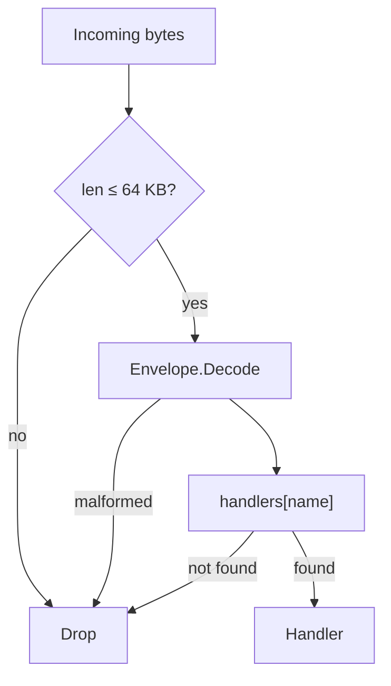
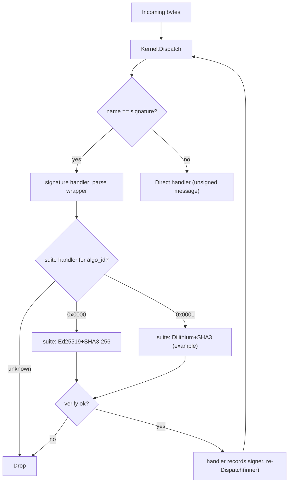

# Seed kernel — Protocol

*The envelope, kernel dispatch, the WASM handler contract, layering, and the pluggable signature module. §16 collects the protocol constants.*

> **Part of the [seed kernel](../README.md) spec.** Section numbers are global across the doc set — a `(§X.Y)` reference points to whichever file below holds that section:
>
> [README](../README.md) §1 · **PROTOCOL §2–§6, §16** · [REGISTRY](REGISTRY.md) §7–§9 · [RUNTIME](RUNTIME.md) §10–§12 · [SECURITY](SECURITY.md) §13–§14

---

## 2. The Envelope

Every message shares a single envelope format. The envelope carries the bare minimum the kernel needs: a routing key (`name`) and an opaque payload. The kernel's only job is to look up the handler for the name and invoke it.

```
┌───────────────────────────────────────────────────────┐
│ magic: 2 bytes          (0x5344 — ASCII "SD")         │
│ version: 1 byte         (0x01)                        │
│ name_len: 1 byte                                      │
│ name: [var bytes]       (opaque dispatch key)         │
│ payload: [remainder of buffer]                        │
└───────────────────────────────────────────────────────┘
```

Four bytes of fixed header, then the name, then the payload runs to the end of the buffer. The total envelope (all fields) must not exceed 65,536 bytes (§2.2). `name_len` must be at least 1; a zero-length name is invalid and will be rejected by the kernel.

| Field | Size | Description |
| --- | --- | --- |
| `magic` | 2 bytes | `0x5344` — identifies a seed kernel envelope |
| `version` | 1 byte | Protocol version (`0x01`) |
| `name_len` | 1 byte | Length of the name (1–255 bytes; `0` is invalid) |
| `name` | variable | Opaque dispatch key; meaning is a convention, not a kernel concern |
| `payload` | to end | The message body — handler-defined |

The kernel does not interpret the payload. Installation, signature wrapping, capability declarations, and every other piece of structure live inside the payload of some specific name and are the concern of the handler registered for that name, not the kernel.

### 2.1 Signing is a wrapper, not a field

To sign a message, you wrap an envelope inside another envelope whose `name` is `signature`. The outer payload carries the algorithm id, signer pubkey, the signature, and the inner envelope bytes. The `signature` handler re-dispatches the inner envelope after verifying. Wire layout and details are in §6.3.

This makes signing **opt-in per message**: you can have unsigned messages alongside signed ones, and a different wrapper kind (say an encryption layer) can wrap or be wrapped without ever changing the envelope format. Signing itself is a **single** wrapper — one signature per message (§2.3); hybrid post-quantum signatures are a **composite suite** (§6.4), both signatures in one suite payload, not nested wrappers.

### 2.2 Maximum message size (64 KB)

The kernel enforces a hard upper bound of **65,536 bytes** on the total envelope (header + name + payload). The kernel rejects any buffer larger than this limit before parsing.

**Rationale.** Signature verification dominates per-message cost (§10). Capping the envelope at 64 KB bounds the worst-case data a `verify` call must process, keeping per-message latency predictable and preventing a single oversized message from stalling the pipeline. For use cases that need to reference large data (files, images, firmware blobs), the payload carries a **content hash** — the digest of the external data under the envelope's signature suite — and consumers retrieve the actual bytes from an external store. The signature still covers the hash, so integrity is preserved end-to-end; the kernel just never has to move the bulk data through its dispatch path.

This limit applies to the **outermost** envelope on the wire. For signature wrappers (§2.1), the 64 KB budget includes the outer framing, the signature fields, and the complete inner envelope. Implementations should account for wrapper overhead — ~140 bytes for Ed25519 over the 33-byte literal-ASCII `signature` name (4 envelope header + 33 name + 2 algo + 2 signer_len + 32 pubkey + 2 sig_len + 64 sig), larger for PQ suites — when sizing inner payloads.

The 64 KB limit is a protocol constant, not a per-deployment configuration knob. Keeping it fixed avoids interoperability splits where one node accepts messages another rejects.

**The cap never constrains module or suite size.** Code never arrives on the wire — a WASM module is delivered in a signed bundle (§12.4) and installed via `SetHandler` from a verified local file, off the dispatch path — so the cap, a bound on inbound `verify` work, does not apply to it. Signature suites are no exception: even post-quantum ones (ML-DSA, Falcon, SLH-DSA), whose verify-only builds run to tens of kilobytes, are ordinary bundle modules, and the genesis suite is seeded host-side (§3.1, §9).

### 2.3 One signature per message

A message carries **at most one** signature. The host drops any `signature` envelope whose inner envelope is *itself* a `signature` envelope — nesting is not allowed, so exactly one signature wraps any message (§6.5).

**Rationale.** Each signature wrapper costs one verify (~95 µs for Ed25519 on a modern core). Per-wrapper overhead is ~140 bytes for Ed25519 (§2.2), so if wrappers could nest, a 64 KB envelope could stack ~475 of them and force that many verifies (~45 ms CPU) from one tiny input — a CPU-amplification DoS against the single-threaded dispatch loop. Forbidding nesting makes that vector **unrepresentable** rather than merely capped: the host records the verified signer of the current dispatch and refuses a second `signature` wrapper while one is already set, so the check is a single null test and costs no verify.

Use cases one might reach a wrapper stack for are served better without one: a hybrid Ed25519+post-quantum signature is a **composite suite** (§6.4) — one `algo_id`, both signatures in one suite payload, verified by one suite handler — which fits the suite-slot model exactly and needs no wrapping-order convention to get right.

---

## 3. The kernel

The kernel has one message-driven path: parse an envelope and dispatch its payload to the handler registered for the name. It also exposes `SetHandler` (§3.1) — a host-level method for directly installing or replacing any handler. `SetHandler` is the **only** install path the kernel knows about; the host-side module registry (§7) drives it under a policy when a signed bundle is loaded. There is no install *message* — installation is a host call, not a wire protocol.

**"Drop" semantics.** Throughout this document, **drop** means "silently ignore: no response is generated, no error is propagated to the sender." Implementations MAY log or meter dropped messages but MUST NOT return a synchronous error or surface a side-effect. The kernel never produces unsolicited responses — every reply travels in a fresh envelope under the relevant app handler's policy.

```
dispatch(bytes):
  if len(bytes) > MAX_ENVELOPE_BYTES:                 drop
  envelope = parse(bytes)
  if envelope == null:                                drop  // bad magic, version, name_len, or truncation
  if handlers[envelope.name] is null:                 drop
  handlers[envelope.name](envelope.payload)
```

A module can call another module using `kernel.call`. The kernel knows nothing about signers, authors, or capabilities — that state lives in the signature handler (§6.5) and the module registry (§7). Any handler that needs to know who signed the current message calls `kernel.call` to `signature.signer`.

**Single-threaded dispatch.** A kernel instance dispatches one message at a time. The current signer (§6.5), the call-depth counter, and the caller stack (used by `kernel.caller`) are all per-instance; the host MUST NOT enter `dispatch` re-entrantly except via `kernel.call`. Concurrent inbound traffic is the host's concern — typically by serializing onto a single event loop or running independent kernel instances per worker.



### 3.1 Host-level handler management (`SetHandler`)

The kernel exposes a single method for the host to manage handlers directly:

```
kernel.SetHandler(name, handler)
```

`SetHandler` installs or replaces the handler for `name` (null removes it); replace is in-place, so the kernel never holds two entries for one name. It returns nothing — a side-effecting primitive on the handler table. The reference host wraps it with a thin `host.register(name, handler) → handlerId` that allocates an internal handler id (used by `host.blockFromCall`, §4.4) before calling `SetHandler`.

`SetHandler` is the only way handlers enter or leave the table — no install message, no privileged "register" path, no protected-vs-unprotected distinction; every entry arrived the same way. Handlers seeded directly (the bootstrap handlers, §9) have **no install record** — they are invisible to the registry (§7). Attribution and policy are the host's concern; the kernel just stores the function pointer.

Because these directly-seeded handlers have no install record, their name is not in any bridge's pinned-caller list; see §8 for why this means bootstrap handlers cannot reach any I/O bridge.

`SetHandler` is internal to the host process — a direct method call, never reachable from inbound messages or WASM handlers. The host controls access through its own authentication (process permissions, operator console, HSM); the kernel defines no access-control policy for it.

The same call the host uses during bootstrap (§9) remains available afterward for emergency replacement of any handler, including bootstrap handlers like `signature`. Ordinary growth loads a signed bundle (§12.4); the host-level `SetHandler` path is the emergency fallback.

**Replacing registry-managed names.** The kernel never touches an install record — it does not know records exist (§7.1). But a stale `(author, bytes_hash)` left behind by a raw replacement would misattribute the slot: the old author would apply to brand-new bytes, so the reference policy would treat the next same-name install as a same-author upgrade of code it never signed. So the host's handler-management path auto-clears any record when it (re)binds or removes a slot — `SetHandler`/`register` and `removeHandler` all do. A `SetHandler` replacement thus always runs with no record (a later bundle load may wire a fresh one), needing no separate `installer.remove(name)` first; `installer.remove` (§7.5) remains the path for operator revocation, where clearing the record is the point.

### 3.2 The module registry (optional)

Most deployments grow by loading signed bundles (§12.4), not by wiring every handler by hand. The bundle loader admits each verified module through a small host-side **module registry**: it holds the install records `(author, bytes_hash)` and runs a deployer-supplied policy callback before each `SetHandler` call. The registry is not part of the kernel — it is host-side state (`host/installer.ts`) the loader calls, not a wire protocol. Frozen-config deployments simply skip it and grow no further.

The registry is described in detail in §7. Its surface is two ideas:

- **`installDirect(name, wasm, author)`** binds a `name` to WASM bytes. The bundle loader calls it once per module, with the manifest author.
- **A policy callback** decides whether to honor each bind. The reference policy is in §7.4.

Because the manifest signature is verified by the loader before it ever calls `installDirect`, "who authored this code" is already settled by an ordinary signature check — the same signature machinery every message uses (§6). Installation is not a special operation; it is `handlers[name] = wasm_bytes`, gated by author + hash policy.

---

## 4. WASM Handler Contract

All WASM interfaces are specified as raw WASM function signatures. Any language that compiles to WASM (AssemblyScript, C#, Rust, C, Zig, Go) can implement these.

Handlers exchange messages with the host through a **scratch region** in their own linear memory. There is no allocator contract, no pointers crossing the boundary, no buffer lifetimes for the handler author to reason about — just "read input here, write output there, return the length."

### 4.1 Exports (handler must provide)

| Export name | WASM type | Description |
| --- | --- | --- |
| `memory` | linear memory | Handler's memory; the host reads input from and writes output to the scratch offset within it. |
| `scratch` | `global i32` | Byte offset into `memory` where the host places input and reads output. Set once during instantiation; the host reads it once after instantiation and the handler MUST NOT change it afterward. |
| `scratchSize` | `global i32` *(optional)* | Bytes of scratch the handler reserves at `scratch`. The host reads it once at instantiation and clamps its input/output copies to it; when absent (or below the 128 KB default, or naming out-of-bounds memory) the default is used. Export it only if the handler genuinely reserves that region — the host writes there. |
| `handle` | `(i32) → i32` | `(input_len) → output_len` — process the message at `scratch` and return the response length. |

**I/O protocol.** Before each call, the host writes the input bytes at offset `scratch` (up to the configured scratch size — default 128 KB, or the handler's exported `scratchSize`, set per handler at instantiation). The handler reads its input from `scratch`, writes its response back at `scratch` (overwriting the input is fine), and returns the number of response bytes. Return `0` for "no response." The host reads `output_len` bytes at `scratch` after `handle` returns and does not touch the region again until the next call.

Memory outside the scratch region is the handler's private state — statics, globals, whatever allocator it wants for its own bookkeeping. None of that is exposed to the host.

### 4.2 Imports (host provides to handler)

The host exposes these under the import module `"kernel"`. These are the **only** host imports — everything else (author queries, capability lookups, logging) is accessed via `kernel.call` to the appropriate module.

| Import name | WASM signature | Description |
| --- | --- | --- |
| `call` | `(i32, i32, i32, i32) → i32` | `(name_ptr, name_len, payload_ptr, payload_len) → response_len` — synchronous dispatch to the handler registered for the given name. The four pointers are into the **caller's own memory** (anywhere the caller likes). The response is written into the caller's scratch region; the return value is the response length, or `-1` on error (no handler registered, call depth exceeded, response too large for caller's scratch). See §4.4. |
| `caller` | `(i32) → i32` | `(out_ptr) → len` — writes the **immediate caller** at `out_ptr` as `[name_len u8][name bytes]`: the name of the handler whose `kernel.call` reached this one. `[0x00]` (single byte, `name_len = 0`) means no caller — the handler was reached by direct envelope dispatch, not through `kernel.call`. Only the immediate caller is exposed, never the deeper chain: bridge authorization (§8.1) is on this name, and exposing nothing else makes treating a non-immediate frame as authoritative *impossible* rather than merely forbidden. It reflects `kernel.call` only; signature-wrapper re-dispatch starts a fresh context (its lineage is the current signer, §6.5). A host that wants a full call-chain audit trail logs it host-side; it routes every `kernel.call` and already holds the chain. |

### 4.3 Safety & memory model

What a handler **cannot** do:

- Access the filesystem, network, or clock. The only outside-world reach is `kernel.call` to other handlers; bridges (handlers that perform real I/O) additionally require the caller to be one they serve — each bridge pins the caller names it answers for (§8). The default is no reach; a bridge only serves callers it explicitly pins.
- Allocate memory across the boundary. There is no allocator contract — every cross-module byte lives in one handler's scratch and is copied by the host into another's. The host never holds a pointer into a handler's memory across a return, and never writes outside the scratch region.
- Corrupt anything outside its own scratch and private memory. A buggy or malicious handler can scribble in itself but cannot touch the host, the kernel, or another handler.

What a handler **must** internalize:

- Memory is bounded by what the WASM module declares (and the host engine's own limits); the kernel imposes no per-handler cap.
- A `kernel.call` overwrites your scratch with the callee's response. If you still need the input, copy it first (§4.4).

> **Compute and memory exhaustion are the host's problem.** WASM engines on the JS platform expose no fuel/timeout mechanism, so this protocol specifies none. The single-signature rule (§2.3), the call-depth cap (§4.4), and the 64 KB limit (§2.2) bound verify-amplification and recursion, but an installed handler can still infinite-loop or declare a huge linear memory and OOM the single-threaded host — and a permissive registry (§7.4) multiplies that across many installs. Deployers exposed to runaway handlers should run dispatch in a Worker with a watchdog and pre-validate bytecode in the policy callback (cap declared memory, forbid unbounded loops) before installing. The kernel bounds call depth but not per-handler time or memory.

### 4.4 Synchronous cross-module calls (`kernel.call`)

`kernel.call` performs a synchronous dispatch to the handler registered for the given `name`. The host wires the two handlers together by copying through their scratch regions:

1. Host reads `name_len` bytes from caller memory at `name_ptr`, and `payload_len` bytes at `payload_ptr`. (These pointers are into caller memory — anywhere the caller put them; they do not need to be in scratch.)
2. Host looks up the target handler. If none is registered, returns `-1`.
3. Host writes the payload bytes into the target's scratch region and calls `target.handle(payload_len)`.
4. Target reads input, writes response at its own scratch, returns `response_len`.
5. Host reads `response_len` bytes from the target's scratch and writes them into the caller's scratch region.
6. Host returns `response_len` to the caller. The caller reads its response from its own `scratch` offset.

**Semantics:**

- The callee sees raw payload bytes at its scratch — there is no envelope wrapping. Routing is by `name` only.
- The callee cannot distinguish an inbound envelope from a `kernel.call`. It sees input at scratch and writes output at scratch.
- Calls are **re-entrant**: A can call B can call C. The host enforces a maximum call depth (default 8); exceeding it returns `-1`.
- **A non-empty callee response overwrites the caller's scratch.** A handler that still needs its input across a `kernel.call` must copy it to private memory first. A `0`-byte response leaves scratch untouched, so callers MUST NOT rely on `kernel.call` to clear it; a handler holding secrets there must zero them itself.
- If the callee's response exceeds the caller's scratch size, the host returns `-1` and writes nothing. Tune scratch size per handler if you expect large responses.

**Handlers blocked from `kernel.call`.** Some handlers MUST cause `kernel.call` to return `-1` *before* the target is invoked. The check belongs at the call router (the host's `kernel.call` import), not inside the handlers.

1. **The `signature` wrapper** — it does not mutate persistent state, but accepting it records the signer and re-dispatches the inner envelope under it. Allowing it via `kernel.call` would let an arbitrary handler reframe the active signer mid-chain and break the "signer = author" rule.
2. **Any deployer-added state mutator** — a handler that calls `kernel.SetHandler` or edits the registry's records under the signer's authority (e.g. a `bootstrap.replace` handler, §9.1). Without the block, an in-handler `kernel.call` could mutate kernel state under the current signer without that signer's intent.

Blocked handlers run only at top-level dispatch, where the signature wrapper has already verified the outer signature. Read-only queries (`signature.signer`) remain freely callable.

The reference bootstrap installs **no** state-mutating wire handler — code arrives as a signed bundle (§12.4), not a wire message — so the standing blocklist holds only `signature`. A deployer who adds a mutating handler MUST mark it blocked via `host.blockFromCall(handlerId)` immediately after `host.register`.

**Replay protection is an application concern.** The kernel has no state-mutating wire handler and no `seq` table — installation is a host call under the bundle loader (§12.4), not a signed message. But a signed *app* envelope replayed verbatim re-verifies and re-dispatches byte-identically; its signature stays valid forever, so anyone who saw the bytes can resend them. Whether that matters is app-specific: an idempotent handler (appending a chat line, say) can ignore replays; a handler whose payload changes state (transferring an asset, casting a vote, charging an account) MUST defend itself. The usual mechanism is a `seq` field consumed before the action, against a per-`(handler, signer.pubkey)` high-water mark keyed on the canonical pubkey — the app picks the field's placement, the counter's storage, and whether related handlers share a map. Stronger needs (exactly-once across a partition, freshness windows) layer a nonce/timestamp/challenge scheme on top; the kernel exposes no clock. A deployer who adds a state-mutating wire handler (§9.1) inherits the same duty.

---

## 5. Layering and composition

Modules form an onion — the stack diagram in §1 draws it: each layer wraps the layers above it and depends only on the layers below. No layer has a hard dependency on the layers around it — the onion is a typical composition, not a required one.

### 5.1 Modules in the reference implementation

A one-line per layer index — full details live in §6 (Signature), §7 (Module registry), §8 (Bridges), and §11 (App examples).

| Layer | Modules | What lives there |
| --- | --- | --- |
| **1: Signature** | Signature | Algorithm suites, the current signer, wrapper verification. |
| **2: Module registry** | Registry (host-side) | The install records and the policy callback. `installDirect` binds a verified bundle module; no wire message. |
| **3: I/O bridges** | Deployer-defined (`net.send`, `ui.write`, `fs.read`, `clock.now`, …) | The only code that performs real I/O. `SetHandler`-installed, each pinning the caller names it serves. |
| **4: App modules** | Chat (example) | User-facing handlers delivered in a signed bundle (§12.4). |

Each module is in its own file and can be used standalone — the signature handler is testable on the kernel alone, the registry is testable without bridges, and chat is just a handler testable without signatures. Inter-module queries go through `kernel.call` to the target module's name (e.g. `signature.signer`); install records are read host-side, not over the wire (§7.6).

**The hash function used for id derivation.** A few places hash: `bytes_hash` (§7.1), the app-name derivations a policy may choose (`hash(canonical || author_pubkey)`, below), and any allowlist that pins a binary. Throughout, `hash(…)` means the **genesis suite's hash** (§6.2) — the only hash guaranteed at boot; in the reference implementation SHA-3-256 (32 bytes). Swapping the genesis suite swaps that hash, so every `bytes_hash` shifts — but the **bootstrap and suite slot names are literal ASCII, not hashes**, so they do *not*, and the §9 seeds survive a genesis swap untouched. Pick the genesis suite once and treat it as a deployment-wide constant.

**Naming convention for bootstrap handlers:** `name = "seedkernel.bootstrap.v1:" + canonical_name` — the **literal ASCII string**, not a hash. Names are opaque bytes, so nothing forces a hash; a readable name reads plainly in logs and keeps the bootstrap namespace independent of the genesis hash (only `bytes_hash` earns that dependency, §14). Suite slots follow the same rule at `"seedkernel.suite.v1:" + algo_id_hex` (§6.4). These handlers are host-seeded via `SetHandler` (§3.1), not admitted through the registry, so there is no install record to mix in.

**Naming convention for app handlers:** free-form within whatever the policy approves. The reference policy (§7.4) places no constraint on names beyond uniqueness — the first author to bind a name owns it, and only that author can update it. Deployers who want author-scoped namespaces (so two parties can each have their own `chat` without conflict) can require names of the form `hash(canonical || author_pubkey)` in their policy callback. The kernel is indifferent.

---

## 6. The signature module

This is where pluggable signatures live. The signature module dispatches verification to pluggable **algorithm suites** — each an ordinary handler (§6.6) installed at a conventional suite-slot name and selected by `algo_id` — and owns the `signature` name, a wrapper format that lets any envelope be signed.

### 6.1 Algorithm suite

An algorithm suite is a bundle of:

| Operation | Purpose | Example (suite 0x0000) |
| --- | --- | --- |
| `hash(data) → bytes` | Produce a name from a canonical string | SHA-3-256 → 32 bytes |
| `verify(pubkey, signature, data) → bool` | Verify a message signature | Ed25519 |

Each suite declares fixed sizes (key length, sig max length, hash length) used for sanity-checking the wrapper payload. Only `verify` is exposed as a WASM handler op (§6.6): signing is a sender-side operation that lives in the host, and id derivation hashes host-side too (§5.1, §6.2) — the suite handler runs neither.

### 6.2 The Genesis suite (algo_id = 0x0000)

The signature module needs *something* to verify the very first message. By convention:

- **algo_id 0x0000** = Ed25519 + SHA-3-256
- It is delivered as a **separate WASM module** (e.g. libsodium compiled to WASM), loaded at boot time.
- The host trusts it **by hash** — the expected SHA-3-256 hash of the genesis WASM module is the one cryptographic constant in the bootstrap configuration.
- It cannot be removed through the pipeline — the reference policy refuses its `SetHandler`-seeded slot (§7.4), so no bundle can unseat it; only a direct host-side `SetHandler(name, null)` can (§7.5, §9.1). But it **can be superseded** for all new messages by installing a new suite at a different slot (§6.4).

The kernel itself does not know about a genesis suite. The hash is held by the host's bootstrap code, which seeds the suite handler via `SetHandler` at its suite-slot name (§6.4) before any messages are dispatched — exactly like the `signature` handler itself.

During a PQ migration, the hybrid is a **composite suite** at a new `algo_id` — one suite that carries and verifies both an Ed25519 and a post-quantum signature — not two nested wrappers. See §6.4.

### 6.3 The `signature` wrapper

Signing is a wrapper message. To send a signed inner envelope, build the inner envelope as normal, then wrap it:

```
outer envelope:
  name          = signature name id
  payload       = [ algo_id:     2 bytes (u16)            ]
                  [ signer_len:  2 bytes (u16)            ]
                  [ signer:      var bytes (public key)   ]
                  [ sig_len:     2 bytes (u16)            ]
                  [ signature:   var bytes                ]
                  [ inner_envelope: remainder of payload  ]
```

The inner envelope is a complete envelope — including its own magic, version, name, and payload.

The signature is computed over `DOMAIN_env ‖ algo_id ‖ signer_len ‖ signer ‖ inner_envelope` — a domain-separation prefix, the outer wrapper fields (`signer_len` is the same 2-byte u16 as on the wire), and the inner envelope's raw bytes including its framing. `DOMAIN_env` is the constant `"seedkernel-envelope-sig-v1\0"` (§16.1), one of a disjoint family of per-context prefixes (§14); it is prepended before signing and verifying but **not** transmitted, so the wire payload and §2.2 overhead are unchanged. Relaying is lossless: a relay alters none of these fields, so the signature stays valid.

Length-prefixing `signer` makes the preimage **self-delimiting**: `signer_len` fixes the `(signer, inner_envelope)` boundary, so no other split of the same bytes yields an identical preimage. With genesis's fixed 32-byte key this is belt-and-suspenders, but a future variable-length-key suite would otherwise let an attacker re-partition `signer ‖ inner` into a different `(signer', inner')` over the same signed bytes — a splice attack the length prefix forecloses structurally, without relying on every suite pinning its key length.

**Signing the outer `algo_id` and `signer` closes the flip attacks.** Covering `algo_id` means an attacker cannot flip it to replay a captured message under a second suite that verifies the same key (§6.4), and covering `signer` means the message cannot be re-attributed to a different `(algo_id, pubkey)` identity — either edit breaks verification. So an app's replay state (§4.4) may be keyed however it likes, and the `signer` a suite verifies against is fixed by the signature, not an out-of-band hint. Suites SHOULD still reject non-canonical or small-order public keys so one logical key has one encoding — author-matching and replay marks key on raw pubkey bytes, so a second encoding would split one identity — but with `signer` signed this is defense-in-depth.

After verification the inner envelope re-enters the pipeline and dispatches normally. The `signature` name holds a single **ordinary handler** — routed like `chat.send` or `store.put`, no special kernel status, no bespoke ABI. It parses the wrapper, verifies via the suite, and on success records the signer, re-dispatches the inner envelope under it, and clears the signer on return (§6.5). The verify-time flow:



Unknown `algo_id`s drop because no handler is installed at that suite slot (§6.4); only installed suites can be verified against.

### 6.4 Registering new algorithms

A suite is an **ordinary handler** (§6.6): a standard scratch-ABI (§4) WASM module at the conventional slot `name = "seedkernel.suite.v1:" + algo_id_hex` — the **literal ASCII string** (`algo_id_hex` is 4 lowercase hex digits), not a hash. There is no suite registry and no separate suite ABI — the signature module builds the literal slot name itself and reaches the suite by plain `kernel.call`, exactly as any handler reaches any other, with no host-side suite-dispatch import (§6.6). Multi-argument primitives fit the single buffer by length-prefixing (§6.6), the same framing the wrapper and install payloads use.

The genesis suite is seeded at bootstrap via `SetHandler` (§6.2, §9), like every bootstrap handler. To add another, ship it as a module in a signed bundle (§12.4) whose manifest binds it at the slot for the new `algo_id`: the loader admits it through the same `installDirect` path as any module (§7) — policy runs, and on approval `SetHandler(slot_name, instance)` binds it and the `(author, bytes_hash)` record lands in `installations[]`. A suite is pure computation.

The policy callback (§7.3) governs who may register suites — the same callback that governs every module; "may this author bind the slot for `algo_id N`?" is just a policy question. The reference first-install/same-author rule (§7.4) applies: the first author to bind a slot owns it and alone can replace its WASM.

Once a new suite is installed, a message signed under it carries that one suite's `algo_id` in its single wrapper (§6.5). A migration that must satisfy two algorithms at once uses a **composite suite** — one `algo_id` whose payload carries and verifies both signatures — rather than two nested wrappers, so there is no wrapping order to get right.

**Duplicate registration.** The same-author rule prevents a different author from replacing an installed suite; to rotate, allocate a new `algo_id` and bind at the new slot. The genesis suite (`0x0000`) is host-seeded via `SetHandler` (§9), so the reference policy refuses to bind over it — its slot has no install record (§7.4). Emergency replacement is a direct host-side `SetHandler`, like any bootstrap-handler replacement (§9.1).

**Lazy validation.** The signature module does not check that suite bytes implement the contract at bind time. If they don't, the first message signed under that `algo_id` fails verification and drops — fail-safe. Interface checking is the policy's job if a deployment cares (it can inspect WASM exports before approving, §7.3).

### 6.5 The current signer

The host records the **signer** of the current dispatch — the single key whose `signature` wrapper verified. The kernel doesn't know it exists; it lives in the host handler that already spans the inner dispatch (§6.3).

**Lifecycle.** On an accepted `signature` wrapper the handler records the signer, dispatches the inner envelope synchronously, and clears it on return. Because the record, the dispatch, and the clear are three consecutive host statements — set / `dispatch(inner)` / clear in a `finally` — the invariant "a signer is set ⟺ its wrapper verified" holds by construction: no partial state, no repair path, nothing to leak across a boundary.

There is at most one signer, because nesting is forbidden (§2.3): a `signature` wrapper whose inner envelope is itself a `signature` wrapper drops before any verify work, since a signer is already set. One message, one signature.

**Query API — `signature.signer`.** Any handler may call `kernel.call(signature.signer, …)` to read the signer. The handler ignores its payload (zero bytes is canonical) and returns `[0x01][algo_id u16][pubkey ..]` when the dispatch is signed — the pubkey runs to the end, so it needs no length prefix and a post-quantum suite's multi-kilobyte key (e.g. ML-DSA) fits — or `[0x00]` when it is not. The signer is scoped to the *top-level* dispatch, so every nested `kernel.call` frame sees the same answer: "who signed the message that caused this chain?" is well-defined throughout.

**Author = the signer.** When the registry (§7) or any other handler asks "who is the author of this dispatch," the answer is that one signer. There is no attestation layer and no wrapping-order convention to get wrong: co-signing or attestation, if a deployment ever needs it, is a **composite suite** (§6.4) that verifies several keys under one `algo_id` and reports whichever the deployment treats as authoritative — an explicit decision in one suite handler, not an implicit consequence of nesting order.

### 6.6 Suite handler contract

A suite is a standard scratch-ABI handler (§4): it exports `memory`, `scratch`, and `handle`, reads input from scratch and writes its response there — no allocator, no pointer arguments, no host-side suite-dispatch import. The signature module invokes it with `kernel.call(suite_slot_name, request)` — the same import every handler gets (§4.2) — building the literal-ASCII slot name (§6.4) itself and reading the `[valid u8]` response from its own scratch. A suite does exactly one operation — **verify** — so the request carries no op selector; its fields are length-prefixed into the single buffer, big-endian (§16), like the wrapper payload (§6.3):

| Request (at scratch) | Response |
| --- | --- |
| `[pubkey_len u16][pubkey][sig_len u16][sig][data ..]` | `[valid u8]` (1 = valid, 0 = invalid) |

Verify is the suite's whole contract. Id derivation is **not** routed through it — the reference host hashes directly via bundled libsodium (§5.1) and the genesis hash is a host-side constant (§6.2) — so a suite never exposes a hash. A second operation, if ever needed, is a *new contract at a new slot version*: the slot pins `…suite.v1:` (§6.4), so a `v2` suite lives at a distinct slot and cannot collide. No in-band op or version byte is needed — the slot you call names the ABI you get.

The `u16` length prefixes accommodate post-quantum suites whose keys and signatures run to kilobytes (§6.5). The `data` field is the full signed preimage `DOMAIN_env ‖ algo_id ‖ signer_len ‖ signer ‖ inner_envelope` (§6.3): the signature module prepends the domain constant and outer fields (including the 2-byte `signer_len` that keeps the preimage self-delimiting) to the inner envelope it already parsed, then hands the whole thing over. The suite stays oblivious to the structure — it verifies `sig` over `data` under `pubkey`, nothing more — so domain separation and outer-field binding live entirely in the signature module, and every suite gets them free.

The one cost versus a bespoke ABI is a single ≤64 KB `memcpy` of `data` into the suite's scratch per verify — negligible against the ~95 µs verify it precedes (§10).

The signer-query schema (`signature.signer`) is described in §6.5 — it is exposed by the signature module itself, not by suite handlers.

---

## 16. Protocol constants

All limits and reserved values in one place. Multi-byte integers are big-endian throughout the protocol.

| Constant | Value | Where enforced | Notes |
| --- | --- | --- | --- |
| `MAGIC` | `0x5344` ("SD") | Envelope decode | First 2 bytes of every envelope. |
| `VERSION` | `0x01` | Envelope decode | Only accepted version. |
| `MAX_ENVELOPE_BYTES` | `65536` | Kernel dispatch + encode | Hard cap on the outermost envelope (§2.2). |
| `MIN_NAME_LEN` | `1` | Envelope decode | `name_len = 0` is invalid. |
| `MAX_NAME_LEN` | `255` | Envelope encode | One-byte length prefix. |
| `MAX_CALL_DEPTH` | `8` (default) | `kernel.call` host import | Re-entrant call cap; host configurable. |
| `DEFAULT_SCRATCH_SIZE` | `131072` (128 KB) | Handler instantiation | Per-handler scratch region; host configurable. |
| `GENESIS_ALGO_ID` | `0x0000` | Signature module | Reserved for the genesis suite (§6.2). |

Reserved-value handling: any envelope whose `magic`, `version`, or `name_len` is outside the table above is **dropped** (see §3 for what *drop* means).

### 16.1 Runtime (shell) constants

These belong to the reference runtime (§12), not the kernel protocol — a different shell could change them without breaking envelope interop, but they are wire- or ABI-visible to bundles and peers of *this* runtime.

| Constant | Value | Where enforced | Notes |
| --- | --- | --- | --- |
| Cap op ids | `1`–`16` | cap-bridge (§12.2) | Guest↔host op identifiers, contiguous and grouped by domain (§12.2); regenerated with the guest preamble, never sent between nodes. |
| Capability domains | `crypto`, `net`, `fs`, `module`, `clock` | manifest `caps` (§12.4) | An unknown domain throws when the guest realm is built. |
| Manifest envelope | `[pk 32][sig 64][json]` | `loadBundle` (§12.4) | Ed25519 detached signature over `DOMAIN_manifest ‖ json`. |
| Link message tags | `HELLO 0x01`, `AUTH 0x02`, `FRAME 0x03` | `PeerLink` (§12.6) | AKE handshake + encrypted frame plane; HELLO carries the ephemeral X25519 key, FRAME bodies are AEAD records. |
| `DOMAIN_env` | `"seedkernel-envelope-sig-v1\0"` | Signature wrapper (§6.3) | Domain-separation prefix for the signed envelope preimage (`algo_id ‖ signer_len ‖ signer ‖ inner`). Prepended before signing, not transmitted. |
| `DOMAIN_manifest` | `"seedkernel-manifest-sig-v1\0"` | Manifest signature (§12.4) | Domain-separation prefix for the signed bundle-manifest JSON. Prepended before signing, not stored. |
| `DOMAIN_guest` | `"seedkernel-guest-sig-v1\0"` | Cap-bridge `SIGN` (§12.2) | Domain-separation prefix for guest-obtainable signatures, followed by the host-derived scope `author_pk ‖ app_len u8 ‖ app` from the admitted manifest. Prepended before signing, not transmitted. |
| `DOMAIN_channel` | `"seedkernel-channel-id-v1\0"` | AUTH signature (§12.6) | Domain-separation prefix for the signed AKE transcript (both identities, nonces, and ephemeral keys). Not transmitted. |
| `MAX_FRAME_BYTES` | `16777216` (16 MiB) | `PeerLink` framing (§12.6) | Hard cap on one link frame, enforced on the length prefix (TCP) or frame length (WS) **before** buffering — bounds what an unauthenticated peer can make a node allocate from a single prefix. Both transports cap identically, so a frame that crosses one crosses the other. |
| `MAX_QUEUE_BYTES` | `1048576` (1 MiB) | `PeerLink` (§12.6) | Total bytes of frames buffered pre-auth; oldest dropped once the sum would exceed it. A byte bound (not a frame count) so pre-auth buffering is capped regardless of frame size. |
| Transport frame kinds | `req 0x00`, `res 0x01` | `Transport` (§12.6) | Single request/response plane, carried inside the §12.6 AEAD record layer. |
| Default request timeout | `2000` ms | shell boot (§12.8) | Response deadline before a peer counts as unreachable (`--timeout`). |

**The `DOMAIN_*` family lives in one file.** The four prefixes above are a *family*, and the only thing they are for is disjointness: no signature made under one may verify under another, over any bytes, ever. That is a property of the whole set rather than of any member, so the set is declared together in `host/domains.ts` — where adding a fifth means reading the other four on the same screen — and imported by the modules that sign (`kernel-host.ts`, `bundle.ts`, `cap-bridge.ts`, `net-link.ts`). The Go/native target evaluates that same file through its generated bundles (§12.9) and reads its prefixes from the evaluated module — including `DOMAIN_env`, which the loader pulls from the realm at boot to verify envelope wrappers natively — so every prefix on every target derives from this one file by construction, not by a copy that could drift. There is **no** hand-copied member anywhere — the wrapper is host code and reads the prefixes from this one file like every other target.

